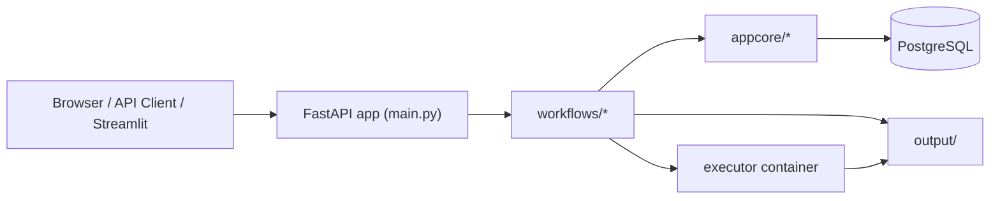
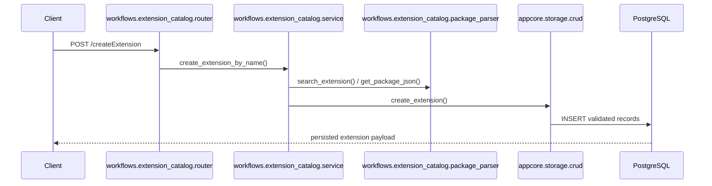
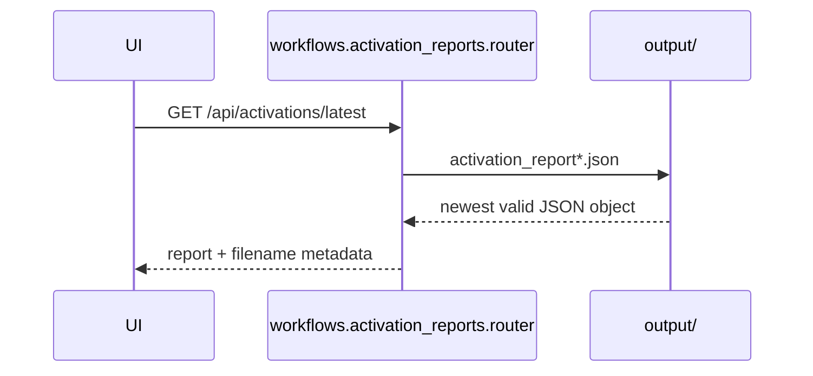
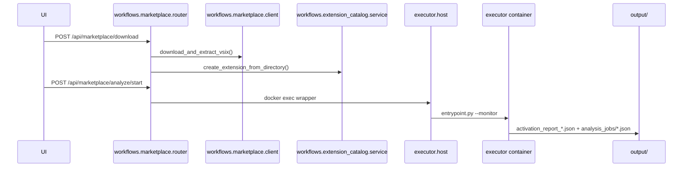

# ExTrace Architecture

`Last Updated: 2026-03-06`

This document describes the post-refactor architecture. The canonical code paths are `appcore/`, `workflows/`, `executor/`, and `ui/`.

## Architecture Summary

## Canonical Modules

### `appcore/`

Shared platform code used by multiple workflows.

- `appcore/api/config.py`
  - Pydantic settings sections for `project`, `api`, `db`, and `executor`.
- `appcore/api/deps.py`
  - FastAPI dependencies such as `get_db`.
- `appcore/db/session.py`
  - SQLAlchemy engine and `SessionLocal`.
- `appcore/storage/models.py`
  - SQLAlchemy ORM models.
- `appcore/storage/crud.py`
  - Canonical read/write access layer.
- `appcore/contracts/schemas.py`
  - Shared request/response schemas.

### `workflows/`

Business logic organized per workflow.

- `workflows/extension_catalog/`
  - Catalog router, manifest parser, and service orchestration.
- `workflows/activation_reports/`
  - Reads activation report JSON files from `output/`.
- `workflows/marketplace/`
  - Marketplace client, trigger selection, download, and analysis orchestration.

### `executor/`

Sandbox runtime for dynamic analysis.

- `executor/container/Dockerfile`
- `executor/container/start.sh`
- `executor/flows/playwright/*.py`

### `ui/`

Streamlit dashboard modules.

- `ui/app.py`: entrypoint
- `ui/api.py`: API client helpers
- `ui/navigation.py`: page routing
- `ui/views/`: `dashboard`, `simulation`, `marketplace`, `theme`

## Canonical Imports

The codebase now imports only from canonical packages:

- `appcore/*` for shared platform code
- `workflows/*` for business workflows
- `executor/host.py` for host-side executor control

## Request Flows

### 1. Extension Catalog Flow

Notes:

- Validation happens with Pydantic v2 schemas before insertion.
- The uniqueness rule remains `(publisher, name, version)`.
- All writes still go through CRUD.

### 2. Activation Report Flow

Notes:

- Reports are filesystem-backed, not database-backed.
- Router logic retries transient `OSError` reads.

### 3. Marketplace Analysis Flow

Notes:

- Synchronous analysis is available at `POST /api/marketplace/analyze`.
- Background job mode is available at `POST /api/marketplace/analyze/start`.
- Job state is persisted under `output/analysis_jobs/` so reads survive worker boundaries.

## Data Boundaries

### Database-backed state

- Extension metadata
- Activation events parsed from `package.json`
- Capabilities, scripts, and contributes data

### Filesystem-backed state

- Extracted extensions under `extensions/`
- Activation report JSON files under `output/`
- Background analysis job snapshots under `output/analysis_jobs/`

### Not Yet Persisted to DB

- Dynamic analysis run history
- Network/process/filesystem telemetry tables
- Risk scores

## Testing Structure

The test suite mirrors the new architecture:

- `tests/platform/`
  - `api/`, `contracts/`, `storage/`, canonical import tests
- `tests/workflows/`
  - `activation_reports/`, `extension_catalog/`, `marketplace/`
- `tests/executor/`
  - Playwright helper and workspace tests

## Architectural Rules

- Put shared code in `appcore/` only when at least two workflows need it.
- Put workflow-specific logic next to its router/service/parser.
- Use SQLAlchemy 2.0 style only.
- Use Pydantic v2 APIs only.
- Keep sandbox execution isolated in Docker.
