<div align="center">

# 🔮 ExTrace Architecture

<br>

**A Secure VS Code Extension Analysis Platform**

<br>

[](https://python.org)
[](https://fastapi.tiangolo.com)
[](https://postgresql.org)
[](https://docker.com)

<br>

---

`Last Updated: 2026-02-19` • `Version: 1.0.0` • `Status: Development`

---

</div>

<br>

## 📑 Table of Contents

<details>
<summary><strong>🗂️ Click to expand navigation</strong></summary>

<br>

| Section | Description |
|:--------|:------------|
| [🌐 System Overview](#-system-overview) | High-level system components and connections |
| [🏛️ High-Level Architecture](#️-high-level-architecture) | Layer-based architecture overview |
| [📊 Layered Architecture](#-layered-architecture) | Detailed layer breakdown |
| [🔗 Module Dependencies](#-module-dependencies) | Inter-module relationships |
| [🔄 Request Flow](#-request-flow) | API request lifecycle diagrams |
| [🗃️ Database Schema](#️-database-schema) | Data model and constraints |
| [🐳 Docker Infrastructure](#-docker-infrastructure) | Container setup and networking |
| [⚙️ Configuration Flow](#️-configuration-flow) | Settings management |
| [📁 File Structure](#-file-structure) | Project directory layout |
| [📜 Architectural Rules](#-architectural-rules) | Design principles and constraints |
| [🎭 Executor: Playwright UI Automation](#-executor-playwright-ui-automation) | Dynamic analysis automation & honeypot |
| [🔮 Future Architecture](#-future-architecture) | Planned enhancements |
| [📋 Quick Reference](#-quick-reference) | Endpoints and tech stack summary |

</details>

<br>

---

<br>

## 🌐 System Overview

> [!NOTE]
> The system operates within a **Docker-based environment** with isolated containers for the API and database, ensuring security and reproducibility.

<br>

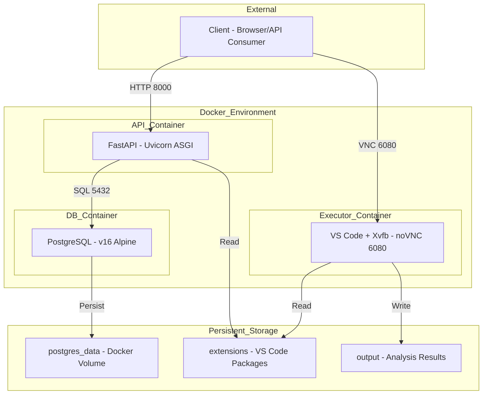

<br>

---

<br>

## 🎯 Design Philosophy & Constraints

> [!IMPORTANT]
> The architectural decisions in ExTrace are driven by specific operational requirements. Understanding these constraints is crucial for maintaining the "robustness" of the system.

### 1. Robustness over Scalability

**Decision:** The system prioritizes data integrity, type safety, and transactional consistency over high-concurrency throughput.
**Reasoning:** As a security analysis tool, partial or corrupted data is unacceptable. We use strict foreign keys, complex Pydantic validation, and synchronous processing to ensure every scanned extension is recorded perfectly.

### 2. Internal Security Tooling

**Decision:** No built-in authentication or role-based access control (RBAC).
**Reasoning:** ExTrace is designed to run in an isolated, secure environment (e.g., local Docker, air-gapped network) accessible only by security engineers. Security is enforced at the network/infrastructure level rather than the application level.

<br>

---

<br>

## 📡 Telemetry Data Flow (Planned)

> [!NOTE]
> While raw telemetry is captured to the `output/` directory, the following flow describes the planned integration for automated analysis.

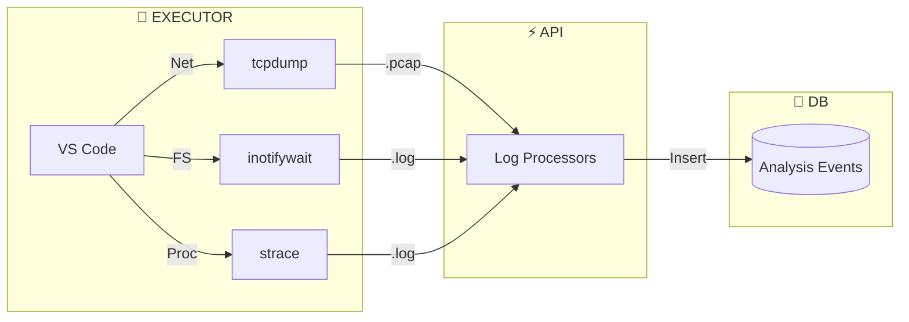

1. **Capture:** Raw events are streamed to the `/results` volume.
2. **Ingest:** The API service monitors the output directory for completed analysis runs.
3. **Process:** Log processors parse raw output (PCAP, text) into structured behavioral events.
4. **Store:** Events are persisted in PostgreSQL, linked to the `analysis_runs` table.

### 3. Targeted Single-Scan Workflow

**Decision:** Filesystem scanning is linear and synchronous.
**Reasoning:** The intended workflow is to analyze specific, high-risk extensions one by one or in small batches. The classic "O(N) scanning problem" is mitigated by the operational usage pattern (targeted audits vs. bulk ingestion).

### 4. Xvfb-First Dynamic Analysis

**Decision:** Use Xvfb (virtual display) for all dynamic analysis — full GUI execution only.
**Reasoning:** VS Code extensions require a running Extension Host process to activate, which needs a full GUI instance. Xvfb provides this with low overhead and a single stack for broad activation-event testing. The current Playwright baseline focuses on common/high-value events and is extended incrementally.

<br>

---

<br>

## 🏛️ High-Level Architecture

> [!IMPORTANT]
> ExTrace follows a **strict layered architecture** ensuring separation of concerns and maintainability.

<br>

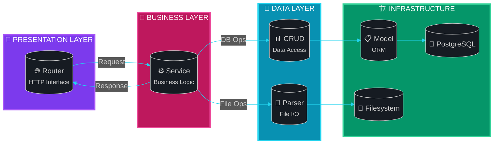

<br>

---

<br>

## 📊 Layered Architecture

<br>

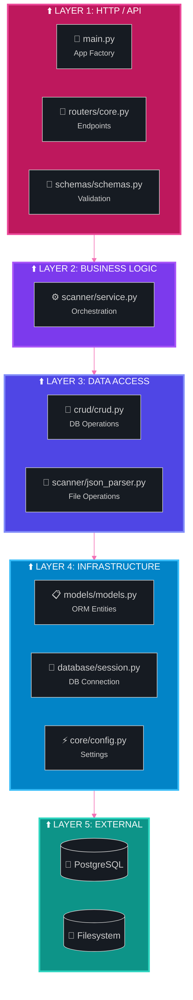

<br>

---

<br>

## 🔗 Module Dependencies

<br>

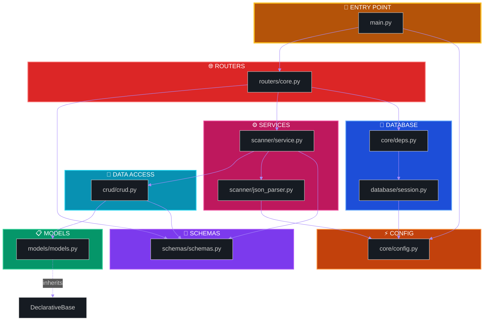

<br>

---

<br>

## 🔄 Request Flow

<br>

### 📤 Create Extension Flow

<details>
<summary><strong>🔽 Click to expand sequence diagram</strong></summary>

<br>

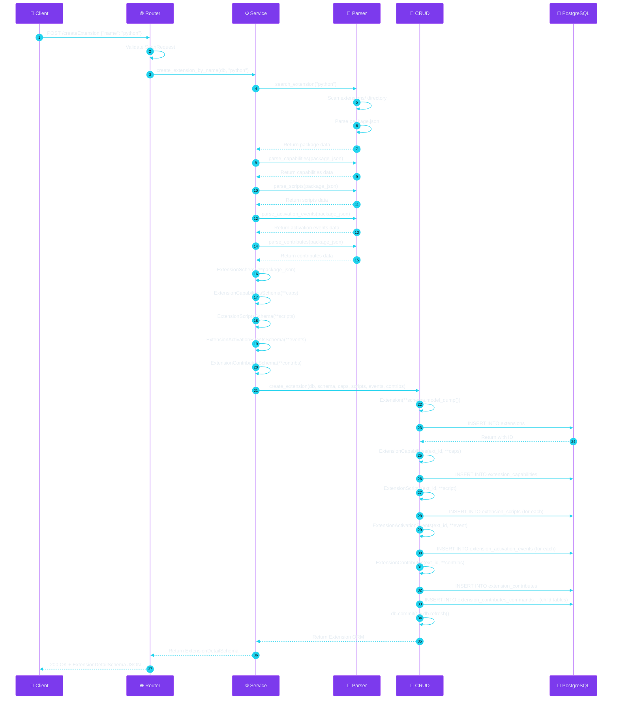

</details>

<br>

### 🔍 Search Extension Flow

<details>
<summary><strong>🔽 Click to expand sequence diagram</strong></summary>

<br>

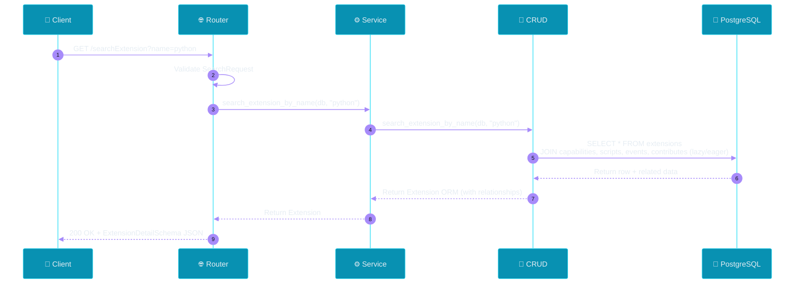

</details>

<br>

### 🗑️ Delete Extension Flow

<details>
<summary><strong>🔽 Click to expand sequence diagram</strong></summary>

<br>

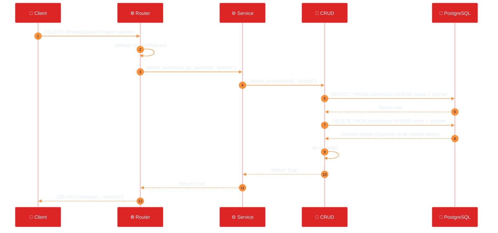

</details>

<br>

---

<br>

## 🗃️ Database Schema

<br>

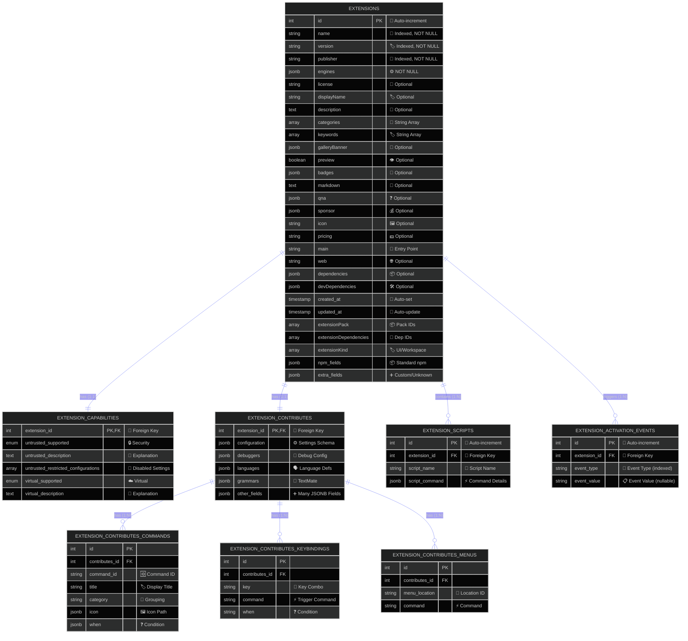

<br>

### 🔒 Constraints & Indexes

<br>

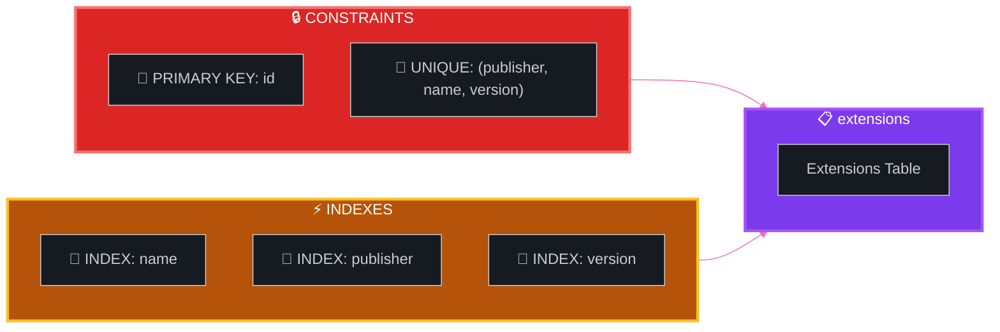

<br>

---

<br>

## 🐳 Docker Infrastructure

<br>

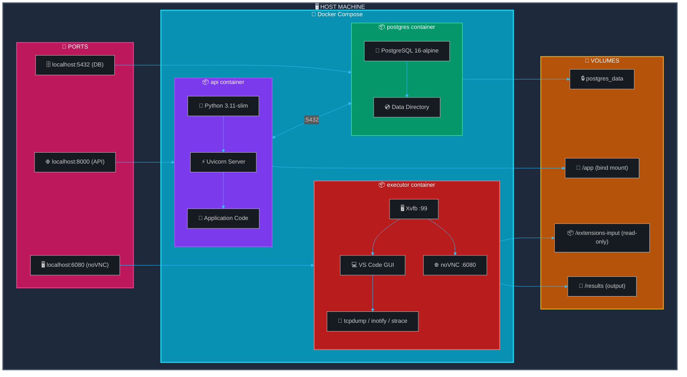

<br>

### 📦 Container Details

<br>

<table>
<tr>
<td width="50%">

#### 🔮 API Container

| Property | Value |
|:---------|:------|
| **Base Image** | `python:3.11-slim-bookworm` |
| **User** | `appuser` (non-root) |
| **Port** | `8000 (default, override with API_PORT)` |
| **Command** | `uvicorn main:app` |

</td>
<td width="50%">

#### 🐘 Database Container

| Property | Value |
|:---------|:------|
| **Base Image** | `postgres:16-alpine` |
| **Port** | `5432 → 5432 (default, override with POSTGRES_PORT)` |
| **Healthcheck** | `pg_isready` |
| **Volume** | `postgres_data` |

</td>
</tr>
<tr>
<td colspan="2">

#### 🔬 Executor Container

| Property | Value |
|:---------|:------|
| **Base Image** | `ubuntu:22.04` |
| **User** | `executor` (non-root) |
| **Port** | `6080 (noVNC, override with EXECUTOR_NOVNC_PORT)` |
| **Display** | `Xvfb :99 (1920x1080x24)` |
| **Window Manager** | `openbox` |
| **VNC** | `x11vnc → noVNC (browser access)` |
| **VS Code** | Full GUI, `--no-sandbox` + CDP (`--remote-debugging-port`) |
| **Monitoring** | `tcpdump`, `tshark`, `inotifywait`, `strace` |
| **Capabilities** | `NET_RAW`, `SYS_PTRACE` |
| **Resources** | 4GB RAM, 2 CPUs |
| **Volumes** | `./extensions:/extensions-input:ro`, `./output:/results` |

</td>
</tr>
</table>

<br>

---

<br>

## ⚙️ Configuration Flow

<br>

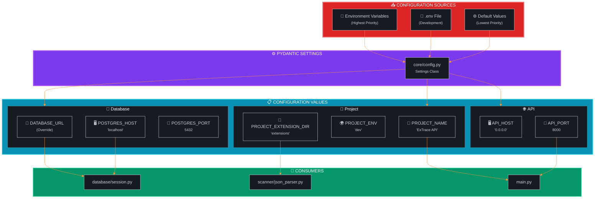

<br>

---

<br>

## 📁 File Structure

<br>

```text
📂 automation_enviroment/
│
├── 📄 main.py                    # 🚀 Application entry point
├── 🐳 docker-compose.yml         # 📦 Container orchestration
├── 🧰 Makefile                   # Dev/test/lint commands
├── 📋 alembic.ini                # 🔄 Migration configuration
├── 🔐 .env                       # 🔒 Environment variables
│
├── 📁 core/                      # ⚡ Core configuration
│   ├── ⚙️ config.py              # Settings management
│   └── 💉 deps.py                # Dependency injection
│
├── 📁 database/                  # 🔌 Database layer
│   └── 🔗 session.py             # Session factory
│
├── 📁 models/                    # 📋 ORM models
│   └── 🗃️ models.py              # SQLAlchemy entities
│
├── 📁 schemas/                   # 📝 Pydantic schemas
│   └── ✅ schemas.py             # Request/Response validation
│
├── 📁 crud/                      # 💾 Data access
│   └── 🔍 crud.py                # CRUD operations
│
├── 📁 routers/                   # 🌐 API routes
│   ├── 🛤️ core.py                # Main endpoints
│   ├── 🐳 Dockerfile             # API container config
│   └── 📦 requirements.txt       # Python dependencies
│
├── 📁 scanner/                   # ⚙️ Business logic
│   ├── 🎯 service.py             # Service orchestration
│   └── 📄 json_parser.py         # File parsing utilities
│
├── 📁 alembic/                   # 🔄 Migrations
│   ├── 🌍 env.py                 # Migration environment
│   └── 📁 versions/              # Migration scripts
│
├── 📁 executor/                  # 🔬 Dynamic analysis
│   ├── 🐳 Dockerfile             # Ubuntu 22.04 + VS Code + Xvfb + monitoring
│   ├── 🚀 start.sh              # Entrypoint: Xvfb, openbox, VNC, noVNC
│   └── 📄 __init__.py           # Package init
│
├── 📁 documents/                 # 📚 Architecture, testing, reviews
│   └── ...
│
├── 📁 extensions/                # 📦 Extension storage (mounted read-only in executor)
│   └── 📂 publisher.ext-1.0.0/   # Unpacked extensions
│
└── 📁 output/                    # 📁 Analysis results (mounted in executor as /results)
```

<br>

---

<br>

## 📜 Architectural Rules

<br>

### ✅ Allowed Dependencies

<br>

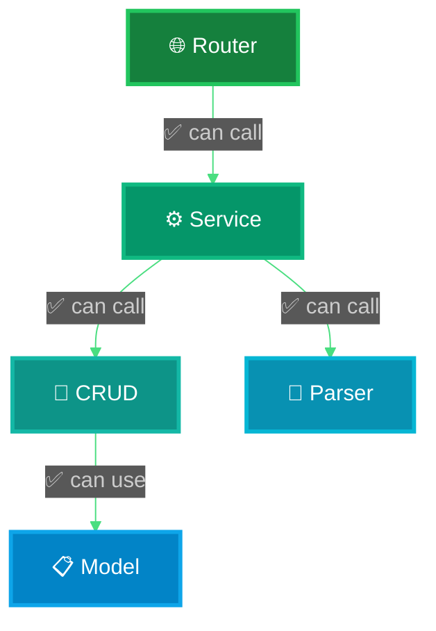

<br>

### ❌ Forbidden Dependencies

> [!CAUTION]
> The following dependencies are **strictly prohibited** to maintain clean architecture.

<br>

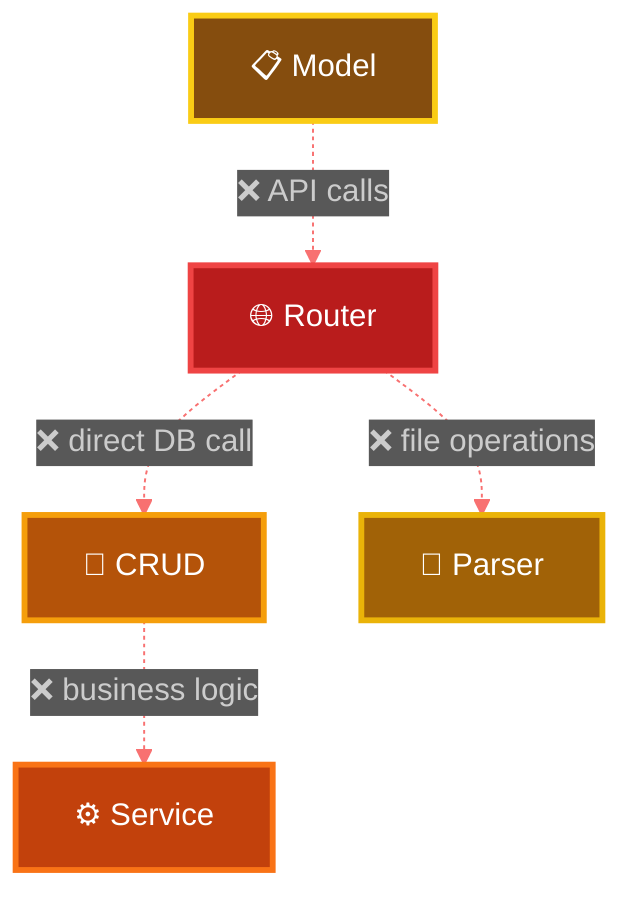

<br>

### 📊 Responsibility Matrix

<br>

| Component | HTTP | Business Logic | DB Operations | File I/O | Validation |
|:----------|:----:|:--------------:|:-------------:|:--------:|:----------:|
| **🌐 Router** | ✅ | ❌ | ❌ | ❌ | ✅ `request` |
| **⚙️ Service** | ❌ | ✅ | ❌ `via CRUD` | ❌ `via Parser` | ✅ `business` |
| **💾 CRUD** | ❌ | ❌ | ✅ | ❌ | ❌ |
| **📄 Parser** | ❌ | ❌ | ❌ | ✅ | ❌ |
| **📋 Model** | ❌ | ❌ | ✅ `schema` | ❌ | ❌ |

<br>

---

<br>

## 🔮 Future Architecture

> [!TIP]
> Planned enhancements for the ExTrace security analysis platform.

<br>

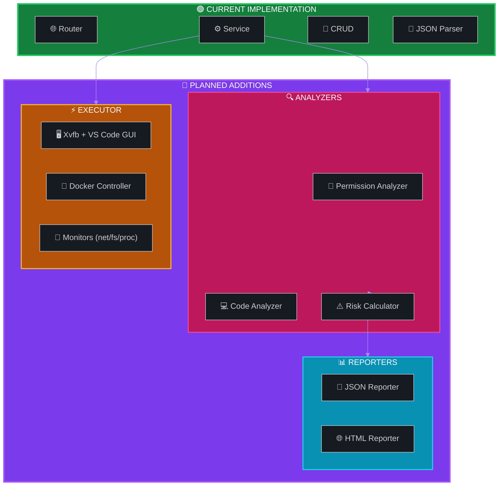

<br>

---

<br>

## 📋 Quick Reference

<br>

### 🌐 Endpoint Summary

<br>

| Method | Endpoint | Query Params | Handler | Service Function |
|:------:|:---------|:-------------|:--------|:-----------------|
| 🟢 `GET` | `/` | — | `read_root()` | — |
| 🟢 `GET` | `/health` | — | `health_check()` | — |
| 🔵 `GET` | `/searchExtension` | `name`, `publisher?`, `version?` | `search_extension()` | `search_extension_by_name()` |
| 🔵 `GET` | `/getExtensionsBaseInfo` | — | `get_extensions_base_info()` | `get_all_extensions_basic()` |
| 🔵 `GET` | `/getExtensionsAllInfo` | `skip?`, `limit?` | `get_extensions_all_info()` | `get_all_extensions_all()` |
| 🟣 `POST` | `/createExtension` | — | `create_extension()` | `create_extension_by_name()` |
| 🔴 `DELETE` | `/deleteExtension` | `name`, `publisher?`, `version?` | `delete_extension()` | `delete_extension_by_name()` |
| 🔵 `GET` | `/getExtensionScripts` | `name`, `publisher?`, `version?` | `get_extension_scripts()` | `get_extension_scripts()` |
| 🔵 `GET` | `/getExtensionActivationEvents` | `name`, `publisher?`, `version?` | `get_extension_activation_events()` | `get_extension_activation_events()` |
| 🔵 `GET` | `/getExtensionCapabilities` | `name`, `publisher?`, `version?` | `get_extension_capabilities()` | `get_extension_capabilites()` |
| 🔵 `GET` | `/getExtensionContributesAll` | `name`, `publisher?`, `version?` | `get_extension_contributes_all()` | `get_extension_contributes_all()` |
| 🔵 `GET` | `/getExtensionContributesCommands` | `name`, `publisher?`, `version?` | `get_extension_contributes_commands()` | `get_extension_contributes_commands()` |

<br>

### 🛠️ Technology Stack

<br>

| Component | Technology | Version | Status |
|:----------|:-----------|:-------:|:------:|
| **⚡ Framework** | FastAPI | `≥0.100.0` | 🟢 Active |
| **🚀 Server** | Uvicorn | `≥0.20.0` | 🟢 Active |
| **🗃️ ORM** | SQLAlchemy | `≥2.0.0` | 🟢 Active |
| **🔄 Migrations** | Alembic | `≥1.10.0` | 🟢 Active |
| **✅ Validation** | Pydantic | `≥2.0.0` | 🟢 Active |
| **🐘 Database** | PostgreSQL | `16` | 🟢 Active |
| **🐳 Container** | Docker Compose | `—` | 🟢 Active |
| **🐍 Python** | CPython | `3.11` | 🟢 Active |
| **🎭 Playwright** | Playwright for Python | `latest` | 🟢 Active |
| **🖥️ Xvfb** | Virtual Framebuffer | `—` | 🟢 Active |
| **🔌 noVNC** | Browser VNC Client | `—` | 🟢 Active |

<br>

---

<br>

## 🎭 Executor: Playwright UI Automation

> [!NOTE]
> Full documentation: [`documents/EXECUTOR_PLAYWRIGHT.md`](EXECUTOR_PLAYWRIGHT.md)

The executor container runs VS Code with a virtual display (Xvfb) and provides Playwright-based UI automation for triggering extension activation events.

<br>

### Container Startup Flow

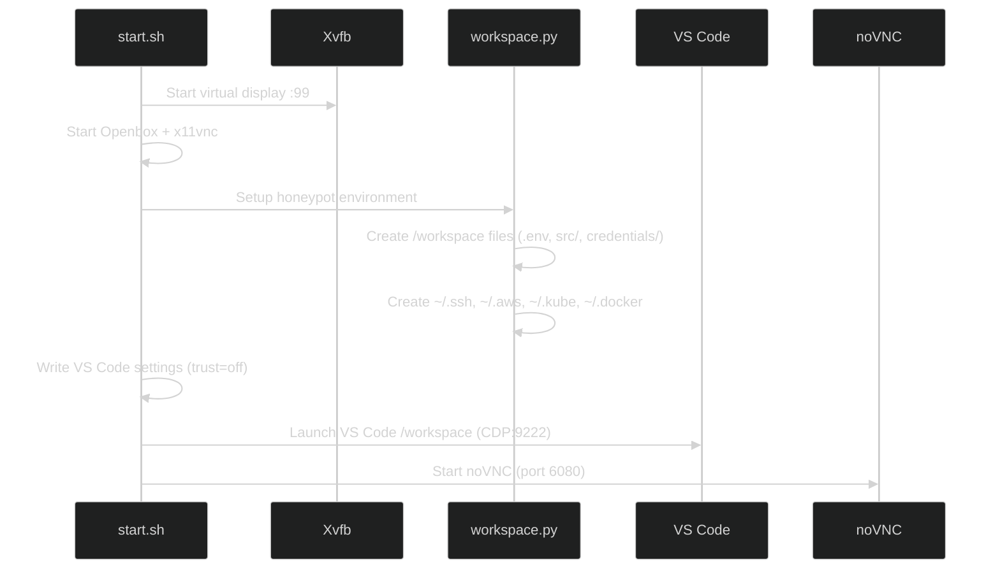

<br>

### Playwright Module Architecture

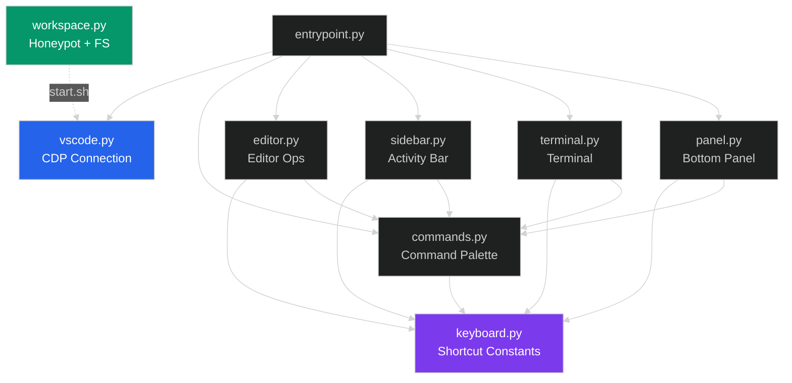

<br>

### Honeypot Coverage

| Target | Location | Files |
|:-------|:---------|:------|
| **Environment** | `/workspace/` | `.env`, `.env.production`, `.env.local` |
| **SSH** | `~/.ssh/` | `id_rsa` (600), `id_rsa.pub`, `config` |
| **AWS** | `~/.aws/` | `credentials`, `config` |
| **Kubernetes** | `~/.kube/` | `config` (cluster token) |
| **Docker** | `~/.docker/` | `config.json` (registry auth) |
| **GCP/Firebase** | `/workspace/credentials/` | Service account JSONs |
| **Git** | `~/` | `.gitconfig`, `.git-credentials` |
| **NPM** | `~/` | `.npmrc` (auth tokens) |
| **Source Code** | `/workspace/src/` | Hardcoded secrets in Python |
| **Infra** | `/workspace/infra/` | Terraform vars, docker-compose |
| **Shell History** | `~/` | `.bash_history`, `.python_history` |
| **Crypto** | `/workspace/.wallet/` | Ethereum keystore |

<br>

---

<br>

<div align="center">

### 📝 Documentation Notice

<br>

> *This document should be updated when significant architectural changes are made.*

<br>

**Made with 💜 for VS Code Extension Security**

<br>


</div>
