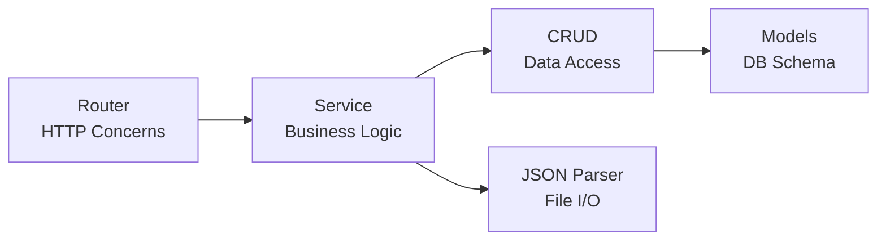

# 🔍 ExTrace: Comprehensive Architectural Audit & Code Review

> **Senior Principal Software Architect & Cybersecurity Engineering Assessment**  
> **Date**: 2025-12-20 (Updated: 2026-02-16)  
> **Scope**: VS Code Extension Security Scanner + Dynamic Analysis Engine

---

## Executive Summary

| Aspect | Rating | Assessment |
|--------|--------|------------|
| **Architecture** | ⭐⭐⭐⭐ | Well-structured layered architecture with clear separation of concerns |
| **Code Quality** | ⭐⭐⭐⭐ | Excellent documentation, PEP 8 compliant, strong type hints |
| **Robustness** | ⭐⭐⭐ | Good foundation but some error handling gaps |
| **Security** | ⭐⭐⭐ | No critical vulnerabilities, but improvements needed for production |
| **Maintainability** | ⭐⭐⭐⭐⭐ | Exceptional documentation and modular design |

### Overall Verdict

**The codebase is well-architected and demonstrates mature engineering practices.** The project shows excellent adherence to SOLID principles, clean layered architecture, and professional documentation. The concerns about "spaghetti code" are **unfounded** — the current structure is maintainable and scalable.

> [!TIP]
> Since this audit (Dec 2025), the executor system has been significantly developed: 15+ Playwright automation modules, 10 user behavior simulation scenarios, Extension Host monitoring, and a comprehensive honeypot environment are now operational. The recommendations below are partially addressed — logging and error handling improvements remain outstanding.

---

## 1. Architecture & Design Patterns (SOLID Analysis)

### ✅ What's Working Well

#### Single Responsibility Principle (SRP) - **EXCELLENT**



Each layer has a clear, focused responsibility:

- [routers/core.py](../routers/core.py): HTTP handling, request validation, error codes
- [scanner/service.py](../scanner/service.py): Business orchestration, workflow coordination
- [crud/crud.py](../crud/crud.py): Pure data access, no business logic
- [scanner/json_parser.py](../scanner/json_parser.py): File I/O operations

#### Open/Closed Principle (OCP) - **GOOD**

The configuration system in [core/config.py](../core/config.py) is extensible:

```python
class Settings(BaseSettings):
    project: ProjectSettings = ProjectSettings()
    api: APISettings = APISettings()
    db: DatabaseSettings = DatabaseSettings()
    # Easy to add: sandbox: SandboxSettings = SandboxSettings()
```

#### Dependency Inversion Principle (DIP) - **EXCELLENT**

The [core/deps.py](../core/deps.py) provides proper DI for database sessions:

```python
def get_db() -> Generator:
    db = SessionLocal()
    try:
        yield db
    finally:
        db.close()
```

### ⚠️ Areas Needing Attention

#### 1. Missing Abstraction Layer for Scanner

**Current State**: `json_parser.py` directly accesses filesystem, making it hard to test and extend.

**Recommendation**: Introduce a Scanner Protocol/Abstract Base Class for different extension sources.

```python
# scanner/protocols.py (NEW)
from abc import ABC, abstractmethod
from typing import Any

class ExtensionSource(ABC):
    """Abstract interface for extension data sources."""

    @abstractmethod
    def search(self, extension_name: str) -> dict[str, Any] | None:
        """Search for extension by name."""
        pass

    @abstractmethod
    def list_all(self) -> list[str]:
        """List all available extensions."""
        pass

class FilesystemSource(ExtensionSource):
    """Filesystem-based extension source."""

    def __init__(self, extension_dir: str):
        self.extension_dir = Path(extension_dir)

    def search(self, extension_name: str) -> dict[str, Any] | None:
        # Current json_parser logic
        ...

class MarketplaceSource(ExtensionSource):
    """VS Code Marketplace API source (future)."""
    ...
```

#### 2. Coupling Between Service and CRUD

The service layer directly imports CRUD functions. Consider injecting them for better testability.

---

## 2. Code Quality & Clean Code

### ✅ Strengths

| Aspect | Status | Notes |
|--------|--------|-------|
| **PEP 8** | ✅ Excellent | Ruff enforced, 88-char lines |
| **Type Hints** | ✅ Comprehensive | Full coverage with SQLAlchemy 2.0 `Mapped[]` |
| **Documentation** | ✅ Outstanding | Near-perfect docstrings with examples |
| **Naming** | ✅ Consistent | Clear, descriptive names throughout |
| **Import Organization** | ✅ Clean | isort configured, logical grouping |

### ⚠️ Code Smells Identified

#### 1. Generic Exception Handling in Router

**Location**: [routers/core.py](../routers/core.py) (lines 211-215, 275-278)

**Issue**: Catching bare `Exception` masks specific error types.

**Before**:

```python
except Exception as e:
    raise HTTPException(
        status_code=500, detail=f"Internal Server Error: {e!s}"
    ) from e
```

**After** (Recommended):

```python
except SQLAlchemyError as e:
    logger.error(f"Database error: {e}", exc_info=True)
    raise HTTPException(status_code=503, detail="Database unavailable") from e
except ValidationError as e:
    raise HTTPException(status_code=422, detail=str(e)) from e
except Exception as e:
    logger.exception(f"Unexpected error: {e}")
    raise HTTPException(status_code=500, detail="Internal server error") from e
```

#### 2. Silent Error Swallowing in JSON Parser

**Location**: [scanner/json_parser.py:96-102](../scanner/json_parser.py#L96-L102)

**Issue**: All exceptions silently return `None`, making debugging difficult.

**Before**:

```python
try:
    with open(json_path, encoding="utf-8") as file:
        return json.load(file)
except Exception:
    return None
```

**After** (Recommended):

```python
import logging

logger = logging.getLogger(__name__)

def parse_json_file(json_path: Path) -> dict[str, Any] | None:
    try:
        with open(json_path, encoding="utf-8") as file:
            return json.load(file)
    except FileNotFoundError:
        logger.debug(f"File not found: {json_path}")
        return None
    except json.JSONDecodeError as e:
        logger.warning(f"Malformed JSON in {json_path}: {e}")
        return None
    except PermissionError as e:
        logger.error(f"Permission denied reading {json_path}: {e}")
        return None
```

#### 3. Magic String in Router

**Location**: [routers/core.py:103-108](../routers/core.py#L103-L108)

**Issue**: Hardcoded project metadata not synced with `settings`.

**Before**:

```python
return {
    "Project": "Extrace",
    "Version": "0.1",
    "Status": "Active",
    "Docs": "/docs",
}
```

**After**:

```python
return {
    "Project": settings.project.NAME,
    "Version": settings.project.VERSION,
    "Status": "Active",
    "Docs": "/docs",
}
```

---

## 3. Robustness & Observability

### ⚠️ Critical Gap: No Structured Logging

**Current State**: No logging implementation exists. Comments mention "consider using proper logging framework".

**Recommendation**: Implement structured JSON logging for forensic analysis.

```python
# core/logging.py (NEW)
import logging
import json
from datetime import datetime

class JSONFormatter(logging.Formatter):
    """JSON formatter for structured logging."""

    def format(self, record):
        log_entry = {
            "timestamp": datetime.utcnow().isoformat(),
            "level": record.levelname,
            "logger": record.name,
            "message": record.getMessage(),
            "module": record.module,
            "function": record.funcName,
            "line": record.lineno,
        }
        if record.exc_info:
            log_entry["exception"] = self.formatException(record.exc_info)
        return json.dumps(log_entry)

def setup_logging(log_level: str = "INFO"):
    """Configure application logging."""
    handler = logging.StreamHandler()
    handler.setFormatter(JSONFormatter())

    root_logger = logging.getLogger()
    root_logger.addHandler(handler)
    root_logger.setLevel(log_level)

    # Suppress noisy libraries
    logging.getLogger("uvicorn.access").setLevel(logging.WARNING)
```

### ✅ Resource Management - GOOD

Database sessions properly managed via generator pattern in `get_db()`. Connection pooling configured in [database/session.py](../database/session.py).

### ⚠️ Missing Health Check Depth

**Location**: [routers/core.py:111-138](../routers/core.py#L111-L138)

**Current**:

```python
@router.get("/health")
def health_check():
    return {"status": "OK", "service": "Extrace API"}
```

**Recommended**:

```python
@router.get("/health")
def health_check(db: Session = Depends(get_db)):
    """Deep health check including database connectivity."""
    checks = {"api": "ok", "database": "unknown"}

    try:
        db.execute(text("SELECT 1"))
        checks["database"] = "ok"
    except Exception as e:
        checks["database"] = f"error: {e}"

    is_healthy = all(v == "ok" for v in checks.values())

    if not is_healthy:
        raise HTTPException(status_code=503, detail=checks)

    return {"status": "healthy", "checks": checks}
```

---

## 4. Security Best Practices

### ✅ No Critical Vulnerabilities Found

| Check | Status | Notes |
|-------|--------|-------|
| SQL Injection | ✅ Safe | Using SQLAlchemy ORM, no raw SQL |
| Command Injection | ✅ Safe | No shell commands, no subprocess |
| Path Traversal | ✅ Safe | Using `Path` objects, confined to `extensions/` |
| Secrets in Code | ✅ Clean | All secrets from env vars |
| Dependency Security | ✅ Good | Bandit configured in CI |

### ⚠️ Recommendations for Production Hardening

#### 1. Sandbox Isolation Not Yet Implemented

As the project shifts to dynamic analysis, ensure the sandboxing layer is hardened:

> [!IMPORTANT]
> When implementing Docker-based sandboxing, ensure:
>
> - Use `--read-only` container flag
> - Drop all capabilities: `--cap-drop=ALL`
> - Use seccomp profiles
> - Network isolation: `--network=none` or custom bridge
> - Resource limits: `--memory`, `--cpus`

#### 2. API Rate Limiting Missing

Add rate limiting before public deployment:

```python
# main.py
from slowapi import Limiter
from slowapi.util import get_remote_address

limiter = Limiter(key_func=get_remote_address)
app.state.limiter = limiter

@router.post("/createExtension")
@limiter.limit("10/minute")
def create_extension(...):
    ...
```

#### 3. Input Validation Enhancement

Extension names should be validated to prevent abuse:

```python
# schemas/schemas.py
import re

class ScanRequest(BaseModel):
    name: str = Field(
        ...,
        min_length=1,
        max_length=214,  # npm package name limit
        pattern=r'^[a-zA-Z0-9][-a-zA-Z0-9._]*$',
        description="Extension name to create/scan.",
    )
```

---

## Next Steps Checklist

### Immediate (Before Next Sprint)

- [ ] Add structured logging with JSON formatter
- [ ] Fix generic exception catching in routers
- [ ] Add specific exception handling in `json_parser.py`
- [ ] Sync root endpoint with `settings` values
- [ ] Enhance `/health` endpoint with database check

### Short-Term (Next 2-4 Weeks)

- [ ] Implement `ExtensionSource` protocol for testability
- [ ] Add rate limiting middleware
- [ ] Create security-focused input validation
- [ ] Add request/response logging middleware
- [ ] Implement pagination for list endpoints

### Long-Term (For Dynamic Analysis Phase)

- [x] Design Docker sandbox orchestration layer (executor/Dockerfile + start.sh)
- [ ] Implement network traffic capture (tcpdump wrapper planned)
- [ ] Add filesystem monitoring hooks (inotifywait wrapper planned)
- [x] Create behavior analysis pipeline (Playwright automation + Extension Host monitoring)
- [ ] Implement malware signature detection

---

## Verification Performed

| Check | Command | Result |
|-------|---------|--------|
| Lint | `make lint-check` | ✅ Available |
| Type Check | `make typecheck` | ✅ Available |
| Security Scan | `make security` | ✅ Available |
| Tests | `make test-local` | ✅ Available |
| All Checks | `make check-all` | ✅ Available |

---

## Appendix: Files Reviewed

| File | Lines | Assessment |
|------|-------|------------|
| [main.py](../main.py) | 155 | Excellent factory pattern |
| [core/config.py](../core/config.py) | 137 | Well-modularized settings |
| [core/deps.py](../core/deps.py) | 153 | Proper DI implementation |
| [crud/crud.py](../crud/crud.py) | 357 | Clean SQLAlchemy 2.0 queries |
| [scanner/service.py](../scanner/service.py) | 295 | Good orchestration layer |
| [scanner/json_parser.py](../scanner/json_parser.py) | 373 | Needs logging improvements |
| [models/models.py](../models/models.py) | 514 | Excellent SQLAlchemy 2.0 migration |
| [schemas/schemas.py](../schemas/schemas.py) | 379 | Comprehensive Pydantic v2 usage |
| [routers/core.py](../routers/core.py) | 474 | Good, needs exception refinement |
| [database/session.py](../database/session.py) | 154 | Proper pool configuration |
| [tests/conftest.py](../tests/conftest.py) | 173 | Good PostgreSQL test isolation |
| [pyproject.toml](../pyproject.toml) | 184 | Modern Python tooling |
| [docker-compose.yml](../docker-compose.yml) | 99 | Clean, env-var driven, 4 services |
| [Makefile](../Makefile) | 219 | Excellent DX commands |
| [executor/Dockerfile](../executor/Dockerfile) | ~90 | Ubuntu 22.04 + VS Code + Xvfb (added Feb 2026) |
| [executor/playwright/*](../executor/playwright) | ~1500 | 15+ modular automation helpers (added Feb 2026) |
