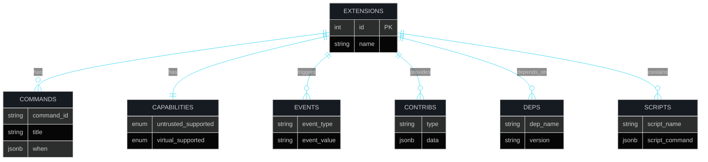
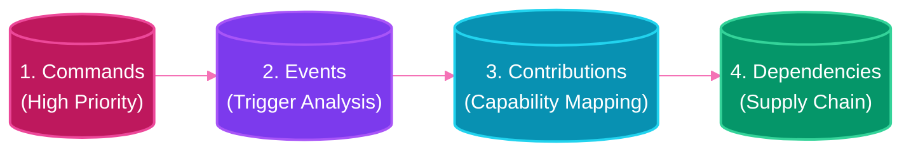

# 🎯 ExTrace - Development Priorities

 

**Roadmap & Implementation Strategy**

 

 

---

`Current Sprint: Identity & Deep Parsing` • `Next: Risk Analysis`

---

 

## 📌 Current Focus: Extension Identity

> [!IMPORTANT]
> The immediate priority is building **comprehensive parsers** to extract the complete identity and behavioral fingerprint of VS Code extensions. Analysis and risk scoring will follow in subsequent sprints.

 

---

 

## 🚀 Phase 1: Deep Parsing

### 1.1 Manifest Parser Enhancement

**Goal:** Extract every field from `package.json` that reveals extension behavior.

| Field Category | Fields to Parse | Purpose | Status |
|:---------------|:----------------|:--------|:-------|
| **Identity** | `name`, `publisher`, `version`, `displayName` | Unique extension identification | ✅ Done |
| **Permissions** | `activationEvents`, `contributes` | What triggers the extension | 🚧 In Progress |
| **Entry Points** | `main`, `browser`, `web` | Code execution locations | ✅ Done |
| **Dependencies** | `dependencies`, `devDependencies`, `extensionDependencies` | Supply chain mapping | ⏳ Pending |
| **Capabilities** | `capabilities`, `extensionKind` | Extension type classification | ✅ Done |
| **Scripts** | `scripts` | npm scripts parsing | ✅ Done |
| **Repository** | `repository`, `homepage`, `bugs` | Source verification | ⏳ Pending |

 

### 1.2 Database Schema Expansion

 

### 1.3 Activation Event Analysis

**Goal:** Understand when and why an extension activates.

| Event Type | Risk Level | Description |
|:-----------|:-----------|:------------|
| `*` | 🔴 **High** | Always active (potential performance/security impact) |
| `onStartupFinished` | 🟡 **Medium** | Runs at VS Code startup |
| `onUri` | 🟡 **Medium** | Can be triggered externally |
| `onFileSystem:*` | 🟡 **Medium** | File access triggers |
| `onCommand:*` | 🟢 **Low** | Only on explicit user action |
| `onLanguage:*` | 🟢 **Low** | When opening specific file types |

 

### 1.4 Contribution Point Mapping

**Goal:** Map all extension contributions to understand capabilities.

<strong>📋 View Contribution Types</strong>

- `languages` - Language support declarations
- `grammars` - Syntax highlighting
- `themes` - Color themes
- `snippets` - Code snippets
- `views` - Custom views/panels
- `viewsContainers` - View containers
- `configuration` - Settings contributions
- `configurationDefaults` - Default settings
- `taskDefinitions` - Task types
- `problemMatchers` - Error patterns
- `debuggers` - Debug adapters
- `breakpoints` - Breakpoint types
- `terminal` - Terminal profiles
- `walkthroughs` - Onboarding flows

 

---

 

## 🔮 Phase 2: Analysis (Future)

> [!WARNING]
> This phase begins **AFTER** Phase 1 completion.

1.  **Risk Scoring Engine**
    *   Pattern-based risk detection
    *   Permission analysis
    *   Behavioral classification

2.  **Code Analysis**
    *   JavaScript/TypeScript static analysis
    *   API call detection
    *   Network request patterns

3.  **Comparison & Diff**
    *   Version comparison
    *   Regression identification

 

---

 

## 📋 Implementation Tasks

### 🗄️ Database Tasks
- [ ] Create `extension_activation_events` table
- [ ] Create `extension_commands` table
- [ ] Create `extension_contributions` table
- [ ] Create `extension_dependencies` table
- [ ] Generate Alembic migrations
- [ ] Update SQLAlchemy models

### ⚙️ Parser Tasks
- [ ] Create `manifest_parser.py` - Full package.json parsing
- [ ] Create `activation_parser.py` - Activation event extraction
- [ ] Create `command_parser.py` - Command detection
- [ ] Create `contribution_parser.py` - Contribution point mapping
- [ ] Create `dependency_parser.py` - Dependency analysis

### 🔄 Service & Schema Tasks
- [ ] Update `service.py` with new parsers
- [ ] Create CRUD functions for new tables
- [ ] Add API endpoints for querying parsed data
- [ ] Create Pydantic schemas for new data structures

 

---

 

## 🚦 Implementation Order

 

---

 

## ✅ Success Criteria

Phase 1 is complete when:
- ✅ All new database tables created and migrated
- ✅ Parsers extract all specified data from package.json
- ✅ API endpoints expose parsed data
- ✅ Test coverage for all parsers
- ✅ Sample extensions fully parsed and stored

  <strong>Phase 1 Target: Q1 2026</strong>

