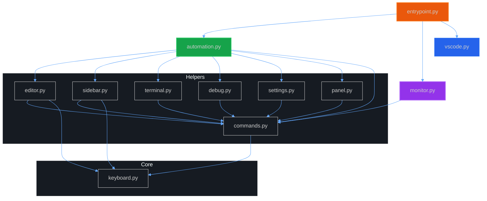
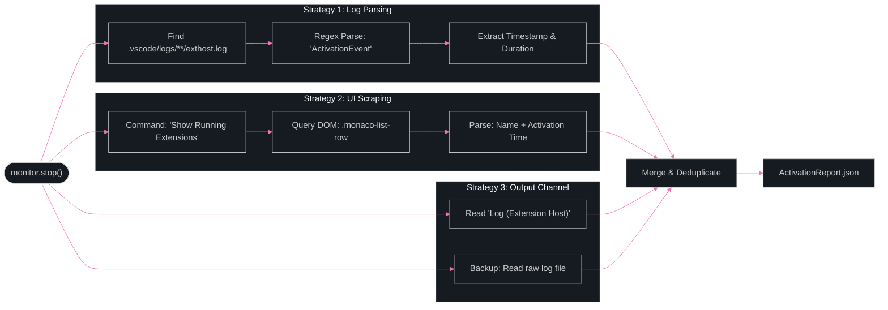

# Executor: Playwright UI Automation & Honeypot Environment

`Last Updated: 2026-02-19 (v3)` | `Status: Active Development`

---

## Overview

A modular system inside the executor container that controls VS Code GUI via Playwright CDP (Chrome DevTools Protocol). Each module has a single responsibility, is function-based (no classes), stateless, and composable.

Additionally, a realistic **honeypot developer environment** is automatically set up when the container starts, designed to attract malicious extensions scanning for secrets.

---

## File Structure

```text
executor/
├── Dockerfile                # Ubuntu 22.04 + VS Code + monitoring tools
├── start.sh                  # Container entrypoint (Xvfb, VNC, VS Code, honeypot)
├── requirements.txt          # Python dependencies (playwright)
├── __init__.py
└── playwright/
    ├── __init__.py            # Package docstring
    ├── keyboard.py            # VS Code shortcut constants (single source of truth)
    ├── vscode.py              # CDP connection, ready wait
    ├── commands.py            # Command Palette operations
    ├── editor.py              # Editor: open/save/close/type + notification dismiss
    ├── sidebar.py             # Activity Bar and sidebar views
    ├── terminal.py            # Integrated terminal
    ├── panel.py               # Bottom panel: problems, output, debug console
    ├── debug.py               # Debug lifecycle (start/stop/step)          [NEW]
    ├── settings.py            # Settings & theme changes                   [NEW]
    ├── monitor.py             # Extension Host activation monitoring       [NEW]
    ├── automation.py          # User behavior simulation scenarios (10x)   [NEW]
    ├── workspace.py           # Filesystem: honeypot environment + file operations
    ├── language_samples.py    # Multi-language sample files for activation coverage
    └── entrypoint.py          # CLI with --monitor, --scenario, --list, --shuffle
```

---

---

## Architecture Diagrams

### 1. Automation Sequence

High-level execution flow when `entrypoint.py` runs:

```mermaid
%%{init: {'theme': 'dark', 'themeVariables': { 'background': '#0d1117', 'primaryColor': '#22c55e', 'primaryTextColor': '#e6edf3', 'lineColor': '#4ade80', 'mainBkg': '#161b22', 'nodeBkg': '#21262d', 'clusterBkg': '#161b22'}}}%%
sequenceDiagram
    participant CLI as entrypoint.py
    participant VS as vscode.py
    participant MON as monitor.py
    participant AUTO as automation.py
    participant REP as ActivationReport

    CLI->>VS: connect()
    VS-->>CLI: browser, page
    CLI->>VS: wait_until_ready()

    rect rgb(30, 40, 50)
        Note over CLI, MON: Optional Monitoring
        CLI->>MON: ExtensionMonitor(page).start()
    end

    CLI->>AUTO: run_all_scenarios(page)
    loop Every Scenario
        AUTO->>AUTO: run_scenario()
        AUTO->>AUTO: _cleanup_between_scenarios()
    end

    rect rgb(30, 40, 50)
        Note over CLI, MON: Collection Phase
        CLI->>MON: stop()
        MON->>MON: Parse Logs (Strategy 1)
        MON->>MON: Scrape UI (Strategy 2)
        MON->>MON: Read Output (Strategy 3)
        MON-->>CLI: report
        CLI->>REP: save(json_path)
    end

    CLI->>VS: disconnect()
```



### 2. Module Dependencies

Functional dependency graph of the `executor/playwright/` package:



### 3. Monitoring Strategies

The 3-pronged approach to sensing extension activation:



---

## Container Startup Flow

When `start.sh` runs, the following sequence executes:

```text
1. Xvfb :99 (1920x1080x24)     -> Virtual display
2. Openbox                       -> Window manager
3. x11vnc (port 5900)           -> VNC server
4. workspace.py                  -> Honeypot environment setup
5. VS Code settings.json         -> Trust/telemetry disabled
6. VS Code /workspace            -> GUI starts (CDP port 9222, --log trace)
7. noVNC (port 6080)            -> Browser access
8. Symlink latest log dir        -> /home/executor/.vscode/logs/latest
```

VS Code is now started with `--log trace` to enable verbose Extension Host logging
for activation monitoring. Log level is configurable via `EXECUTOR_VSCODE_LOG_LEVEL` env var.

### VS Code Auto-Configuration

`start.sh` writes these settings before VS Code starts:

```json
{
  "security.workspace.trust.enabled": false,
  "workbench.startupEditor": "none",
  "telemetry.telemetryLevel": "off",
  "update.mode": "none"
}
```

This ensures:

- **Workspace Trust dialog** does not appear
- **Welcome tab** does not open
- **Telemetry** is disabled
- **Auto-update** is disabled

VS Code opens `/workspace` directly — no manual selection required.

---

## Module Details

### keyboard.py — Shortcut Constants

All VS Code keyboard shortcuts are defined in one place. Other modules import these constants. If VS Code changes a shortcut, only this file needs updating.

```python
# Examples
COMMAND_PALETTE = "Control+Shift+KeyP"
QUICK_OPEN      = "Control+KeyP"
NEW_FILE        = "Control+KeyN"
SAVE_FILE       = "Control+KeyS"
TOGGLE_TERMINAL = "Control+Backquote"
FOCUS_EXPLORER  = "Control+Shift+KeyE"
```

**Full list:** Command Palette, Quick Open, Editor (new/save/close), Sidebar (explorer/search/scm/debug/extensions), Panel, Terminal, Navigation, Debug lifecycle (F5/Shift+F5/F10/F11), Settings (Ctrl+,), Language server actions (format/definition/suggest/rename), Output/Problems focus, Fullscreen toggle.

---

### vscode.py — CDP Connection

Connects to VS Code via Chrome DevTools Protocol.

| Function | Description |
|----------|-------------|
| `connect(playwright)` | Connects via CDP, returns `(browser, page)` |
| `wait_until_ready(page, timeout_ms)` | Waits until `.monaco-workbench` is visible |
| `disconnect(browser)` | Closes the CDP connection |

```python
from playwright.sync_api import sync_playwright
import vscode

with sync_playwright() as pw:
    browser, page = vscode.connect(pw)
    vscode.wait_until_ready(page)
    # ... operations ...
    vscode.disconnect(browser)
```

**CDP URL:** `http://localhost:9222` (env: `EXECUTOR_CDP_PORT`)

---

### commands.py — Command Palette

Command Palette and Quick Open operations. **Each function presses Enter and waits for the widget to close.**

| Function | Description |
|----------|-------------|
| `open_command_palette(page)` | Opens palette, waits for visibility |
| `run_command(page, command_text)` | Opens palette, types command, presses Enter, **waits for close** |
| `quick_open(page, query)` | Opens Ctrl+P, types query, presses Enter, **waits for close** |

**Important detail:** VS Code doesn't remove `.quick-input-widget` from DOM, it sets `display: none`. A custom CSS selector checks for widget closure:

```python
_QUICK_INPUT_VISIBLE = ".quick-input-widget:not([style*='display: none'])"
```

**Covers:** `onCommand:*` activation events.

---

### editor.py — Editor Operations

Opening, writing, saving, and closing files. Also provides notification toast dismiss helper.

| Function | Description |
|----------|-------------|
| `new_untitled_file(page)` | Opens new empty tab (Ctrl+N) |
| `save_file(page)` | Saves current file (Ctrl+S) |
| `save_file_as(page, filename)` | Saves via Save-As dialog (**xdotool**) |
| `close_active_editor(page)` | Closes active tab (Ctrl+W) |
| `type_in_editor(page, text)` | Types text into editor |
| `open_file_by_name(page, filename)` | Opens file via Quick Open |
| `close_all_editors(page)` | Closes all tabs (Command Palette) |
| `format_document(page)` | Format document (Ctrl+Shift+I) — auto-dismisses "No formatter" popup |
| `go_to_definition(page)` | Go to definition (F12) — triggers language servers |
| `trigger_suggest(page)` | IntelliSense suggestions (Ctrl+Space) — triggers completion |
| `rename_symbol(page, new_name)` | Rename symbol (F2) — triggers rename providers |
| `select_all(page)` | Select all text (Ctrl+A) |
| `_dismiss_notification(page)` | Dismisses VS Code notification toasts (close button or Escape) |

**Notification Toast Handling:** VS Code shows notification dialogs ("No formatter installed", "Find Python extension", etc.) as `.notification-toast` elements. `_dismiss_notification()` tries the close button first, then Cancel, then falls back to Escape. Used by `format_document()`, `_recover_ui_state()`, and `_cleanup_between_scenarios()`.

**Native Dialog Issue:** The `save_file_as` function opens a GTK native file dialog via `Ctrl+Shift+S`. This dialog is outside Playwright's DOM — it's not in the Chromium web page. Therefore `xdotool` is used:

```python
subprocess.run(["xdotool", "key", "ctrl+a"], check=True)      # Select current name
subprocess.run(["xdotool", "type", "--delay", "30", filename]) # Type new name
subprocess.run(["xdotool", "key", "Return"], check=True)       # Save
```

**Covers:** `onLanguage:*`, `onCustomEditor:*` activation events.

---

### sidebar.py — Sidebar & Activity Bar

Opening/closing left sidebar views.

| Function | Description |
|----------|-------------|
| `toggle_sidebar(page)` | Show/hide sidebar (Ctrl+B) |
| `open_explorer(page)` | Explorer view (Ctrl+Shift+E) |
| `open_search(page)` | Search view (Ctrl+Shift+F) |
| `open_source_control(page)` | Source Control (Ctrl+Shift+G) |
| `open_debug(page)` | Run & Debug (Ctrl+Shift+D) |
| `open_extensions_view(page)` | Extensions (Ctrl+Shift+X) |
| `open_view_by_command(page, view_name)` | Any view via Command Palette |

**Covers:** `onView:*` activation events. `open_view_by_command` is used for custom `viewContainers`.

---

### terminal.py — Integrated Terminal

| Function | Description |
|----------|-------------|
| `toggle_terminal(page)` | Show/hide terminal panel |
| `new_terminal(page)` | Create new terminal (keyboard shortcut Ctrl+Shift+`) |
| `new_terminal_via_command(page)` | Create terminal via Command Palette (fallback) |
| `type_in_terminal(page, text, press_enter=True)` | Type in terminal, presses Enter by default |

`press_enter=True` is the default — commands are automatically executed after typing.

---

### panel.py — Bottom Panel

| Function | Description |
|----------|-------------|
| `toggle_panel(page)` | Show/hide bottom panel (Ctrl+J) |
| `focus_problems(page)` | Focus Problems tab (Ctrl+Shift+M keyboard shortcut) |
| `focus_output(page)` | Focus Output tab (Ctrl+Shift+U keyboard shortcut) |
| `open_problems(page)` | Problems tab (Command Palette) |
| `open_output(page)` | Output tab (Command Palette) |
| `open_debug_console(page)` | Debug Console tab |

---

### debug.py — Debug Lifecycle [NEW]

| Function | Description |
|----------|-------------|
| `start_debug(page)` | Start debugging (F5) |
| `stop_debug(page)` | Stop debug session (Shift+F5) |
| `step_over(page)` | Step over current line (F10) |
| `step_into(page)` | Step into function call (F11) |
| `add_breakpoint_via_command(page)` | Toggle breakpoint via Command Palette |
| `create_launch_json(page, debug_type)` | Create launch.json configuration |
| `run_debug_session(page, wait_ms)` | Full debug lifecycle: start → wait → stop |

**Covers:** `onDebug:*`, `onDebugResolve:*`, `onDebugAdapterProtocol:*`

---

### settings.py — Settings & Configuration [NEW]

| Function | Description |
|----------|-------------|
| `open_settings(page)` | Open Settings UI (Ctrl+,) |
| `open_settings_json(page)` | Open settings.json via Command Palette |
| `search_setting(page, query)` | Search in Settings UI |
| `change_theme(page, theme_name)` | Change color theme — waits for quick-input close with timeout fallback |
| `toggle_setting_via_json(page, key, value)` | Insert key-value into settings.json, save, and close file |
| `write_settings_batch(page, settings)` | Write multiple settings in one operation (open once, save once) |
| `toggle_fullscreen(page)` | Toggle fullscreen/zen mode (F11) |

`write_settings_batch()` is more reliable than calling `toggle_setting_via_json()` multiple times — it opens settings.json once, navigates to end for each setting, and saves once.

**Covers:** `onConfiguration:*`, layout change events

---

### monitor.py — Extension Host Activation Monitoring [NEW]

Three strategies to verify extension activations:

**Strategy 1: VS Code log file parsing** (most reliable)

- Finds Extension Host log files under `/home/executor/.vscode/logs/`
- Parses activation events using regex patterns compatible with multiple VS Code versions
- Extracts: extension ID, activation event, timestamp, duration

**Strategy 2: Running Extensions UI snapshot** (via Playwright)

- Opens `Developer: Show Running Extensions` command
- Scrapes the list of active extensions from DOM (`aria-label` for ID, inner text for timing)
- Returns extension ID, display name, and activation time in ms

**Strategy 3: Extension Host log file reading**

- Reads the raw Extension Host log file content
- Provides the full log for detailed post-hoc analysis

| Function / Class | Description |
|----------|-------------|
| `find_exthost_logs()` | Find Extension Host log files (newest first) |
| `parse_activations_from_log(path)` | Parse activation events from a log file |
| `parse_all_exthost_logs()` | Find and parse all log files |
| `get_running_extensions(page)` | Scrape Running Extensions UI via Playwright |
| `read_extension_host_output()` | Read Extension Host log file content |
| `watch_exthost_log(callback, timeout_s)` | Real-time log watching (inotifywait or polling) |
| `check_extension_activated(ext_id, page)` | Quick check if a specific extension is active |
| `ExtensionMonitor(page)` | Context manager: wraps scenarios with monitoring |
| `ActivationReport` | Data class with `.save(path)`, `.print_summary()` |

Usage:

```python
import monitor, automation

mon = monitor.ExtensionMonitor(page)
mon.start()
automation.run_all_scenarios(page)
report = mon.stop()
report.print_summary()
report.save("/results/activation_report.json")
```

---

### automation.py — User Behavior Simulation Scenarios [NEW]

10 scenarios that simulate realistic developer workflows to trigger extension activation events:

| Scenario | Triggers | Status |
|----------|----------|--------|
| `coding_session` | onLanguage, completionProvider, formatterProvider, definitionProvider | ✅ Tested OK |
| `debug_session` | onDebug, onDebugResolve, onDebugAdapterProtocol | ✅ Tested OK |
| `terminal_usage` | onTerminalCreate, shell integration | ✅ Tested OK |
| `git_workflow` | onView:scm, git provider | ✅ Tested OK |
| `extension_browsing` | onView:extensions | ✅ Tested OK |
| `settings_modification` | onConfiguration, layout events | ✅ Tested OK |
| `project_exploration` | onLanguage (15 file types) | ✅ Tested OK |
| `search_workflow` | onView:search, search providers | ✅ Tested OK |
| `diagnostics_check` | diagnostics, linters | ✅ Tested OK |
| `refactor_workflow` | renameProvider, codeActionProvider | ✅ Tested OK |

| Function | Description |
|----------|-------------|
| `run_all_scenarios(page, shuffle)` | Run all 10 scenarios sequentially |
| `run_scenario(page, name, **kwargs)` | Run single scenario by name |
| `list_scenarios()` | Return available scenario names |

**Error recovery:** After any scenario failure, `_recover_ui_state(page)` dismisses stuck dialogs (3x Escape + notification toast dismiss). Between every scenario, `_cleanup_between_scenarios(page)` closes all editors (Ctrl+K Ctrl+W chord), kills all terminals, closes bottom panel, and dismisses notifications.

---

### workspace.py — Filesystem & Honeypot Environment

Has two responsibilities:

1. **General file operations** — `create_workspace_file`, `create_workspace_dir`, `create_language_file`, `create_workspace_structure`, `clean_workspace`
2. **Honeypot developer environment** — `setup_dev_environment()`

**Not dependent on Playwright** — uses pure `pathlib` and `shutil`.

**Automatically run by `start.sh` when container starts.**

```bash
# Inside start.sh, BEFORE VS Code:
python3 /home/executor/playwright/workspace.py
```

---

## Honeypot Developer Environment

The `setup_dev_environment()` function creates files in two locations:

### /workspace/ (Project Directory)

VS Code opens this folder automatically. Project files that extensions would scan:

| File/Folder | Contents |
|-------------|----------|
| `.env` | DATABASE_URL, JWT_SECRET, OPENAI_API_KEY, STRIPE_SECRET_KEY, AWS keys, SENTRY_DSN |
| `.env.production` | Production DB URL, API key |
| `.env.local` | Local dev credentials |
| `.git/config` | GitHub remote URL (SSH) |
| `src/app.py` | Flask application |
| `src/config.py` | Credential reading via `os.environ.get()` |
| `src/database.py` | Hardcoded DB connection string |
| `src/auth.py` | JWT secret, token operations |
| `src/payments.py` | Stripe API key |
| `src/storage.py` | AWS S3 boto3 client |
| `frontend/.env` | React app env (Stripe publishable key, Sentry DSN) |
| `frontend/package.json` | Node.js dependencies |
| `docker-compose.yml` | DB/Redis passwords in plaintext |
| `credentials/gcp-service-account.json` | GCP service account (fake private key) |
| `credentials/firebase-admin-sdk.json` | Firebase admin SDK |
| `infra/terraform.tfvars` | DB password, Redis password, API secret |
| `infra/main.tf` | AWS RDS definition |
| `scripts/deploy.sh` | Docker login token, SSH commands |
| `scripts/seed.py` | Hardcoded DB password |
| `scripts/backup.sh` | pg_dump connection string |
| `.wallet/keystore.json` | Ethereum wallet (fake) |
| `alembic/env.py` | SQLAlchemy URL |
| `requirements.txt` | Python dependencies |
| `Dockerfile` | Production container |
| `README.md` | Project description |

### /home/executor/ (User Profile)

Files accessible by extensions scanning `$HOME` directory:

| File | Contents |
|------|----------|
| `.ssh/id_rsa` | OpenSSH private key (chmod 600) |
| `.ssh/id_rsa.pub` | Public key |
| `.ssh/config` | GitHub + production server |
| `.ssh/known_hosts` | GitHub fingerprint |
| `.aws/credentials` | AWS access key + secret (default & production profiles) |
| `.aws/config` | Region settings |
| `.kube/config` | Kubernetes cluster token |
| `.docker/config.json` | Docker registry auth (ghcr.io, private registry) |
| `.config/gcloud/application_default_credentials.json` | GCP OAuth refresh token |
| `.npmrc` | NPM and GitHub Packages auth tokens |
| `.gitconfig` | Git user info |
| `.git-credentials` | GitHub PAT (plaintext) |
| `.bash_history` | SSH, docker login, kubectl, aws, curl + API key commands |
| `.python_history` | boto3, os.environ accesses |

### Multi-Language Sample Files

For full `onLanguage:*` activation coverage, sample files are created for all supported languages:

| Language | Sample Files |
|----------|--------------|
| TypeScript | `frontend/src/index.ts` |
| Go | `services/api/main.go`, `go.mod` |
| Rust | `services/worker/src/main.rs`, `Cargo.toml` |
| Java | `services/legacy/.../App.java`, `pom.xml` |
| C | `native/parser.c` |
| C++ | `native/engine.cpp` |
| C# | `services/dotnet/Program.cs`, `extrace.sln` |
| Ruby | `scripts/migrate.rb`, `Gemfile` |
| PHP | `legacy/api.php` |
| Swift | `mobile/ios/ExTrace/App.swift` |
| Kotlin | `mobile/android/.../MainActivity.kt` |
| HTML | `frontend/public/index.html` |
| CSS | `frontend/public/styles.css` |
| XML | `config/settings.xml` |

### Design Principles

- All credentials are **fake but correctly formatted** — matches real regex patterns
- AWS keys start with `AKIA...` prefix (real format)
- SSH keys have correct permissions (600/700)
- `.bash_history` contains realistic commands
- File structure reflects a typical startup backend project

---

## Import Strategy

The `executor/playwright/` directory creates a naming conflict with the pip `playwright` package. Solution:

1. **Helper modules** (`commands.py`, `editor.py`, etc.) import each other **directly**: `import keyboard`, `from commands import run_command`
2. **pip `playwright`** package continues to work: `from playwright.sync_api import Page`
3. **`entrypoint.py`** bootstraps by adding its directory to `sys.path`:

   ```python
   _pkg_dir = str(Path(__file__).resolve().parent)
   if _pkg_dir not in sys.path:
       sys.path.insert(0, _pkg_dir)
   ```

4. **`workspace.py`** has no Playwright dependency — run directly by `start.sh` as `python3 /path/to/workspace.py`.

---

## Activation Event Coverage

### Covered Events ✅ (12/25)

| Activation Event | Triggering Module | Method |
|-----------------|-------------------|--------|
| `*` | — | VS Code startup (extensions with wildcard always activate) |
| `onStartupFinished` | — | VS Code startup (lazy extensions post-ready) |
| `onLanguage:*` | `workspace.py` + `editor.py` + `automation.py` | Opens 20+ language files from honeypot |
| `onCommand:*` | `commands.py` | Every Command Palette action across all scenarios |
| `workspaceContains:*` | `workspace.py` | Honeypot creates `package.json`, `Makefile`, `.git`, etc. |
| `onView:*` | `sidebar.py` + `automation.py` | Explorer, SCM, Debug, Extensions, Search sidebar views |
| `onDebug:*` | `debug.py` + `automation.py` | Start/stop debug session (F5/Shift+F5) |
| `onDebugResolve:*` | `debug.py` | Create launch.json, start debug |
| `onDebugInitialConfigurations` | `debug.py` | Debug session launch prompts initial config |
| `onConfiguration:*` | `settings.py` + `automation.py` | Writes 4 real settings to settings.json + theme change |
| `onTerminalShellIntegration:*` | `terminal.py` + `automation.py` | Opens terminal, runs commands |
| `onAuthenticationRequest:*` | — | Automatic (VS Code built-in GitHub auth) |

### Not Covered ❌ — Gap Analysis (13/25)

| Activation Event | Description | Difficulty | Recommendation |
|-----------------|-------------|------------|----------------|
| `onFileSystem:*` | Open via custom FS scheme (ftp://, ssh://) | 🔴 Hard | Requires extension or mock filesystem |
| `onUri` | Open `vscode://extension-id/path` URI | 🟡 Medium | `xdg-open vscode://...` from terminal |
| `onWebviewPanel:*` | Restore a webview panel | 🔴 Hard | Requires webview state from extension |
| `onCustomEditor:*` | Open file with custom editor | 🔴 Hard | Requires extension contribution point |
| `onNotebook` | Open a notebook file | 🟢 Easy | Add `.ipynb` file to honeypot |
| `onSearch` | Custom search provider | 🟡 Medium | Use search sidebar (partially done) |
| `onTaskType` | Run a VS Code task (npm, gulp) | 🟢 Easy | `Terminal > Run Task` via Command Palette |
| `onWalkthrough` | Open an extension walkthrough | 🟢 Easy | Command Palette search |
| `onEditSession` | Edit session continuation | 🔴 Hard | VS Code-specific feature |
| `onChatParticipant` | Chat participant activation | 🔴 Hard | Requires Copilot integration |
| `onDebugDynamicConfigurations` | Dynamic debug config provider | 🟡 Medium | Trigger via debug dropdown |
| `onDebugAdapterProtocolTracker` | DAP tracker activation | 🟡 Medium | Start specific debug type |
| `onLanguageModelTool` | Language model tool activation | 🔴 Hard | Requires AI/Copilot features |

### Coverage Summary

- **Covered:** 12/25 activation events (~48%)
- **Easy to add:** 3 events (`onNotebook`, `onTaskType`, `onWalkthrough`)
- **Medium effort:** 4 events (require specific VS Code interactions)
- **Hard / Extension-specific:** 6 events (require contribution points or external services)

> **Security note:** The 12 covered events represent the **most commonly used** activation triggers. Malicious extensions almost always use `*`, `onStartupFinished`, `onLanguage`, or `onCommand` — all of which are fully covered. The uncovered events (`onFileSystem`, `onWebviewPanel`, `onCustomEditor`, etc.) require extensions to register specific contribution points, making them rare in malware.

---

## Usage

### Starting the Container

```bash
make exec-build         # Build image
make exec-up            # Start container (honeypot + VS Code automatic)
```

### Running Automation

```bash
# Inside the container (docker exec or make exec-shell):

# Run all 10 scenarios
python3 /home/executor/playwright/entrypoint.py

# Run all scenarios + activation monitoring (generates JSON report)
python3 /home/executor/playwright/entrypoint.py --monitor

# Run single scenario
python3 /home/executor/playwright/entrypoint.py --scenario coding_session

# Single scenario + monitoring
python3 /home/executor/playwright/entrypoint.py --monitor --scenario debug_session

# List available scenarios
python3 /home/executor/playwright/entrypoint.py --list

# Randomize scenario order
python3 /home/executor/playwright/entrypoint.py --shuffle

# Custom report output path
python3 /home/executor/playwright/entrypoint.py --monitor --report-path /results/my_report.json

# Legacy quick demo
python3 /home/executor/playwright/entrypoint.py --demo
```

**Important:** Use `PYTHONUNBUFFERED=1` when running via `docker exec` for real-time output:

```bash
docker exec -e PYTHONUNBUFFERED=1 automation_executor python3 /home/executor/playwright/entrypoint.py --monitor
```

### Observing via noVNC

```text
http://localhost:6080/vnc.html
```

### Container Shell

```bash
make exec-shell
```

### Monitoring Report Output

When `--monitor` is used, a JSON report is saved to `/results/activation_report.json`:

```json
{
  "summary": {
    "total_activated": 15,
    "unique_extensions": 15,
    "running_extensions": 12,
    "monitoring_duration_s": 48.0,
    "extension_ids": ["vscode.css-language-features", "vscode.git", ...]
  },
  "activated": [
    {
      "extension_id": "vscode.typescript-language-features",
      "activation_event": "onLanguage:javascript",
      "duration_ms": null,
      "timestamp": "2026-02-16 12:08:44.501",
      "source": "log"
    }
  ],
  "running_extensions": [
    {
      "extension_id": "vscode.typescript-language-features",
      "name": "TypeScript and JavaScript Language Features",
      "activation_time_ms": 153,
      "status": "active"
    }
  ]
}
```

---

## Known Limitations

| Limitation | Description | Workaround |
|------------|-------------|------------|
| Native dialogs | GTK file picker not in Playwright DOM | Interact via `xdotool` |
| Package name conflict | `playwright/` directory conflicts with pip package | `sys.path` bootstrap + direct imports |
| Quick Input widget | VS Code doesn't remove from DOM, sets `display:none` | Custom CSS selector |
| Container memory | 4GB limit needed for full 10-scenario run | Inter-scenario cleanup kills terminals + closes editors |
| CDP single connection | Only one Playwright connection at a time; orphaned processes block new ones | Kill orphaned processes before reconnecting |
| Keyboard chords | Playwright can't handle space-separated key combos | Split into sequential `press()` calls |

---

## Resolved Bugs (2026-02-16)

All previously identified bugs have been fixed and verified:

| Bug | Issue | Fix Applied |
|-----|-------|-------------|
| BUG-1 | `settings_modification` timeout on `change_theme()` | Rewrote scenario: JSON edits first via `write_settings_batch()`, then theme change with quick-input wait |
| BUG-2 | VS Code crash at 2GB memory | Increased to 4GB + cleanup kills terminals + closes editors between scenarios |
| BUG-3 | `monitor.stop()` crash on Strategy 2 | Broadened exception catch from `PlaywrightError` to `Exception` |
| NEW-1 | `format_document()` "No formatter" popup blocks UI | Added `_dismiss_notification()` helper in `editor.py` |
| NEW-2 | `toggle_setting_via_json` "Go to End of File" matched wrong command | Replaced with `Ctrl+End` keyboard shortcut |
| NEW-3 | `git diff` opens pager, blocks terminal | Changed to `git --no-pager diff` |
| NEW-4 | Debug "Find Python extension" popup blocks UI | Added `_dismiss_notification()` after debug start/stop |
| NEW-5 | Keyboard chord `Ctrl+K Ctrl+W` Playwright error | Split into two sequential `press()` calls |

---

## Test Results (2026-02-16 v2)

### Full automation: all 10 scenarios with `--monitor`

**Result: ✅ PASS — 10/10 scenarios, 0 failures**

```text
Monitoring duration : 275.7s
Activations found   : 11
Unique extensions   : 11
Running extensions  : 8
```

| Scenario | Result |
|----------|--------|
| coding_session | ✅ PASS |
| debug_session | ✅ PASS |
| terminal_usage | ✅ PASS |
| git_workflow | ✅ PASS |
| extension_browsing | ✅ PASS |
| settings_modification | ✅ PASS |
| project_exploration | ✅ PASS |
| search_workflow | ✅ PASS |
| diagnostics_check | ✅ PASS |
| refactor_workflow | ✅ PASS |

Detected activation events (from log + UI):

- `onTerminalShellIntegration:*` → vscode.terminal-suggest
- `onLanguage:markdown` → vscode.markdown-language-features
- `onLanguage:jsonc` → vscode.typescript-language-features
- `onLanguage:php` → vscode.php-language-features
- `onLanguage:html` → vscode.html-language-features
- `onLanguage:css` → vscode.css-language-features
- `onDebugResolve` → vscode.debug-server-ready
- `api` → vscode.markdown-math
- Via UI: vscode.github, vscode.git, vscode.json-language-features + 5 more

---

## Next Steps

- [ ] Add `onNotebook` coverage (`.ipynb` file in honeypot) — Easy
- [ ] Add `onTaskType` coverage (`Terminal > Run Task`) — Easy
- [ ] Add `onWalkthrough` coverage (Command Palette) — Easy
- [ ] Extension install/uninstall automation (`code --install-extension`)
- [ ] Network/filesystem/process monitoring integration (tcpdump, inotifywait, strace)
- [ ] Automatic trigger selection based on `activationEvents` from DB
- [ ] Save analysis results to database
- [ ] Persona-based simulation (Phase 2)
