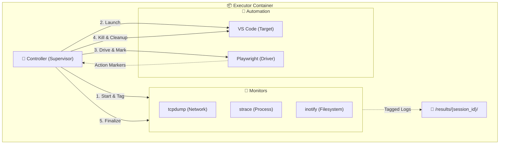

# 🛣️ Automation Roadmap: The Path to a Robust Pipeline

> [!NOTE]
> This roadmap focuses specifically on building a **bulletproof**, **production-grade** automation pipeline for the `executor` module. The goal is to ensure high reliability, reproducibility, and invisibility before the data analysis phase begins in Month 2.

## 📅 Month 1: Infrastructure Hardening

### Week 1: The "Controller" (Orchestration Layer)
**Objective:** Move from independent scripts to a centralized Supervisor Process.

- [ ] **Design `executor/controller.py`:** Create a master script that manages the entire lifecycle of a single analysis run.
- [ ] **State Management:** Implement strict states (`INIT`, `PREPARE`, `MONITOR`, `EXECUTE`, `CLEANUP`, `ERROR`).
- [ ] **Process Supervision:** Ensure `tcpdump`, `strace`, and `code` are launched as child processes of the controller, allowing for graceful termination and signal handling.
- [ ] **Session IDs:** Generate a unique `session_id` for every run and tag all output files (`.pcap`, `.log`) with this ID.

### Week 2: Reliability & "Visual Anchors"
**Objective:** Solve race conditions and ensure 100% startup success rate.

- [ ] **Smart Wait Strategy:** Replace all `time.sleep()` calls in Playwright with "Visual Anchors" (e.g., waiting for specific DOM elements, Extension Host status bar indicators).
- [ ] **Health Checks:** Implement a pre-flight check that verifies Xvfb, noVNC, and the Network Interface before launching VS Code.
- [ ] **Crash Handling:** Add logic to detect if the Extension Host crashes mid-analysis and log it as a specific `CRASH` result type instead of a generic timeout.
- [ ] **Timeout Guard:** Implement a strict global timeout (e.g., 5 mins) that forcefully kills the container or resets the state if an analysis hangs.

### Week 3: Contextual Telemetry
**Objective:** Link "Action" to "Reaction" in the logs.

- [ ] **Action Tagging:** Modify Playwright scripts to emit "Markers" (e.g., writing to a specific log file or stdout) whenever a high-level action starts (e.g., `[ACTION_START] Open File`, `[ACTION_END] Open File`).
- [ ] **Time Synchronization:** Ensure all monitors (System, Network, Automation) use UTC timestamps to allow for precise event correlation later.
- [ ] **Log Rotation:** Ensure logs are flushed to disk immediately (no buffering) to prevent data loss during crashes.

### Week 4: Stress Testing & Invisibility
**Objective:** Verify stability and reduce detection footprint.

- [ ] **Anti-Fingerprinting:**
    - [ ] Randomize mouse movement paths and typing speeds in Playwright.
    - [ ] Hide/Mask the `--remote-debugging-port` flag if possible (or ensure it's bound only to localhost).
- [ ] **Batch Processing Test:** Create a script to queue 50+ dummy extensions and run them sequentially without manual intervention.
- [ ] **Memory Leak Check:** Monitor container RAM usage over long runs to ensure `code` or `playwright` processes aren't leaking memory.

---

## 🎯 Target Architecture (End of Month 1)

## 📝 Success Criteria (Definition of Done)

1.  **Zero Flakiness:** The pipeline runs 50 times in a row without a single "setup failure" or "timeout" caused by the infrastructure itself.
2.  **Perfect Linkage:** Every line in the network/fs logs can be temporally matched to a specific phase of the automation (e.g., "This connection opened while Playwright was simulating a file open").
3.  **Hands-Off:** You can start the process, go to sleep, and wake up to a folder full of perfectly organized, ID-tagged analysis results.
