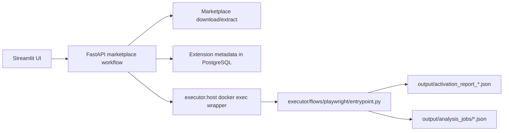

# Pipeline Roadmap

`Last Updated: 2026-03-06`

This roadmap reflects the current executor pipeline after the refactor. The older controller-centric plan has been replaced by workflow orchestration in `workflows/marketplace/` plus sandbox execution in `executor/flows/playwright/`.

## Current Pipeline

## Phase A: Stabilize the Existing Pipeline

- Make sandbox reset and reload behavior deterministic
- Ensure trigger file generation matches the actual workspace mounted in the executor
- Improve status reporting from background jobs
- Add tests for job snapshot persistence and failure states

## Phase B: Persist Analysis Runs

- Add a DB-backed `analysis_runs` record for every marketplace analysis request
- Store report filename, status, timestamps, and extension identity
- Keep raw JSON artifacts in `output/` as audit material

## Phase C: Normalize Telemetry

- Parse network/process/filesystem artifacts
- Convert them into Pydantic contracts
- Persist them through `appcore.storage.crud`
- Expose read APIs for the UI

## Phase D: Risk and Triage

- Add rule-based risk scoring
- Show risk summaries in the Streamlit dashboard
- Support historical comparisons across versions of the same extension

## Design Constraints

- Workflow orchestration belongs in `workflows/marketplace/`
- Shared contracts and persistence belong in `appcore/`
- Sandbox mechanics belong in `executor/`
- Legacy wrapper paths are not the target for new pipeline code
