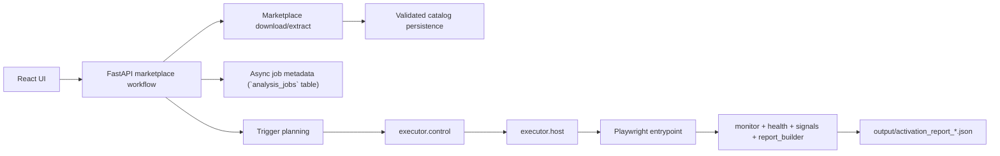

# Pipeline Roadmap

`Last Updated: 2026-04-17`

This is the short staged view of the analysis pipeline. For the current
backlog, use `automation_todo.md`; for active priorities, use
`DEVELOPMENT_PRIORITIES.md`; for the 7-week window,
`REFACTOR_OPTIMIZATION.md` §10.

## Current Pipeline

## Next Phases

### Phase A: Runtime Truthfulness

- keep failure states explicit
- keep interrupted jobs obvious
- keep artifact retention intentional

### Phase B: Coverage Closure

- close official-track gaps for `scm` and `settings`
- decide how partial scaffolding for `chat`, `comments`, `testing`, and
  `workspace_trust` should evolve

### Phase C: Report Stability

- keep JSON fields stable for the UI
- refine degraded vs inconclusive semantics
- keep verdict and attribution signals aligned
- keep activation reports artifact-first while async job state stays DB-backed

### Phase D: Detection Layer (W5-W7)

- introduce `DetectionReport` as a sibling contract to `ActivationReport`
  (ADR 0003); verdicts are a deterministic rollup of findings
- `inconclusive` verdict dominates `clean` when verification gaps remain
- detection rules live inside `packages/` and consume only contracts;
  they never import runtime, web, or storage layers
- malicious fixtures under `extensions/malicious/` carry tier-aware
  handling per ADR 0004; T1+T2 in CI via `make test-security`, T3 via
  break-glass `make test-security-live`

## Design Constraints

- orchestration stays in `workflows/marketplace/`
- shared contracts and persistence stay in `appcore/` (platform
  contracts) and `packages/analysis_contracts/` (analysis contracts)
- sandbox mechanics stay in `executor/`
- workflow code reaches sandbox mechanics only through `executor.control`
- dynamic-analysis persistence remains artifact-first unless product needs change
- analysis output is semi-trusted (ADR 0002 §6); do not forward,
  upload, or index without scrubbing
- security posture is fixed by ADRs 0002-0004; scope expansion requires
  a new ADR, not an informal upgrade
