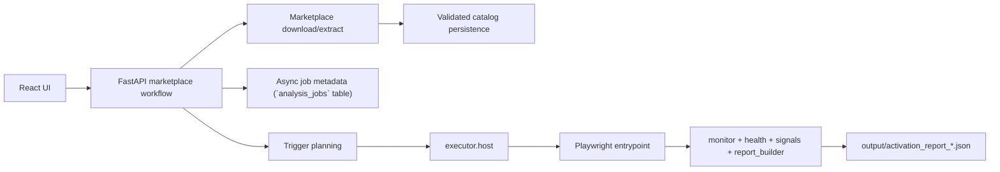

# Pipeline Roadmap

`Last Updated: 2026-04-15`

This is the short staged view of the analysis pipeline. For the current backlog,
use `automation_todo.md`; for active priorities, use
`DEVELOPMENT_PRIORITIES.md`.

## Current Pipeline

## Next Phases

### Phase A: Runtime Truthfulness

- keep failure states explicit
- keep interrupted jobs obvious
- keep artifact retention intentional

### Phase B: Coverage Closure

- close official-track gaps for `scm` and `settings`
- decide how partial scaffolding for `chat`, `comments`, `testing`, and
  `workspace_trust` should evolve

### Phase C: Report Stability

- keep JSON fields stable for the UI
- refine degraded vs inconclusive semantics
- keep verdict and attribution signals aligned

## Design Constraints

- orchestration stays in `workflows/marketplace/`
- shared contracts and persistence stay in `appcore/`
- sandbox mechanics stay in `executor/`
- dynamic-analysis persistence remains artifact-first unless product needs
  change
