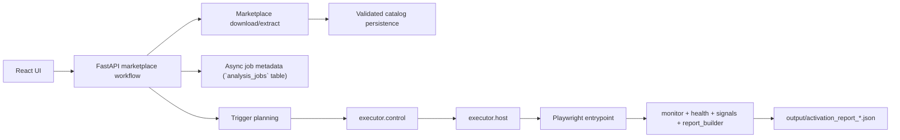

# Pipeline Roadmap

`Last Updated: 2026-04-23`

This is the short staged view of the analysis pipeline. For the current
backlog, use `automation_todo.md`; for active priorities, use
`DEVELOPMENT_PRIORITIES.md`; for the 7-week window, use
`REFACTOR_OPTIMIZATION.md` §10.

Week 4 closure was validated on `2026-04-20`. W5 detection foundations
(contracts, A1/A2/A4/A6 rules, T1 canaries, `make test-security`) landed
`2026-04-20`. W6 automation reliability and capture hardening landed
`2026-04-21`, and the W6 correctness follow-up (target-only attribution,
`tls_client_hello` in `TLS_EVENT_TYPES`, `RuleExecutionStatus.ERROR`
dominance, security-fixtures CI lane) closed on `2026-04-23`. The pipeline
below now describes a fully wired automation + detection path; W7
(acceptance + buffer) drives the PoC acceptance checklist against it.

## Current Pipeline

## Next Phases

### Phase A: Runtime Truthfulness

- keep failure states explicit
- keep interrupted jobs obvious
- keep artifact retention intentional

### Phase B: Coverage Closure

- close official-track gaps for `scm` and `settings`
- decide how partial scaffolding for `chat`, `comments`, `testing`, and
  `workspace_trust` should evolve

### Phase C: Report Stability

- keep JSON fields stable for the UI
- refine degraded vs inconclusive semantics
- keep verdict and attribution signals aligned
- keep activation reports artifact-first while async job state stays DB-backed

### Phase D: Detection Layer (W5-W6 complete, W7 acceptance)

- detection scaffolding is implemented and wired:
  - `packages/analysis_contracts/detection/` exposes
    `DetectionReport`/`DetectionFinding`/`Confidence`
  - `packages/analysis_engine/rules/` ships A1/A2/A4/A6 rules with
    target-only attribution
  - `extensions/malicious/` T1 canary manifests for A1/A2/A4/A6
  - `tests/security/` plus `make test-security` (CI) and
    `make test-security-live` (break-glass)
- `DetectionReport` lives alongside `ActivationReport` per ADR 0003; verdicts
  are a deterministic rollup of findings, with `RuleExecutionStatus.ERROR`
  degrading automation health to `inconclusive` before rollup.
- `RiskSignal.confidence_tier` shares the `Confidence` enum with
  `DetectionFinding` via `packages.analysis_contracts.quantize_confidence`,
  and `detection_report_invariant_issues` enforces evidence `event_id`
  resolution into `ActivationReport.evidence_events[]`.
- detection rules live inside `packages/` and consume only contracts; they
  never import runtime, web, or storage layers.
- malicious fixtures under `extensions/malicious/` carry tier-aware handling
  per ADR 0004; T1+T2 belong in `make test-security`, T3 remains
  break-glass-only via `make test-security-live`.
- W7 work is acceptance + buffer against `REFACTOR_OPTIMIZATION.md` §10.7,
  not new pipeline shape.

## Design Constraints

- orchestration stays in `workflows/marketplace/`
- shared contracts and persistence stay in `appcore/` (platform contracts) and
  `packages/analysis_contracts/` (analysis contracts)
- sandbox mechanics stay in `executor/`
- workflow code reaches sandbox mechanics only through `executor.control`
- dynamic-analysis persistence remains artifact-first unless product needs
  change
- analysis output is semi-trusted (ADR 0002 §6); do not forward, upload, or
  index without scrubbing
- security posture is fixed by ADRs 0002-0004; scope expansion requires a new
  ADR, not an informal upgrade
