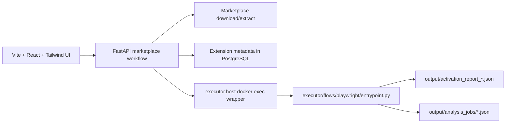

# Pipeline Roadmap

`Last Updated: 2026-04-13`

This roadmap reflects the current executor pipeline after the refactor. The older controller-centric plan has been replaced by workflow orchestration in `workflows/marketplace/` plus sandbox execution in `executor/flows/playwright/`.

The roadmap assumes a single-user sandbox appliance, not a large shared app.

## Current Pipeline

## Phase A: Stabilize the Existing Pipeline

- Make sandbox reset and reload behavior deterministic
- Ensure trigger file generation matches the actual workspace mounted in the executor
- Improve status reporting from background jobs
- Add tests for job snapshot persistence, restart interruption, and failure states

## Phase B: Improve Report Truthfulness

- Tighten automation health reporting
- Make degraded vs healthy runs easier to distinguish
- Preserve enough metadata in JSON artifacts for reliable analyst review

## Phase C: Normalize Telemetry

- Parse network/process/filesystem artifacts
- Convert them into Pydantic contracts
- Expose read APIs and UI adapters where it materially improves analyst review
- Keep persistence minimal unless the product assumptions change

## Phase D: Risk and Triage

- Add rule-based risk scoring
- Show risk summaries in the React reports experience
- Improve comparison of extension versions only when it helps the single-operator workflow

## Design Constraints

- Workflow orchestration belongs in `workflows/marketplace/`
- Shared contracts and persistence belong in `appcore/`
- Sandbox mechanics belong in `executor/`
- Legacy wrapper paths are not the target for new pipeline code
- Do not assume queue workers, tenancy, or distributed job ownership without a product change
