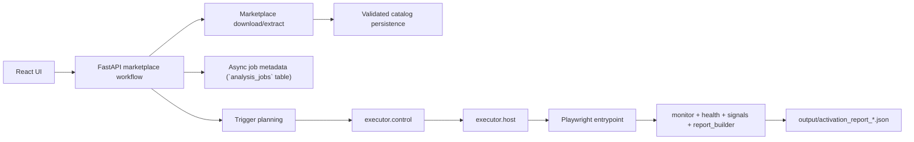

# Pipeline Roadmap

`Last Updated: 2026-05-11`

This is the short staged view of the analysis pipeline. For the current
backlog, use `automation_todo.md`; for active priorities, use
`DEVELOPMENT_PRIORITIES.md`; for the 7-week window, use
`REFACTOR_OPTIMIZATION.md` §10. For post-PoC deferrals, use
`POST_POC_BACKLOG.md`.

Week 4 closure was validated on `2026-04-20`. W5 detection foundations
(contracts, A1/A2/A4/A6 rules, T1 canaries, `make test-security`) landed
`2026-04-20`. W6 automation reliability and capture hardening landed
`2026-04-21`, and the W6 correctness follow-up (target-only attribution,
`tls_client_hello` in `TLS_EVENT_TYPES`, `RuleExecutionStatus.ERROR`
dominance, security-fixtures CI lane) closed on `2026-04-23`. **W7
(acceptance + buffer) closed on `2026-04-23`** with the §10.7 PoC
acceptance checklist green (11/11); the pipeline below describes the
acceptance-green automation + detection path. **Post-W7 hardening on
`2026-04-24`** added fatal UI-crash fail-fast, scan-between VS Code
restart, the `attribution/` subpackage split, and the `sim-target`
Makefile lane without changing pipeline shape. **Post-W7 simulation
UX + reliability on `2026-04-25`** added weighted simulation progress,
the first full-stack analysis cancel flow. W13-3 later hardened it into a
two-phase `cancelling` lifecycle with hot-zone poll points and worker-side
finalization. The VNC harness ready-marker fix
(`vscode.py::reload_workbench_window` unlinks the marker before reload;
harness `activate()` awaits the write), and the
`t1-demo-runnable-canary` + rule + `make demo-canary` lanes — none
change pipeline shape but cancel remains an operator-visible lifecycle
surface. **PR345 and W8-0 on
`2026-04-27`** sharpened target activation lifecycle evidence and harness
readiness diagnostics without changing the high-level pipeline shape.

## Current Pipeline

## Next Phases

### Phase A: Runtime Truthfulness

- keep failure states explicit
- keep interrupted jobs obvious
- keep artifact retention intentional

### Phase B: Coverage Closure

- close official-track gaps for `scm` and `settings`
- decide how partial scaffolding for `chat`, `comments`, `testing`, and
  `workspace_trust` should evolve

### Phase C: Report Stability

- keep JSON fields stable for the UI
- refine degraded vs inconclusive semantics
- keep signal summary and attribution signals aligned (authoritative
  `Verdict` now lives on `DetectionReport`; activation-layer
  `signal_summary` is a presentation-only behavioral heuristic)
- keep activation reports artifact-first while async job state stays DB-backed

### Phase D: Detection Layer (W5-W7 closed)

- detection scaffolding is implemented and wired:
  - `packages/analysis_contracts/detection/` exposes
    `DetectionReport`/`DetectionFinding`/`Confidence`
  - `packages/analysis_engine/rules/` ships A1/A2/A3/A4/A6 rules with
    target-only attribution (A3 typosquat landed in the W7 Phase 3a
    buffer; allow-list at
    `packages/analysis_engine/allowlists/popular_extensions.txt`)
  - `extensions/malicious/` T1 canary manifests for A1/A2/A3/A4/A6
  - `tests/security/` plus `make test-security` (CI) and
    `make test-security-live` (break-glass)
- `DetectionReport` lives alongside `ActivationReport` per ADR 0003; verdicts
  are a deterministic rollup of findings, with `RuleExecutionStatus.ERROR`
  degrading automation health to `inconclusive` before rollup.
- `RiskSignal.confidence_tier` shares the `Confidence` enum with
  `DetectionFinding` via `packages.analysis_contracts.quantize_confidence`,
  and `detection_report_invariant_issues` enforces evidence `event_id`
  resolution into `ActivationReport.evidence_events[]`.
- detection rules live inside `packages/` and consume only contracts; they
  never import runtime, web, or storage layers.
- malicious fixtures under `extensions/malicious/` carry tier-aware handling
  per ADR 0004; T1+T2 belong in `make test-security`, T3 remains
  break-glass-only via `make test-security-live`.
- W7 acceptance was validated by
  [`scripts/demo_acceptance.py`](../scripts/demo_acceptance.py) +
  [`DEMO_SCENARIO.md`](DEMO_SCENARIO.md) on the A1 credential-read →
  network canary; §10.7 checklist closed 11/11.
- Post-W7 `attribution/` subpackage split moves annotation/classification
  (`attribution/events.py`) and evidence-link builders
  (`attribution/links.py`) behind a re-export facade. W12-2 trims that
  facade to 10 public names while preserving the evidence semantics above.
- Remaining stretch classes (A5 malicious update, A7 VS Code API abuse)
  live in `POST_POC_BACKLOG.md`.

## Design Constraints

- orchestration stays in `workflows/marketplace/`
- shared contracts and persistence stay in `appcore/` (platform contracts) and
  `packages/analysis_contracts/` (analysis contracts)
- sandbox mechanics stay in `executor/`
- workflow code reaches sandbox mechanics only through `executor.control`
- dynamic-analysis persistence remains artifact-first unless product needs
  change
- analysis output is semi-trusted (ADR 0002 §6); do not forward, upload, or
  index without scrubbing
- security posture is fixed by ADRs 0002-0005 plus ADR 0007; scope expansion
  requires a new ADR, not an informal upgrade. ADR 0007 is Accepted and
  implemented `2026-04-29` via W8-7 — loopback defaults plus
  `EXTRACE_ALLOW_LAN` opt-in are enforced in `appcore/api/config.py`,
  `docker-compose.yml`, and `tests/architecture/test_default_bindings.py`.
