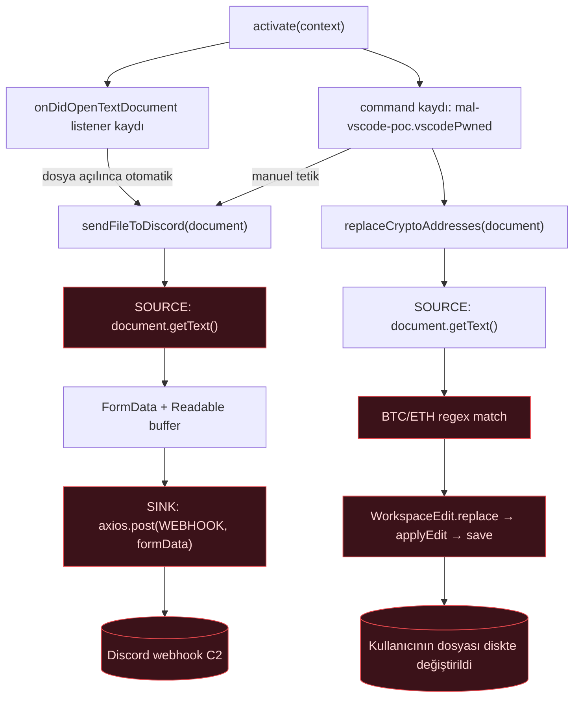
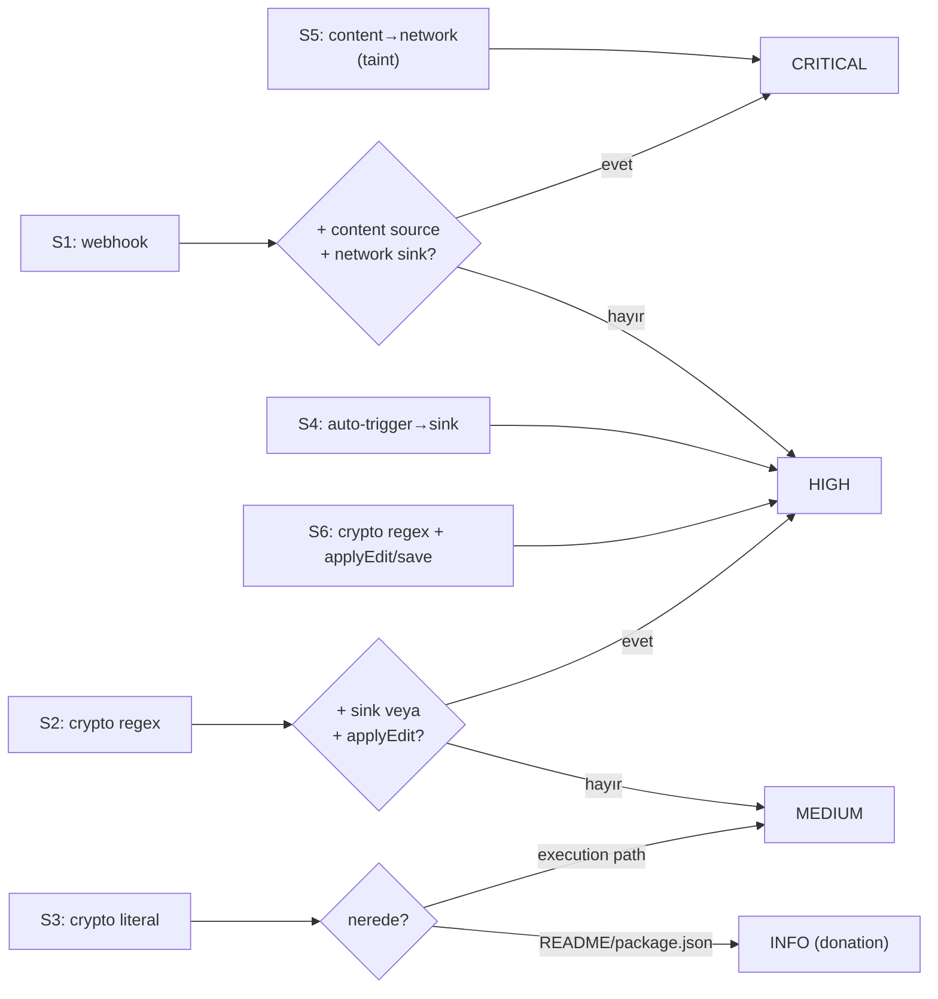

# ExTrace Detection Spec — `apollyon` (Discord Webhook Infostealer PoC)

> **Provenance:** authored as a detection *design input* (handed to the rule-dev
> effort on `security-development`, 2026-06-03). This file preserves that spec.
> Where it made assumptions about ExTrace internals it flagged them with
> **DOĞRULA** — those have now been verified against the codebase and the
> corrections live in [`architecture-reconciliation.md`](architecture-reconciliation.md).
> Read that doc alongside this one: it is the load-bearing map from these signals
> to the *real* rule layers, severities, and gate behaviour.
>
> **Amaç:** Bu doküman `apollyon` örneğinin davranışını detection sinyallerine
> indirger, ExTrace'in static katmanı (AST + taint + regex) ve dynamic katmanı
> için kural taslakları sağlar, ve her sinyalin false-positive / evasion
> sınırlarını açıkça belirtir. **Bu bir saldırı kılavuzu değildir** — hedef bu
> sınıf infostealer'ları *yakalamaktır*.

> ⛔ **SAFETY — this document never instructs fetching live malware.** Real
> apollyon code is **never** downloaded into this repo or onto the dev host. The
> provenance/IOC strings below are **attribution + regression anchors only** (text
> in a doc), not a fetch instruction — never resolve, execute, or use them to pull
> the sample down. Repo fixtures are **synthetic, declawed canaries**
> (`kind: internal_canary`); validating a rule against a **real** sample happens
> **only inside the disposable sandbox** (`automation_executor` /
> `automation_static_analyzer`, `network_mode: none`). See the README safety
> section for the full policy.

> ✅ **Status (2026-06-03):** three general rules + the UI shipped & verified.
>
> - `extrace.s8.exfil_webhook` (static, S1) · `extrace.s9.crypto_address_scan`
>   (static, S2) · `extrace.a5.workspace_file_tamper` (dynamic, S6/B3) — all
>   live, fixture-tested, and browser-verified in the Rules tab.
> - The Rules tab now lists **static *and* dynamic** rules with Static/Dynamic
>   labels + a stream filter (was dynamic-only).
> - §5's `A?` placeholders are filled with the real **A1–A7** taxonomy; the §3
>   semgrep YAML stays a *design sketch* (the runner pins semgrep to MEDIUM/WARN —
>   severity-bearing signals are in-house s-rules). Full map: the reconciliation doc.

---

## 0. Sample Provenance (read-only)

| Alan | Değer |
|---|---|
| Source repo (upstream — **NOT fetched into this repo**) | `trailofbits/vsix-zoo` → `samples/apollyon/extension.js` |
| Upstream (attribution only) | `github.com/0x-Apollyon/Malicious-VScode-Extension` |
| Publisher (manifest) | `0x-Apollyon` |
| Family | Infostealer |
| Capabilities (manifest) | `data-exfiltration`, `crypto-wallet`, `discord-webhook` |
| Dosya | tek dosya, `extension.js`, 5822 bytes, obfuscation **yok** |
| SHA256 (çekilen kopya) | `3f55304806a85a0da2f1d07d71f80e0349fdd756e484bcf33b603f88efe956ba` |

> Not: manifest'te `sha256: null`. Yukarıdaki hash benim çektiğim raw
> `extension.js`'in hash'i; upstream'de satır sonu/EOL farkı varsa değişebilir.
> **IOC olarak content-hash'e güvenme** — bu bir PoC, her fork'ta byte düzeyinde
> değişir. Davranışsal sinyaller content-hash'ten daha dayanıklıdır.
>
> ⛔ **How this sample is (and is NOT) used here:** the real apollyon
> `extension.js` is **never** placed in this repo. The repo's
> [`extensions/malicious/`](../../extensions/malicious/) corpus holds only
> **synthetic, declawed canaries** (`kind: internal_canary`): a hand-authored
> `LABEL.yaml` plus the minimal artefact the tested layer needs — for the dynamic
> rules a synthetic `activation_report.json` (no payload), for a static rule a
> tiny hand-written manifest/snippet that *exhibits the shape* without the live
> webhook/wallet. Example: the A5 canary
> [`extensions/malicious/t1-a5-file-tamper-canary/`](../../extensions/malicious/t1-a5-file-tamper-canary/)
> is a 3-event synthetic report, not apollyon code. Validating a rule against the
> **real** apollyon VSIX happens **only inside the sandbox** via the analysis
> pipeline (`make sim-target` / the executor container), where the sample is
> destroyed with the container and never touches the host or git.

---

## 1. Ne Yapıyor (davranış kırılımı)

İki ayrı kötücül yetenek var; ikisi de `activate()` içinde kuruluyor.

**B1 — Otomatik exfiltration (data-exfiltration).** `vscode.workspace.onDidOpenTextDocument`
listener'ı kuruluyor. Bir dosya **açıldığı anda**, kullanıcı hiçbir şey yapmadan,
`sendFileToDiscord(document)` çağrılıyor. Bu fonksiyon `document.getText()` ile tüm içeriği alıp
`form-data` ile multipart paket yapıyor ve hardcoded bir **Discord webhook**'una `axios.post`
ediyor. Yani: *editörde açılan her dosyanın tam içeriği* attacker'a gidiyor.

**B2 — Manuel exfiltration komutu.** `mal-vscode-poc.vscodePwned` command'ı kayıtlı; tetiklenince
tüm açık dökümanları Discord'a yolluyor + crypto replace çalıştırıyor.

**B3 — Crypto-wallet hijack (integrity attack).** `extractCryptoAddresses()` BTC/ETH regex'leriyle
açık dosyalardaki adresleri buluyor; `replaceCryptoAddresses()` bunları `vscode.WorkspaceEdit` +
`applyEdit()` + `document.save()` ile placeholder string'lerle **değiştirip diske yazıyor**. PoC'de
placeholder (`attackers-btc-address`) var; gerçek bir variant burada attacker'ın kendi cüzdan
adresini koyar → para yönlendirme.

**Düşük-değerli artifact'ler:** `console.log('[!] Malicious...')` ile kendini ilan ediyor (stealth
yok → bu *gerçek* değil, PoC seviyesi). `fs` import edilmiş ama **kullanılmıyor** (dead import).

### Akış (Mermaid)



İki bağımsız taint flow var, ikisi de aynı source'tan (`document.getText()`) besleniyor:

- **Exfil flow:** `document.getText()` → network egress (confidentiality ihlali)
- **Hijack flow:** `document.getText()` → regex → `applyEdit/save` (integrity ihlali)

---

## 2. Detection Signal Kataloğu

`FP risk` = false-positive riski (yüksek olması, tek başına flag'lemenin tehlikeli olduğu anlamına
gelir). **Not:** buradaki `S1..S7` *sinyal* numaralarıdır — ExTrace'in in-house static *kural*
isimleri olan `s1..s8` ile karıştırma (isim çakışması; eşleme için reconciliation doc'a bak).

| # | Sinyal | Kanıt (apollyon'da) | Base severity | FP risk | Escalation kuralı |
|---|---|---|---|---|---|
| S1 | **Discord/Slack/Telegram webhook URL** extension içinde | `discord.com/api/webhooks/1332.../5Hnr...` | HIGH | Düşük | + content source + network sink ise → CRITICAL |
| S2 | **Crypto-address regex** (tarama yeteneği) extension kodunda | `[13][a-km-zA-HJ-NP-Z1-9]{25,34}`, `0x[a-fA-F0-9]{40}` | MEDIUM‑HIGH | Orta | + `applyEdit/replace` → HIGH; + network → HIGH |
| S3 | **Hardcoded crypto-address literal** (değer, regex değil) | (apollyon'da yok; placeholder string var) | LOW/INFO | Yüksek | `package.json`/`README`'de → INFO (donation); execution path'te → MEDIUM |
| S4 | **Auto-trigger → sink** (event listener'dan sink'e akış) | `onDidOpenTextDocument` → `sendFileToDiscord` → `axios.post` | HIGH | Düşük | tek başına auto-trigger + sink yeterli sinyal |
| S5 | **Document content → network egress** (taint flow) | `document.getText()` → `axios.post(webhook,...)` | CRITICAL | Çok düşük | en güçlü sinyal; tek başına yeterli |
| S6 | **Crypto regex + WorkspaceEdit/save** (hijack) | `extractCryptoAddresses` + `applyEdit` + `save` | HIGH | Düşük | clipper/wallet-hijack imzası |
| S7 | **`document.getText()` over `textDocuments` toplu okuma** | `vscode.workspace.textDocuments.forEach(...)` | MEDIUM | Orta | + sink → HIGH (tüm açık dosyaları topluyor) |

### `activeTextEditor` düzeltmesi (önemli)

`vscode.window.activeTextEditor` **tek başına sinyal değildir** — neredeyse her meşru extension
onu kullanır. Tek başına flag'lersen FP cannon'a dönüşür. Apollyon'da sorunlu olan, document
içeriğinin (1) bir **event listener ile otomatik tetiklenmesi** ve (2) bir **dangerous sink'e**
(network / file-write) akması. Doğru sinyal **S4 + S5**, "activeTextEditor kullanımı" değil.

### Donation nüansı (S3)

Hardcoded crypto adresi ikircikli: donation adresi (meşru, genelde `README`/`package.json`)
**veya** attacker'ın hijack hedefi. Bu yüzden **S3 base'i LOW/INFO**; sadece adres `extension.js`
execution path'inde geçiyorsa (MEDIUM) ya da replace logic'iyle birlikteyse (S6 → HIGH) yükselt.

---

## 3. Detection Rule Spec'leri (3 katman) — *design sketch*

> ⚠️ **Reconciliation:** ExTrace'in gerçek katmanlaması ve entegrasyon noktaları
> [`architecture-reconciliation.md`](architecture-reconciliation.md)'de. Özetle:
> semgrep katmanı **MEDIUM/WARN-pinned** (asla BLOCK etmez), o yüzden severity
> taşıyan sinyaller **in-house s-rule** olarak yazılır; taint için community
> semgrep çoğunlukla intra-file'dır (interproc `--pro` ister). Aşağısı sinyal
> tasarımı olarak doğru, ama "nereye yazılır" için reconciliation doc esas alınır.

### Layer 1 — IOC / regex (en ucuz, commodity'i yakalar)

Discord/Slack/Telegram webhook literal + crypto-address regex presence. Yüksek-fidelity ipucu:
`[a-km-zA-HJ-NP-Z1-9]` (Base58 alfabesi, `0 O I l` dışlanmış) bir extension kaynağında geçiyorsa
kod "Bitcoin adresi" kavramını biliyor demektir — donation adresinin tek başına yapamayacağı şey.
Bu S2'yi S3'ten ayıran ana işaret.

### Layer 2 — Taint (en güçlü static sinyal, S5/S6)

`document.getText()` / `vscode.workspace.textDocuments` → `axios.post/fetch/http.request/Socket.write`
(S5), ve crypto-regex match → `applyEdit/replace/save` (S6). **Dürüst sınır:** Community Semgrep
taint engine'i ağırlıklı intra-file; apollyon'un exfil flow'u fonksiyon sınırı aşıyor
(`onDidOpenTextDocument` callback → `sendFileToDiscord` → `axios.post`). `pattern-propagators`
zincirin bir kısmını taşır ama callback→named-function geçişi engine'i zorlar. Garanti için
**Layer 3 co-occurrence** fallback'ini birlikte çalıştır; tam interproc için Semgrep Pro gerekir.

### Layer 3 — Co-occurrence heuristic (interproc fallback, S4)

Taint zinciri kopsa bile yakalar: *aynı dosyada* "document source" + "auto-trigger event"
(`onDidOpen/Change/Save/ActiveTextEditor`) + "network sink" birlikte varsa flag → HIGH. FP riski
taint'ten yüksek ama auto-trigger şartı pratikte çok daraltır. ExTrace'in in-house AST/regex
katmanında presence-counter olarak yazılabilir.

### Layer 4 — Dynamic plane (ExTrace'in asıl gücü)

Static obfuscation'ı yense bile apollyon **dosya açılınca otomatik egress** yaptığı için
dynamic'te trivial yakalanır: sandbox'a bir dosya aç → `tshark` ile `discord.com` (ya da herhangi
beklenmedik) egress'i gözlemle (webhook obfuscate edilse bile runtime'da hostname çözülür).
File-integrity: içinde BTC/ETH adresi olan dosya aç, komutu tetikle, dosyanın diskte değişip
değişmediğini izle (S6'nın dynamic doğrulaması). **Bu katman ExTrace'te A-serisi kurallarıdır**
(`extrace.a4.workspace_exfil` apollyon B1'i zaten yakalar — bkz §5).

---

## 4. Severity / Verdict Escalation Matrisi



Temel ilke: **confidentiality (exfil)** ile **integrity (hijack)** sinyalleri ayrı eksenlerde
puanlanmalı; ikisi birden varsa (apollyon = ikisi de) verdict en yükseğe çıkar.

> ⚠️ **Reconciliation:** ExTrace'in static gate'i ADR 0016 *block-and-warn* truth
> table'ı (CRITICAL veya promoted-HIGH → BLOCK; diğer HIGH/MEDIUM/LOW → WARN;
> yok/INFO → ALLOW). "CRITICAL → reject before sandbox" budur. Co-occurrence
> tabanlı CRITICAL escalation in-house katmanda ifade edilebilir.

---

## 5. A1–A7 Taksonomi Eşlemesi  ✅ DOĞRULANDI

ExTrace'in adversary taksonomisi **`AdversaryClass` enum'u (ADR 0003): A1–A7**
([`packages/analysis_contracts/detection/enums.py`](../../packages/analysis_contracts/detection/enums.py)).
Kurallar **dynamic** `ActivationReport` üzerinde çalışır
([`packages/analysis_engine/rules/`](../../packages/analysis_engine/rules/)). Gerçek tanımlar:

| Class | Rule (varsa) | Tanım (koddan) |
|---|---|---|
| **A1** | `extrace.a1.credential_read_then_network` | Credential dosyası okuması ardından outbound network |
| **A2** | `extrace.a2.startup_network_beacon` | Activation hemen sonrası bursty beaconing |
| **A3** | `extrace.a3.typosquat` | Typosquat publisher/isim |
| **A4** | `extrace.a4.workspace_exfil` | `/workspace/` dosya okuması → ~30s içinde outbound POST/TLS |
| **A5** | `extrace.a5.workspace_file_tamper` ✅ | Okunan `/workspace/` dosyasının yerinde geri yazılması (read→modify→save) — clipper/integrity. **Bu branch'te eklendi** (önceden boş slottu) |
| **A6** | `extrace.a6.startup_ui_prompt` | Startup-time credential-prompt tarzı sahte UI |
| **A7** | `extrace.a7.blacklisted_domain` | Bilinen kötücül domain teması |

Apollyon davranışlarının eşlemesi:

| Sinyal / davranış | Gerçek kategori | Gerekçe |
|---|---|---|
| S5, B1/B2 (content→network) | **A4** — workspace exfil (dynamic, mevcut) + static `extrace.ext.exfil_webhook` IOC | confidentiality; A4 runtime'da read→egress korelasyonu yapar |
| S6, B3 (crypto clipper) | **A5** `extrace.a5.workspace_file_tamper` (✅ eklendi) — workspace read→write same path | integrity; A4'ün (confidentiality) ikiz karşıtı |
| S4 (auto-trigger→sink) | Dynamic A4'ün tetik koşulu + static co-occurrence | kullanıcı onayı olmadan tetik |
| S1/S2 (webhook/crypto IOC) | static `extrace.ext.*` (adversary_class **yok** — IOC/capability surface) | yetenek göstergesi; attribution dynamic katmanda |

> **Önemli ayrım (koddan çıkarıldı):** static s-rule'lar `adversary_class=None`
> taşır (capability/IOC surface; örn. `s5`), adversary *attribution* dynamic
> A-rule'lara aittir (örn. `a4` → `AdversaryClass.A4`). Static webhook IOC bu
> yüzden A-class atamaz — exfil *kanalını* raporlar, davranışı değil.

---

## 6. Evasion Analizi — Bu Kurallar Neyi Yakalar, Neyi Kaçırır

**Yakalar (commodity / PoC / educational — apollyon dahil):** plaintext webhook URL (Layer 1),
düz `axios.post`/`fetch` (Layer 2), aynı dosyada trigger+source+sink (Layer 3), runtime'da
gözlemlenebilir egress (Layer 4).

**Kaçırır (advanced evasion):**

- **String obfuscation:** webhook'un base64/hex/charCode ile runtime assemble edilmesi → Layer 1
  regex ölür. (Layer 4 dynamic hâlâ yakalar; hostname runtime'da çözülür.)
- **Runtime C2 resolution:** URL'nin pastebin/CDN/DGA'dan çekilmesi → static'te hiç görünmez.
- **Dynamic dispatch:** `globalThis['ax'+'ios'].post(...)`, `eval`, `Function(...)`, computed
  member access → Layer 2 AST pattern'leri eşleşmez. (Bunun *kendisi* ayrı bir suspicion
  sinyali; ExTrace semgrep'te `eval`/`function_constructor`/`dynamic_require` zaten var.)
- **Non-Discord kanal:** meşru görünen telemetry endpoint'ine (`*.amazonaws.com`,
  `*.azurewebsites.net`) exfil → S1 ölür, S5 taint / Layer 4 baseline hâlâ yakalar.
- **Conditional/gated trigger:** sadece `.env`/`id_rsa`/wallet dosyalarında ya da env-check
  geçince exfil → sandbox'ta tetiklenmezse Layer 4 kaçırır. (apollyon *her* dosyada tetiklendiği
  için bu zaafı yok — trivial sample.)
- **bech32 cüzdanları:** apollyon'un *kendi* regex'i `bc1...` (native segwit) adreslerini
  kaçırıyor. Detection regex'ine bech32 farkındalığını ekle (`bc1[a-z0-9]{25,90}`) ki S2 modern
  cüzdan-aware kodu da yakalasın.

**Net dürüst çerçeve:** Bu kural seti apollyon-sınıfı commodity infostealer'ları ve çoğu
PoC/educational sample'ı **güvenilir yakalar**. Runtime C2 + string obfuscation + gated trigger
kullanan APT-grade actor'ı static katman **güvenilir yakalamaz**; orada dynamic plane + network
egress baselining (bilinmeyen host'a giden her egress'i flag) + capability-surface modeli devreye
girer.

---

## 7. İmplementasyon Görevleri (sıralı, MVP-first) — *durum*

**SHIPPED + verified (2026-06-03) — genel, sample'a özel değil:**

- **S1 webhook IOC** — `extrace.s8.exfil_webhook`
  ([rule](../../static_runtime/rules/s8_exfil_webhook.py) ·
  [test](../../tests/static_runtime/test_s8_exfil_webhook.py)), Discord/Slack/Telegram,
  severity **HIGH** (WARN; promoted-blocker değil).
- **S2 crypto-awareness** — `extrace.s9.crypto_address_scan`
  ([rule](../../static_runtime/rules/s9_crypto_address_scan.py) ·
  [test](../../tests/static_runtime/test_s9_crypto_address_scan.py)), Base58 / ETH
  (`0x`+40-hex, SHA-1 FP-guard'lı) / quantified bech32 regex presence, severity
  **INFO** (capability inventory; WARN ancak clipboard/file-write korelasyonuna
  aittir).
- **S6/B3 clipper (dynamic)** — `extrace.a5.workspace_file_tamper`
  ([rule](../../packages/analysis_engine/rules/a5_workspace_file_tamper.py) ·
  [test](../../tests/security/rules/test_a5_workspace_file_tamper.py) · synthetic
  canary [t1-a5-file-tamper-canary](../../extensions/malicious/t1-a5-file-tamper-canary/)):
  hedefin okuduğu `/workspace/` dosyasını geri yazması (read→modify→save), severity
  **MEDIUM** (formatter'lar da yazar — dürüst seviye). A4'ün integrity ikizi.
- **UI** — Rules sekmesi artık static **ve** dynamic kuralları Static/Dynamic
  rozeti + stream filtresiyle listeliyor (önceden dynamic-only); her catalog kuralı
  zengin `detail` açıklaması taşıyor. `s1.activation_wildcard` LOW → **HIGH**.

Hepsi **her extension'ı** tarar (apollyon'a özel literal kural mantığında yok) ve
canlı Rules sekmesinde doğrulandı.

Sonraki iterasyonlar (önceliklendirilmiş, reconciliation doc'ta gerçek dosya/test ile):

1. **Layer 1 commodity surface (semgrep):** Discord/Slack/Telegram webhook + crypto-regex
   presence kurallarını `extrace-vsix-js.yml` + `_RULE_META`'ya ekle (MEDIUM/WARN advisory;
   in-house s8/s9 ile tamamlayıcı, çift-kanıt).
2. **Layer 3 co-occurrence (S4, in-house):** auto-trigger + document source + network sink aynı
   dosyada → HIGH (ve S2+clipboard/write → kripto-clipper escalation).
3. **Layer 2 taint (semgrep):** S5/S6, `--pro` ile/onsuz interproc farkını ölç; hangi katmanın
   yakaladığını finding metadata'sına yaz.
4. **Escalation matrisi (§4):** kombinasyon-verdict; S1+content+sink → CRITICAL/promote.
5. **Gerçek-örnek doğrulaması (sandbox-only):** apollyon-sınıfı bir VSIX'i **yalnızca sandbox'ta**
   (`make sim-target` / executor container) analiz edip s8/s9/a5'in fire ettiğini gör — örnek
   **asla repoya inmez**. Repo tarafı sentetik canary ile kapsanır (a5 örneği zaten mevcut).

**Perfectionism guard:** s8/s9/a5 apollyon'un webhook + kripto-tarama + clipper yüzeylerini zaten
yakalıyor + yeşil. Önce ship; taint/co-occurrence sonradan iterate edilir.

---

## 8. IOC / Sinyal Appendix (regression referansı)

```text
# String IOCs (PoC'ye özgü — fork'ta değişir, davranışa öncelik ver)
webhook_url      : https://discord.com/api/webhooks/1332511931541491802/5Hnr5TXbOi_O9REwjkk4MPLBaImsrsfkZPkJ115lAQD35e2hHNtR_h0M62VLACH-qEZ2
command_id       : mal-vscode-poc.vscodePwned
self_announce    : "[!] Malicious VS Code extension triggered"
placeholder_btc  : attackers-btc-address
placeholder_eth  : attackers-eth-address

# Davranışsal sinyaller (dayanıklı)
btc_regex_literal: [13][a-km-zA-HJ-NP-Z1-9]{25,34}
eth_regex_literal: 0x[a-fA-F0-9]{40}
base58_charclass : [a-km-zA-HJ-NP-Z1-9]      # yüksek-fidelity crypto-awareness işareti
auto_trigger     : vscode.workspace.onDidOpenTextDocument
exfil_source     : document.getText() / vscode.workspace.textDocuments
exfil_sink       : axios.post(<webhook>, formData)
hijack_sink      : vscode.WorkspaceEdit + applyEdit + document.save()
dead_import      : require('fs')   # kullanılmıyor — zayıf sinyal

# Tespit ederken EKSİK olanı da kapat (apollyon'un kendi coverage gap'i):
bech32_btc       : bc1[a-z0-9]{25,90}        # apollyon BUNU kaçırıyor; detection'a EKLE
eip55_eth        : mixed-case checksum varyantları da [a-fA-F0-9]{40}'a düşer
```
