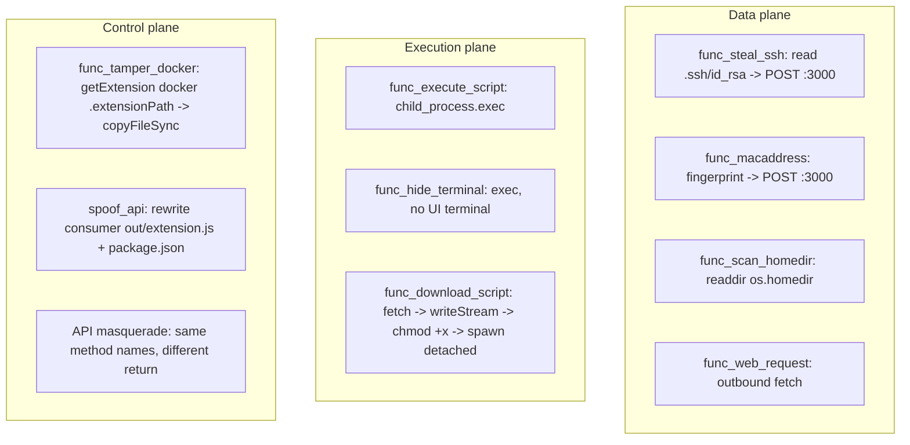
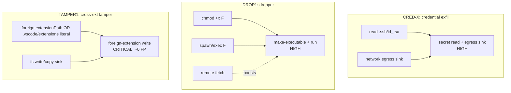

# ExTrace × vsix-zoo — `ecm3401` Malicious-Suite Detection Spec (MALICIOUSNESS axis)

> **Class:** MAL (actively-malicious extension) — the **opposite** of the
> [snyk-labs VLN spec](snyk-labs-vln-detection-spec.md). There the extension is
> benign-but-vulnerable ("is there an exploitable bug?"); here the extension *is*
> hostile ("is it actively malicious?") → the classic **MALICIOUSNESS** axis.
> Companion to [`architecture-reconciliation.md`](architecture-reconciliation.md) §4g.
>
> **Sample:** `ecm3401/` — a **dissertation PoC** (University of Exeter ECM3401
> final-year project), not production malware. That shapes the FP/IOC calls
> (§7/§8): it is *deliberately unobfuscated*.
>
> ⛔ **Safety:** read-only. The repo was **not** cloned; no `npm install` /
> `vsce package` / `F5` was run. No live payload, receiver, or downloaded stage is
> in the repo. All fixtures are **synthetic declawed stubs** (~15 lines) with
> defanged placeholders — the real `func_*.ts` payloads are never reproduced
> verbatim. Full policy: the [README](README.md) safety section.

---

## 1. How it works

ECM3401 is a four-component suite that bundles **nine independent techniques** in
one extension — not a single vuln class.

| Component | Role | ExTrace scope |
|---|---|---|
| **Extension-Attack-Suite** | 8 attack payloads + an "honest API" | ✅ in-scope (main target) |
| **Malicious-API-Extension** | spoofed version of that API + repoints the consumer | ✅ in-scope |
| Example-API-Extension | the honest API's normal consumer (victim) | ✅ (as a tamper target) |
| Local-Web-Server | exfil receiver (`:3000`) | ⛔ attacker infra, **out of scope** (the `track.php` analogue — ExTrace only sees extension source, not the receiver) |

Attacks are command-palette triggers (`func.*`, `ECM3401:` prefix);
`Malicious-API-Extension` uses `activationEvents: ["*"]` and does its consumer
rewrite eagerly in `activate()`.

### 1.1 Technique inventory (trust-plane grouped)

The suite maps cleanly onto ExTrace's Control / Execution / Data trust planes —
it violates all three, making it an ideal positive sample for the coverage matrix.



### 1.2 The two distinctive Control-plane techniques

Most payloads are commodity (child_process exec, fetch). The two high-fidelity,
VS-Code-specific ones reduce to one observable static primitive — **a write into
the `.vscode/extensions/` tree (outside the extension's own directory)**:

**(A) Cross-extension binary tamper — `func_tamper_docker`.** Overwrite a *different*
installed extension's bundle (`ms-azuretools.vscode-docker/dist/extension.bundle.js`)
with an attacker bundle via `fs.copyFileSync`. VS Code performs **no integrity
check** on installed extensions and `~/.vscode/extensions/` is a world-writable
user dir → the Docker extension runs attacker code on its next activation =
**persistence + execution hijack**, no marketplace involvement. Breaks the implicit
trust assumption that an installed extension's on-disk code is post-install
immutable.

**(B) API spoofing — `spoof_api` + masquerade.** Two stages:

1. **Consumer rewrite (catchable):** in `activate()`, read the victim consumer's
   installed files (`~/.vscode/extensions/<victim>/out/extension.js` + `package.json`),
   string-replace its dependency id (honest → malicious provider), `fs.writeFileSync`
   back. → the **same primitive** as (A): a write under `.vscode/extensions/<other>`.
2. **API masquerade (hard to detect statically):** the malicious provider exposes
   the *same method names* with different returns. VS Code's inter-extension API
   model has **no authenticity/integrity guarantee** on `getExtension(id).exports`.

**Key observation:** both Control-plane attacks collapse to one high-fidelity,
near-zero-FP static primitive — **a foreign write into the extensions install
tree.** That is the crown-jewel rule (§3 INV3, §4 `s16`).

---

## 2. Signal catalogue — TTP-grouped

> These mnemonic IDs are this spec's framing. The repo malice taxonomy is
> `AdversaryClass` A1–A8 (static IOC rules stay class-less); §6 records the
> mapping. The CRED/EXEC/DROP/TAMPER ids below are placeholders for the structural
> signals, not taxonomy nodes.

| ID | Signal | Static evidence | Base severity | FP risk | Note |
|---|---|---|---|---|---|
| **CRED1** | sensitive-file read | `fs.read*` of `.ssh`/`id_rsa`/`.aws/credentials`/… | medium-high | low-medium | runtime-built path → token-anywhere match |
| **CRED-X** | **cred → network** | CRED1 source co-occurs with a network egress sink | **high** | low-medium | confidentiality axis |
| **EXEC1** | child_process exec/spawn | `cp.exec`/`spawn` | low | **very high** | context only |
| **DROP1** | **make-executable → run** | `chmod +x F` ∧ `spawn/exec F` (+ remote fetch) | **high** | low-medium | dropper invariant (§3) |
| **TAMPER1** | **cross-extension write** | write/copy into a foreign `extensionPath` or a `.vscode/extensions` path | **high→critical** | **≈zero** | crown jewel |
| **NET1** | outbound HTTP | `fetch`/`http.request` | low | very high | context only; exfil = NET + CRED source |
| **RECON1** | home-dir enumeration | `fs.readdirSync(os.homedir())` | low | medium | context multiplier |
| **FINGERPRINT1** | device fingerprint | `macaddress` / `os.networkInterfaces()` | low-medium | medium | NET → exfil signal |
| **ACT1** | eager activation | `activationEvents: ["*"]` | low | high | "runs with no user interaction" escalator |

**FP semantics (critical).** `child_process` (EXEC1), `fetch` (NET1) and `["*"]`
(ACT1) are **huge false-positive generators** — dozens of legitimate extensions
run git/linters/builds, make HTTP calls, eager-activate. Never build a verdict on
those alone. The power is in **taint/co-occurrence** (CRED-X, DROP1) and
**structural rarity** (TAMPER1 — almost no legit extension writes into another
extension's dir).

---

## 3. Detection invariants — high-fidelity conjunctions

Three conjunctions are deterministically malicious; **any one alone is sufficient
for a MALICIOUS verdict.** ECM3401 exhibits all three.



- **INV1 (CRED-X)** — source = sensitive-path read, sink = network. The MALICIOUSNESS
  mirror of snyk-labs' taint (there source = request-path, sink = fs read; here the
  reverse direction).
- **INV2 (DROP1)** — pure Semgrep taint cannot connect the downloaded bytes to the
  spawn (they flow through a `createWriteStream` stream, and the filename is a
  separate literal — the dataflow is broken). The catchable core is **make a file
  executable, then run it** (`chmod +x F` ∧ `spawn/exec F`), with the remote fetch
  and the shared symbol as confidence boosters.
- **INV3 (TAMPER1)** — structural-rarity invariant. Two sub-shapes: (a) a write/copy
  sink targeting a foreign `getExtension(...).extensionPath`, (b) a write into a
  `.vscode/extensions` install-root path literal. Both in `s16`.

---

## 4. As-built layer map

| Signal / behaviour | Layer | Rule id | Status |
|---|---|---|---|
| **TAMPER1** foreign-extension write (INV3) | in-house static | `extrace.s16.cross_extension_tamper` | ✅ **NEW — CRITICAL → BLOCK** |
| **CRED-X** credential read + network egress (INV1) | in-house static | `extrace.s17.credential_exfil` | ✅ **NEW — HIGH / WARN** |
| **DROP1** make-executable + run (INV2) | in-house static | `extrace.s18.download_exec_dropper` | ✅ **NEW — HIGH / WARN** |
| TAMPER1b install-root write (echo) | semgrep | `cross_extension_write` (`extrace.sg.cross_extension_write`) | ✅ **NEW** advisory MEDIUM/WARN |
| RECON1 home-dir enumeration | semgrep | `home_dir_enumeration` (`extrace.sg.home_dir_enumeration`) | ✅ **NEW** advisory MEDIUM/WARN |
| FINGERPRINT1 device fingerprint | semgrep | `device_fingerprint` (`extrace.sg.device_fingerprint`) | ✅ **NEW** advisory MEDIUM/WARN |
| CRED1 sensitive-path read (echo) | semgrep | `sensitive_file_read` | ✅ pre-existing advisory MEDIUM/WARN |
| EXEC1 child_process | semgrep | `child_process` | ✅ pre-existing |
| NET1 outbound network | semgrep | `outbound_net_module` | ✅ pre-existing |
| ACT1 `["*"]` activation | in-house static | `extrace.s1.activation_wildcard` | ✅ pre-existing (HIGH / WARN) |
| runtime cred read → egress | dynamic | `extrace.a1.credential_read_then_network` / `extrace.a4.workspace_exfil` | ✅ pre-existing (the runtime CRED-X half, §5) |

### 4a. `extrace.s16.cross_extension_tamper` (crown jewel) — CRITICAL/BLOCK

Fires when a write/copy sink targets a **foreign** extension's path, via any of:

- a foreign `<recv>.extensionPath`/`.extensionUri` inside the sink call (the
  own-context allowlist — `context`/`ctx`/`this.context`/… — is exempt);
- `getExtension(...).extensionPath` inline in the sink;
- a `.vscode/extensions` (or `-server`/`-oss`/`vscodium`/`cursor`/`windsurf`)
  install-root literal in the sink;
- the **variable form** — a sink argument that is a variable holding any of the
  above (e.g. `const dst = path.join(target.extensionPath, ...); copyFileSync(src, dst)`;
  `const victim = homedir + "/.vscode/extensions/<v>/out/extension.js"; writeFileSync(victim, …)`).
  Variables assigned from a *read* (file contents, not a path) are excluded.

CRITICAL because overwriting another extension's on-disk code is a finished
persistence/execution-hijack primitive with no benign explanation. **FP ≈ zero**;
the one documented legitimate cousin is an extension-pack/installer (rare, and
arguably *should* be reviewed). Writing to the extension's *own*
`context.extensionPath`/`globalStorage` is allowlisted and never fires.

### 4b. `extrace.s17.credential_exfil` (CRED-X) — HIGH/WARN

File-level co-occurrence: a **sensitive credential path token** (matched anywhere,
since ECM3401 builds the path by runtime concat `/Users/${u}/.ssh/id_rsa`) **∧** an
`fs` read primitive **∧** an outbound network egress sink. HIGH/WARN (not
CRITICAL/BLOCK): this is co-occurrence, not proven dataflow — a legitimate cloud/SSH
extension can read `.aws/credentials` *and* call its provider API without
exfiltrating. Surfaces the capability for review.

### 4c. `extrace.s18.download_exec_dropper` (DROP1) — HIGH/WARN

Conjunction of a **make-executable** operation (shell `chmod … +x`, or an
`fs.chmod`/`chmodSync` with a literal exec-bit mode — `0o755`/`0o700`/`'744'` match,
`0o644`/`'600'` do not) **∧** a `child_process` exec/spawn sink. Confidence is HIGH
when a remote fetch is present (the full download→chmod→execute chain) or when the
chmod target and the exec target are the **same symbol** (the spec's highest-fidelity
DROP1 sub-invariant); MEDIUM otherwise. HIGH/WARN (not CRITICAL/BLOCK): drop-and-run
has a legitimate cousin — a toolchain/LSP extension downloading and running a helper
binary — so it surfaces for review rather than rejecting before the sandbox.

### 4d. Non-signals (deliberately not rules)

- **API masquerade** (same method names, different returns) — `activate()`
  returning `{sum, mul}` is ubiquitous; zero signal. The catchable half of the
  spoof is the **consumer rewrite (TAMPER1b)**, not the masquerade. Do not try to
  detect masquerade statically.
- **EXEC1 / NET1 / ACT1 alone** — context only; never a standalone verdict.

---

## 5. Dynamic expectation

ECM3401 is a **first-class dynamic sample** — unlike snyk-labs (where the vuln is
passive and needs an exploit page), every ECM3401 command *actually produces
syscalls*, so a containerised dynamic run yields clean signatures:

| Attack | Dynamic observation (Falco/strace/tshark) |
|---|---|
| steal_ssh | `openat(.ssh/id_rsa)` + `connect()` → receiver + outbound POST |
| download_script | outbound `connect()` + file `write()` + `chmod` + **`execve()` (spawned child)** |
| execute_script | `execve()` shell child |
| tamper_docker | `openat`/`write` → another extension's dir (`…/ms-azuretools.vscode-docker/dist/…`) |
| spoof_api | `write()` → `…/<victim>.example-api-extension/out/extension.js` |

The runtime CRED-X half is carried by the pre-existing dynamic rules
(`extrace.a1.credential_read_then_network`, `extrace.a4.workspace_exfil`); no new
dynamic rule was added (there is no Falco rule artifact in this repo — the syscall
expectations above are the dynamic oracle, not encoded rules).

> ⚠️ **Dynamic gap (from our own architecture).** `func_download_script` forks the
> dropped child with `spawn(filename, {detached:true})`. Without `strace -f`
> follow-fork, that child's `execve` — the most security-relevant step (the
> downloaded thing running) — is invisible. ECM3401's dropper is the exact test
> case for that gap. Verify `-f` (and detached-child process-tree capture) before
> running the dynamic harness against this sample.

---

## 6. Verdict / escalation — MALICIOUSNESS axis

ECM3401 is the **contrast example** that proves the malice and vulnerability axes
are independent:

```text
snyk-labs / Instant Markdown : benign intent + vulnerable  -> MALICIOUSNESS none, VULNERABILITY high
ecm3401  / Attack Suite      : hostile intent + (clean code, no bug) -> MALICIOUSNESS high, VULNERABILITY n/a
```

- **Verdict: `MALICIOUSNESS: high`** — three independent high-fidelity invariants
  (CRED-X, DROP1, TAMPER1) + multi-TTP aggregation. Any single invariant alone
  suffices; all three together is overwhelming.
- **Severity axis:** confidentiality **high** (SSH private-key disclosure),
  integrity **high** (foreign-extension overwrite + RCE), availability low.
- **Trust-plane report:** all three planes violated — Data (cred/recon/exfil),
  Execution (exec/dropper), Control (tamper/spoof).

### 6.1 ATT&CK mapping (for the coverage matrix)

> ⚠️ Tactic-level mapping is solid; some sub-technique ids are best-effort —
> **verify against mitre.org** before putting them in the thesis matrix. The
> in-house rule `categories` already carry the high-confidence ones
> (`s16` → T1554/T1574, `s17` → T1552.004/T1041, `s18` → T1105/T1059).

| Payload | ATT&CK tactic | Technique (verify) |
|---|---|---|
| steal_ssh | Credential Access | T1552.004 Unsecured Credentials: Private Keys *(high confidence)* |
| steal_ssh / macaddress / web_request | Exfiltration | T1041 over C2 **or** T1567 over Web Service *(verify which)* |
| execute_script / hide_terminal | Execution | T1059.004 Unix Shell *(high confidence)* |
| download_script | C2 / Execution | T1105 Ingress Tool Transfer + T1059.004 *(high confidence)* |
| scan_homedir | Discovery | T1083 File and Directory Discovery *(high confidence)* |
| macaddress | Discovery | T1082 System Information Discovery **or** T1016 *(verify)* |
| tamper_docker | Persistence / Defense Evasion | T1554 Compromise Host Software Binary; supply-chain framing T1195.001 alt |
| spoof_api | Execution / Persistence | T1574 Hijack Execution Flow family *(no exact sub-id; verify)* |

---

## 7. Evasion / limitations

ECM3401 is commodity/script-kiddie-grade — a dissertation PoC, so **deliberately
unobfuscated**. These rules catch it and similar naive samples, but **not
APT-grade tradecraft**:

- **String/API obfuscation** — `require(["child","process"].join("_"))`,
  `fs["read"+"FileSync"]`, base64/char-code paths → literal patterns and
  `metavariable-regex` go blind (the glassworm lesson's ECM3401 analogue).
- **Dynamic dispatch / `eval`/`Function`/dynamic import** — command/URL/path built
  at runtime from env/config/C2 response → AST can't see it; taint helps only if
  the source is visible.
- **Out of scope** — the downloaded payload (what `func_download_script` fetches)
  and the exfil receiver (`Local-Web-Server`) are extension-external → ExTrace does
  not see them. Not a gap, a scope boundary.
- **Native execution** — a payload that hands off to a native binary/WASM evades
  JS-API static → the dynamic `execve` layer is required.
- **FP front (except TAMPER1)** — EXEC1/NET1/ACT1 are high-FP; only used via
  co-occurrence. CRED-X (s17) and DROP1 (s18) are HIGH/**WARN** precisely because a
  legit cloud extension / toolchain bootstrap can match the co-occurrence. TAMPER1
  (s16) is ≈0-FP but the rare "extension-pack" legit cousin is the documented edge.

**Recurring-class value (thesis).** ECM3401's **cross-extension tamper** and
**inter-extension API spoof** are demonstrated in an academic PoC but are a real
recurring class — supply-chain and VS Code extension trust-boundary attacks
(glassworm et al.) use the same primitives. `s16` covers the **trust-boundary
class**, not a single sample → a durable Control-plane axis for the coverage matrix.

---

## 8. IOC / signal appendix

ECM3401 is a PoC, so some literals exist but are **non-durable** (sample-specific).
The durable signals are structural.

| Signal | Type | Durability |
|---|---|---|
| write into `.vscode/extensions/<other>` | structural | **very high** (invariant, TAMPER1) |
| `getExtension($id).extensionPath` → write | structural | **very high** |
| sensitive-path read + network sink (co-occurrence) | dataflow-ish | high (CRED-X) |
| `chmod +x F` ∧ `spawn/exec F` | structural/co-occurrence | high (DROP1) |
| `child_process.exec/spawn` | structural | low (high-FP, EXEC1) |
| `fetch`/`http.request` outbound | structural | low (high-FP, NET1) |
| `activationEvents:["*"]` | manifest | low (high-FP, ACT1) |
| publisher `ecm3401`, command prefix `ECM3401:` / `func.*` | string | **very low** — sample-specific, trivially changed |
| download URL → benign `hello-world.sh` (defanged) | string | **very low** — sample-specific, non-durable |
| hardcoded absolute path `/Users/<author>/Desktop/…` | string | **very low** — PoC dev artifact (macOS-only; prod malware would not) |
| `localhost:3000` exfil endpoint | string | **very low** — sample-specific receiver |

> **IOC lesson:** never build a rule on publisher/command/URL/path literals — they
> change in the next sample. The only durable axes are structural/dataflow
> (TAMPER1, CRED-X, DROP1). This class has **no fabricated network IOCs** (the
> receiver and downloaded payload are extension-external and not reproduced).

---

## 9. As-built notes

- **No taxonomy/contract/gate-policy change.** `s16` is CRITICAL (auto-BLOCKs, like
  `s10`/`s11`/`s12`/`s13` — no `_PROMOTED_HIGH_BLOCKERS` edit); `s17`/`s18` are
  HIGH/WARN. All three are class-less per the static-IOC convention. No enum, no
  Pydantic contract, no `schema_version` bump.
- **General, not sample-specific.** No `ecm3401` literal in any rule; sample IOCs
  live only in tests + this appendix. The rules scan every extension.
- **Verified locally:** `pytest tests/static_runtime/ tests/security/` green; ruff
  + mypy clean. Semgrep echoes (`cross_extension_write` regex pinned locally;
  `home_dir_enumeration`/`device_fingerprint` are AST patterns) fire only in the
  `automation_static_analyzer` container (no local semgrep).
- **Fixtures** are synthetic declawed stubs in `tests/static_runtime/test_s16_*`,
  `test_s17_*`, `test_s18_*` — never the real `func_*.ts`.
