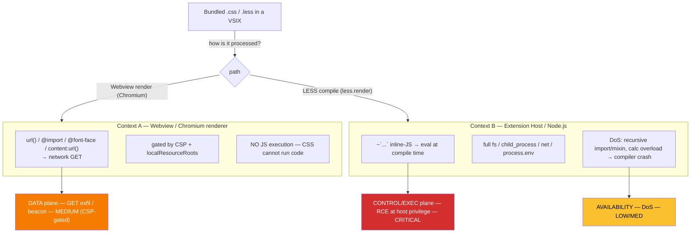

# ExTrace × vsix-zoo — `nextsecurity` Stylesheet-TTP Detection Spec

> **Class:** STY (stylesheet-borne TTP) — a **new detection surface** for this
> engine. Every rule s1–s18 reasons about JavaScript / manifest behaviour; this
> class is the first to treat a bundled **CSS / LESS stylesheet** as a malware
> carrier. The spec documents the corpus in detail, grades each TTP honestly
> against the VS Code / Electron runtime, and records the rules it motivated.
>
> **Source:** `trailofbits/vsix-zoo` → `samples/nextsecurity/` (origin GitHub repo
> `NextSecurity/malicious-code-samples`, "Curated dataset of malicious source code
> samples"). vsix-zoo is Trail of Bits' corpus for exercising their `vsix-audit`
> scanner; `nextsecurity` is its CSS/LESS stylesheet-TTP category.
>
> ⛔ **Safety:** the corpus was **never** downloaded, committed, or stored in this
> repo or on the host — not in `extensions/`, not in a scratch dir, not
> "temporarily". All fixtures are synthetic, declawed shapes built from RFC 2606
> placeholder hosts (`*.example.com`/`*.example.org`). The corpus' own IOCs are
> *themselves* synthetic placeholders (see §8) and must never be resolved, fetched,
> or fed to a threat-intel feed. Full policy: the [README](README.md) safety
> section.

---

## 0. TL;DR — two findings shape everything below

1. **The corpus is a detection-test set, not live malware.** All 42 files are
   synthetic. Every "C2" is an RFC 2606 placeholder (`*.example.com`,
   `*.example.org`) or a generic fake (`evil-domain.xyz`); the base64 blobs decode
   to harmless strings (`.attacked { color: red;}`, `Hello Malicious Content`).
   There is no real IP, no live infrastructure. Its value to ExTrace is a
   **labelled known-pattern corpus** for tuning stylesheet rules.

2. **The corpus' README severities are inflated for a browser/CSS-engine context;
   in a VS Code extension half the TTPs are dead.** Electron/Chromium ignores IE
   `expression()`, `filter:progid`, and has removed `ftp://`; `@import` does not
   accept `ws://`; `url(var(--x))` is invalid CSS. The one genuinely dangerous
   vector is **LESS inline-JS eval (`` ~`...` ``)** — which is RCE in the
   extension-host Node.js context. The honest TTP→impact grade is §3.

The detection landing reflects that grade: **one CRITICAL rule** for the inline-JS
RCE, **two MEDIUM/WARN rules** for the data-plane and signature-only shapes, and an
explicit "what we don't cover" list (DoS structures, taint, CSP-grading) — never
the corpus README's flat "High/Medium".

---

## 1. Sample anatomy

```text
samples/nextsecurity/
├── README.md                      # manifesto
├── LICENSE                        # MIT
└── dataset/
    ├── css/   (22 files)          # 20 TTP + css17b (recursive-import partner) + README
    └── less/  (22 files)          # 20 TTP + less16b (recursive-import partner) + README
```

All files carry a `.less` extension (even the "CSS" examples are saved as `.less`).
The CSS and LESS sets repeat the **same 20 TTPs** in two syntaxes; the only
LESS-exclusive vectors are inline-JS, mixin override, and recursive mixin.

The irony worth recording: packaging a "malicious-sample dataset" and shipping it
into the ecosystem is **itself a supply-chain risk** even when the payloads are
synthetic — it trips a scanner, can break a build pipeline (the DoS TTPs really do
blow up a LESS compiler), and would do harm if the patterns were real. That is why
vsix-zoo lists it as a "malicious extension".

---

## 2. Threat model — how a stylesheet becomes dangerous inside an extension

A stylesheet is inert until **something processes or renders it**. A VS Code
extension has two distinct execution contexts, and the threat surface forks across
them — mapping cleanly onto ExTrace's trust planes.



### Context A — Webview (Chromium renderer)

The extension renders an HTML/CSS panel via `createWebviewPanel()`. Chromium
processes the CSS. The danger is the **resource-loading properties** (`url()`,
`@import`, `@font-face src`, `content: url()`): each fires a network GET.
Exfiltration is **GET-only and one-way** (data smuggled into the URL path/query).
There is **no JS execution** — CSS cannot run code. Critically, this egress is
**gated by the webview's CSP and `localResourceRoots`**: a restrictive
`connect-src`/`img-src`/`font-src` blocks the outbound `url()` at the browser. So a
stylesheet exfil signal should be **graded by the extension's webview CSP**, which
both lowers false positives and yields a truer risk score (a dynamic-plane
refinement; the static rule surfaces the shape at MEDIUM).

### Context B — Extension Host (Node.js) LESS compile

If the extension compiles LESS at runtime (`less.render()`), a `` ~`...` ``
backtick inline-JS escape is **`eval`'d at compile time** (legacy less.js
`javascriptEnabled` behaviour). That code runs **in the extension-host Node.js
process, not the webview sandbox** — full `fs`, `child_process`, `net`,
`process.env`. **This is the only true RCE vector in the corpus** and the clear
top priority.

> **Validity note:** less.js ≥ 3.0 defaults `javascriptEnabled: false`. The vector
> is live only with (a) an old less.js, or (b) a build that sets
> `javascriptEnabled: true`. But as a static signature it is **unambiguous author
> intent** in every case and must be caught — exactly the `s11` win32-gate
> precedent (a runtime-gated payload still convicts CRITICAL).

---

## 3. TTP → real-impact matrix (honest grade)

Do not copy the corpus README's severities. The VS Code / Electron reality:

| # | TTP (README) | Vector | State in Electron/VS Code | Plane | Real severity |
|---|---|---|---|---|---|
| 1 | FTP `@import` | `ftp://` fetch | **DEAD** — Chromium 88+ removed FTP | Data | signature-only |
| 2 | `data:` URI import | base64 CSS embed | **Works** but CSS cannot exec → carries, never triggers | Data | low |
| 3 | WebSocket `@import` | `ws://` fetch | **DEAD** — `@import` rejects `ws://` | — | signature-only (anomaly) |
| 4 | Trojan class/mixin override | known name + remote url | works (override + GET exfil) | Data | medium |
| 5 | Cryptominer `background:url(.js)` | `.js` via `url()` | **Misleading** — `url()` GETs the resource, does not *run* JS; no miner | Data | low (beacon only) |
| 6 | `file://` import | local read | **Conditional** — `localResourceRoots` blocks; open on misconfig | Data | medium (conditional) |
| 7 | Base64-in-comment | hidden payload in comment | inert (comments go nowhere) but **author intent** | — | signature-only |
| 8 (css) | IE `expression()` | CSS→JS | **DEAD** — IE-only, Chromium ignores | — | signature-only |
| **8 (less)** | **Inline JS `` ~`...` ``** | **compile-time eval** | **LIVE RCE** (if javascriptEnabled) | **Control/Exec** | **CRITICAL** |
| 9 | Suspicious domain refs | remote `url()` | works (GET beacon) | Data | medium |
| 10 | Deep nesting (DoS) | parser overhead | works (compile/render load) | Availability | low |
| 11 | Attribute-selector keylogger | `input[value^=]`+url | **Conditional** — `value` attribute does not reflect live input by default; works for framework/managed inputs | Data | medium (conditional) |
| 12 | Malicious `@font-face` | remote font GET | works (GET beacon) | Data | medium |
| 13 | Query-param `@import` (`?cmd=`) | command in url | works but `cmd=` is just a *string* — inert unless server-interpreted | Data | low (theatre) |
| 14 (css) | IE `filter:progid` | url + obfuscation | **DEAD** — IE-only | — | signature-only |
| 15 | Zero-width / RTL unicode | identifier obfuscation | works (scanner/human deception) | Evasion | medium |
| 16 | `content:` exfil (`::after`) | pseudo-element GET | works (GET exfil) | Data | medium |
| 17 | Recursive `@import` loop | A↔B infinite import | works (compiler crash/OOM) | Availability | low-med |
| 18 | Trojan `@keyframes` | animated repeat GET | partial — frames cache the image once, not a continuous fetch; still a beacon | Data | low-med |
| 19 | `calc()` overload | resource exhaustion | works (parser load, bounded in modern engines) | Availability | low |
| 20 | Houdini / `var()` url | dynamic obfuscation | **DEAD** — `url(var(--x))` invalid CSS; Houdini needs a JS worklet | — | signature-only |
| 16b/17b/19(less) | Recursive mixin `.m(){.m()}` | infinite recursion | works (LESS stack overflow) | Availability | medium |

**Takeaway:** of 20 TTPs, ~7 are dead in Electron (signature-only), ~9 are
data-plane GET beacons (medium, CSP-bound), 3 are availability/DoS, and **1 is
critical RCE**. ExTrace's verdict must reflect that gradient.

---

## 4. As-built layer map

The new work is **one CRITICAL + two MEDIUM in-house rules** in a single
stylesheet module, plus a **coverage fix** that makes the corpus visible at all.

| Signal / behaviour | Layer | Rule id | Status |
|---|---|---|---|
| `.less`/`.scss`/`.sass` were never scanned | content scanners | `_common.TEXT_SUFFIXES` | ✅ **fix** — added the suffixes; extends s4/s5/s7/s8/s9/s12 to stylesheets |
| LESS inline-JS eval (TTP #8-less, RCE) | in-house static | `extrace.s19.stylesheet_inline_js` | ✅ **CRITICAL → BLOCK** |
| Non-standard-scheme load (TTP #1/#3/#6) | in-house static | `extrace.s19.stylesheet_nonstandard_scheme` | ✅ **MEDIUM / WARN** |
| CSS keylogger + content exfil (TTP #11/#16) | in-house static | `extrace.s19.stylesheet_css_exfil` | ✅ **MEDIUM / WARN** |
| Zero-width / RTL unicode in stylesheet (TTP #15) | in-house static | `extrace.s12.invisible_unicode_run` | ✅ **pre-existing** — scans raw bytes of every file, `.less` included |
| Remote-host `url()` / `@font-face` (TTP #4/#9/#12) | in-house static | `extrace.s4.blacklisted_domain` / `extrace.s5.suspicious_network_endpoint` | ✅ **now reach `.less`** via the suffix fix (host scrutiny, not stylesheet-specific) |

### 4a. The coverage fix is load-bearing

Before this work, `is_text_document` (`_common.TEXT_SUFFIXES`) listed `.css` but
**not** `.less` / `.scss` / `.sass`. The entire corpus ships as `.less`, so *none*
of it was being scanned — not by the new s19 rules and not by the existing content
rules. Adding the three suffixes is the single highest-leverage change here: it
extends s4 (blacklisted domain), s5 (network endpoint), s7 (secret), s8 (webhook),
s9 (crypto address) and the s19 family to stylesheet sources for free. `s12`
(invisible-unicode) already scanned raw bytes of every file regardless of suffix,
so TTP #15 (zero-width/RTL unicode) was already covered — the suffix fix simply
makes the rest of the family see the files.

### 4b. `extrace.s19.stylesheet_inline_js` — TTP #8-less (CRITICAL)

A backtick-delimited span **in a stylesheet file** is LESS inline JavaScript. CSS,
SCSS and SASS have no backtick token, so a backtick pair (`` ~`...` `` or
`` `...` ``) can only be LESS inline-JS eval. The rule is **stylesheet-suffix
scoped** — this is the load-bearing precision decision: the corpus' own suggested
regex `` ~?`[^`]*` `` would false-positive on *every JavaScript template literal*
if run over `.js`. Scoping to `.css`/`.less`/`.scss`/`.sass` (where a backtick is
anomalous) makes it near-zero-FP. CRITICAL → BLOCK, like `s10`/`s11`/`s16`:
compiled-time eval in the extension-host Node context is a finished RCE primitive.
Conditional on `javascriptEnabled` exactly as `s11` is conditional on `win32` —
still CRITICAL on author intent.

### 4c. `extrace.s19.stylesheet_nonstandard_scheme` — TTP #1/#3/#6 (MEDIUM)

A stylesheet resource loader (`@import` / `url()` / `src:`) targeting `ftp:`,
`ws:`/`wss:`, `gopher:`, `file:`, `javascript:`, or `vbscript:`. Most are inert in
a modern Chromium webview (FTP removed; `@import` rejects `ws://`), so the value is
**signature/author-intent** plus the one live member: `file://` is a local-read
attempt (gated by `localResourceRoots`). MEDIUM/WARN, never a blocker — these are
mostly dead-signature evidence, not a finished primitive. **Remote `http(s)` hosts
are deliberately *not* in this rule** — a remote `url()` to a CDN is routine and
legitimate; remote-host scrutiny is the s4/s5 layer's job (now reaching `.less` via
the suffix fix) and is gradable by CSP.

### 4d. `extrace.s19.stylesheet_css_exfil` — TTP #11/#16 (MEDIUM)

The two CSS-native data-exfiltration shapes with **no JavaScript-rule analogue**:

- **Attribute-selector keylogger** — a substring/prefix/suffix attribute selector
  (`[value^="a"]`, `[title*="x"]`) whose declaration block fires a **remote**
  `url()`. Each matched input value triggers a unique GET, leaking the value
  char-by-char. The negative lookahead **excludes URL/structural attributes**
  (`href`/`src`/`class`/`id`/`type`/`rel`/`role`/`aria`/`lang`) because
  prefix-matching *those* with a remote icon is the legitimate external-link-icon /
  BEM pattern — the FP that would otherwise sink this rule. Exact-match selectors
  (`[type="text"]`) are not the keylogger primitive and are excluded by
  construction (the rule requires `^=`/`$=`/`*=`).
- **`::before`/`::after` content exfil** — a content pseudo-element that GETs a
  **remote** `url()`: a render-time beacon that can carry a token in the URL.
  Legit pseudo-elements use text or *local* icons, so requiring a remote url
  (`https?://` or protocol-relative `//`) keeps it tight.

MEDIUM/WARN: the remote-egress half is gated by the webview CSP /
`localResourceRoots`, so static cannot prove exploitability — it surfaces the
exfil shape for review. CSP-grading is the dynamic-plane refinement (§6).

---

## 5. Detection invariants & why the conjunctions

| Rule | Invariant | Why low-FP |
|---|---|---|
| inline_js | backtick **in a stylesheet** | CSS/SCSS/SASS have no backtick token; LESS uses it only for JS eval |
| nonstandard_scheme | loader (`@import`/`url(`/`src:`) **near** a non-std scheme, one declaration | bounds the gap so a scheme in an unrelated comment does not assemble |
| css_exfil (keylogger) | substring attr selector on a **value-bearing** attr **+ remote url in the same block** | excludes href/src/class/id prefix selectors (external-link icons); block-scoped, not file-scoped |
| css_exfil (content) | `::before/::after` `content` **+ remote url in the same block** | local-icon pseudo-elements don't match; remote required |

The repo principle holds: **match a behaviour/capability class, not a sample**.
None of the three carries a `nextsecurity` literal; the corpus' synthetic IOCs live
only in the tests + §8.

---

## 6. What this does NOT cover (honest gaps + deferred)

The static regex layer is a first-pass filter; several corpus TTPs need an AST /
taint / dynamic layer this engine does not run locally. Recorded so they are not
mistaken for coverage:

| Gap | Corpus TTPs | Why deferred | Where it would land |
|---|---|---|---|
| **DoS structures** — deep nesting, `@import` cycle, recursive mixin, `calc()` overload | #10, #17, #18b/19-less, #19 | regex cannot model graph cycles / nesting depth; needs a LESS/postcss AST + call-graph (SCC) pass | a future AST rule or a compile-time cgroup CPU/mem watchdog (availability axis) |
| **Taint through indirection** — `url(@{base}+"a")`, `url(var(--evil))`, host split across variables | #11/#20-style, the APT evasion in §7 | the L1 regex sees the literal, not the variable→sink flow; needs taint | semgrep `mode: taint` (container-only; no local semgrep) — the "regex vs taint precision" delta |
| **CSP / `localResourceRoots` grading** — does the webview actually allow the egress? | all data-plane GET TTPs | the static rule cannot prove exploitability; the true risk depends on the webview CSP | dynamic plane (CDP Network domain initiator filter) + a future static CSP cross-check |
| **base64 recursive re-scan** — decode `data:`/comment blobs and re-scan | #2, #7 | the corpus' blobs are inert benign strings; the general decode-then-rescan is broader scope | a `data:` decode pass feeding back into the scanners |
| **Semgrep commodity echo** | inline-JS / scheme | semgrep is js/ts-scoped here and CSS/LESS isn't scanned by the js rules; can't verify locally (no local semgrep) | container-iteration follow-up if a CSS-in-JS template-literal echo proves worthwhile |
| **UI `ruleCatalog.ts` entry** | — | enrichment only; s15–s18 are also not yet catalogued (consistent deferral) | opportunistic, next UI pass |

No taxonomy / report-contract / gate-policy change was made. `s19.stylesheet_inline_js`
is CRITICAL (auto-BLOCKs like `s10`/`s11`/`s16`, no `_PROMOTED_HIGH_BLOCKERS` edit);
the other two are MEDIUM/WARN; all three are class-less per the static-IOC convention.

---

## 7. Detection efficacy & evasion (commodity vs APT)

**This corpus is commodity / script-kiddie grade** — literal strings, overt
`evil`/`malicious` names, flat patterns. The s19 rules catch it comfortably. That
only means the *naive author* is caught. A real-world actor evades:

- **inline_js (s19a):** base64 the payload — `` ~`eval(atob('...'))` `` still fires
  s19a (the backtick is the signal), but a staged loader that fetches the LESS at
  runtime moves the signature off the static plane entirely.
- **nonstandard_scheme / host (s19b + s4/s5):** use a legit-looking HTTPS CDN
  (typosquat `cdn-jsdelivr[.]net`), domain-fronting, or split the host across LESS
  variables (`@a:"ev"; @b:"il.example"; url("https://@{a}@{b}/")`) — **only taint
  follows that; regex breaks.** The corpus' own less9/less11/less20 indirections
  are the miniature proof of this gap.
- **css_exfil (s19c):** build the selector/url by variable concatenation; or rely
  on the CSP being permissive (the rule already can't prove the egress fires).
- **unicode (s12):** new confusable sets requiring post-NFKC normalization matching.

**Defence-in-depth conclusion:** no single layer suffices. Static (intent +
obfuscation) + taint (indirection) + dynamic (behaviour, source-blind) + context
grading (CSP/`localResourceRoots` for true exploitability) together. ExTrace's
value over the corpus README's flat "malicious" is exactly the graded verdict:
**confirmed-RCE (s19a) / suspicious-exfil (s19c) / dead-signature (s19b on a dead
scheme) / availability-DoS (deferred)**.

---

## 8. IOC / signal appendix (synthetic — defanged, do NOT feed a TI feed)

> **Every value here is synthetic.** `*.example.com`/`*.example.org` are RFC 2606
> reserved (IANA non-routable test domains — never seen in real traffic; adding
> them to a blocklist is meaningless and harmful). `evil-domain.xyz`/`*.xyz` are
> generic placeholders — unregistered today, anyone could take them tomorrow. These
> are **rule-pattern test data, not an IOC feed.** No host was added to
> `blacklist_domains.txt` for this class (there is no durable host to add). The
> durable signals are structural (the rule invariants in §5), never a string.

| Defanged IOC | Scheme | TTP | Kind |
|---|---|---|---|
| `ftp[://]malicious[.]example[.]com/evil.css` | ftp | #1 | dead scheme |
| `data:text/css;base64,…` (decodes `.attacked{color:red}`) | data | #2 | embedded benign |
| `ws[://]attacker-c2[.]example[.]org/hook.css` | ws | #3 | dead scheme |
| `file[://]/etc/passwd` | file | #6 | local-read attempt |
| `hxxps[://]evil[.]example[.]com/exfil?char={a,b,…}` | https | #11 | keylogger exfil |
| `hxxps[://]attacker[.]example[.]com/exfil?secret=USER_TOKEN` | https | #16 | content exfil |
| `hxxps[://]malicious[.]example[.]org/fonts/evil.woff2` | https | #12 | remote font beacon |

Base64 payloads (decoded — all benign): `LmF0dGFja2VkIHsgY29sb3I6IHJlZDt9` →
`.attacked { color: red;}`; `SGVsbG8gTWFsaWNpb3VzIENvbnRlbnQ=` → `Hello Malicious
Content`. No IPv4/IPv6 literal anywhere in the corpus.

---

## 9. MITRE ATT&CK coverage (claimed vs applicable)

| Technique | Name | Corpus TTPs | s19 rule | Applicability |
|---|---|---|---|---|
| T1059 | Command/Scripting Interpreter | #8-less | `stylesheet_inline_js` | **the one real RCE** — Electron-relevant |
| T1041 | Exfil over C2 channel | #4,9,11,16,18 | `stylesheet_css_exfil` | GET-only, one-way |
| T1071 | Application Layer Protocol | #3,#12,#18 | `stylesheet_nonstandard_scheme` + s4/s5 | ws:// dead; https beacon live |
| T1056 | Input Capture | #11 | `stylesheet_css_exfil` | conditional (managed-input reflection) |
| T1005 | Data from Local System | #6 | `stylesheet_nonstandard_scheme` | localResourceRoots-bound |
| T1027 | Obfuscated Files/Info | #7,#15,#20 | `s12` (unicode) | base64/unicode real; var-obfuscation deferred |
| T1499 | Endpoint DoS | #10,17,18,19,mixin | — (deferred §6) | compiler/build-targeted |
| T1190 / T1566 / T1587 | (README claims) | various | — | **mostly mis-mapped** — not applicable in the VS Code context; corpus README overreach |

The honest note for any thesis use: the corpus README's T1190/T1566/T1587 mappings
are forced. Showing "claimed vs applicable" is the critical-evaluation point.

---

## 10. As-built notes

- **No taxonomy / contract / gate change.** Three class-less static rules under one
  `s19` module (mirrors the multi-rule `s1`/`s3` modules); `stylesheet_inline_js`
  is CRITICAL and BLOCKs automatically (no `_PROMOTED_HIGH_BLOCKERS` edit). The
  production rule count went 22 → **25** (`EXPECTED_STATIC_PRODUCTION_RULE_IDS`,
  `test_static_runner`, the container smoke kept in lockstep).
- **General, not sample-specific.** No `nextsecurity` literal in rule logic; the
  corpus IOCs live only in tests + §8.
- **Verified locally:** `pytest tests/static_runtime/ tests/security/` green; ruff +
  mypy clean. Semgrep echoes (if ever added) and the live container fire are
  CI/container-only (no local semgrep on the dev machine).
