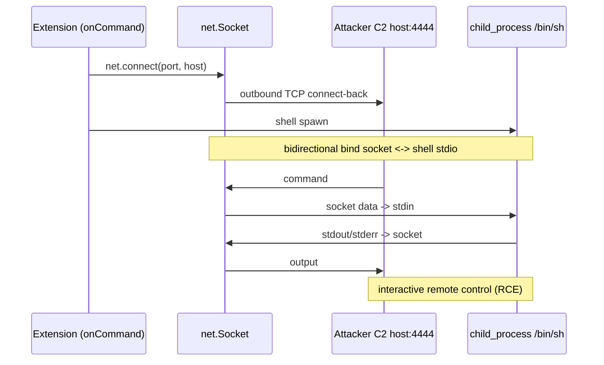
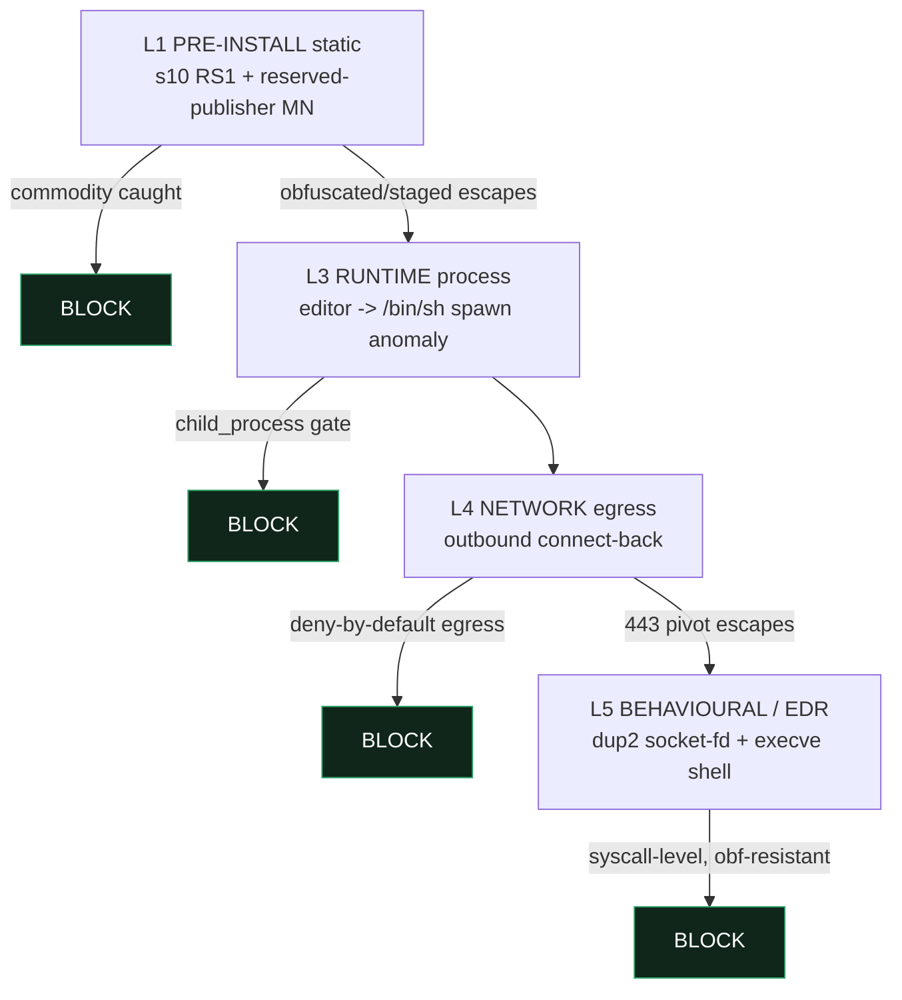

# ExTrace × vsix-zoo — `nf3xn` Reverse-Shell Detection Spec

> **Class:** RS (reverse shell) — the same core invariant as `securezeron`. This
> spec does **not** extend the taxonomy; it documents the `nf3xn` sample in detail,
> shows which layer stops it, and records the two genuinely-new rule additions it
> motivated. Companion to [`securezeron-detection-spec.md`](securezeron-detection-spec.md).
>
> ⛔ **Safety:** `nf3xn` is a *functional* reverse shell. It was **never**
> downloaded, installed, or executed for this work. No live sample is in the repo;
> all fixtures are synthetic, declawed shapes with documentation-range
> (RFC 5737 / RFC 2606) C2 placeholders. Behaviour notes are detection-level only —
> no copy-paste reverse shell. Full policy: the [README](README.md) safety section.
>
> ⚠️ **IOC trust:** any host/port literal attributed to the sample (referenced
> below as `buran:4444`) is from a prior source-verified reading, not re-fetched
> here. Durable detection never keys on a string IOC (§9) — verify against a live
> sample in the sandbox if an exact value is ever needed.

---

## 0. Scope + provenance

- **Read-only, detection-level.** Target of detection is the extension itself
  (`src/extension.ts` + `package.json`).
- `nf3xn` is a commodity Node.js reverse shell embedded in the yo-code "Hello
  World" extension template. Its manifest honestly self-labels as a "Malicious
  Extension PoC" — a research artifact, not a novel technique; commodity
  reverse-shell mechanics wrapped in an extension package.

---

## 1. How it works

The payload is the union of three primitives — each benign alone, the
**conjunction** an RCE:

1. **`net` connect-back** — outbound TCP to a hardcoded `host:port`. Not a bind:
   an *outbound* connection, so inbound firewall rules do not apply.
2. **`child_process` shell spawn** — an interactive `/bin/sh` in the extension-host
   user's context.
3. **stdio ↔ socket bridge** — the shell's stdin is fed from the socket and its
   stdout/stderr stream back to the socket (bidirectional).



**Result:** the attacker gets an interactive shell as the extension-host user. On a
developer machine that means direct reach to SSH keys, cloud tokens, git
credentials, `.npmrc`/`.pypirc`.

Two low-intensity deltas vs. `securezeron`:

- **Activation:** `activationEvents: "onCommand:malext.helloWorld"` → **not** eager.
  The victim must run the command. (`securezeron` used `["*"]` and fired at startup
  → `nf3xn` is lower severity on the activation axis, identical once triggered.)
- **Publisher spoof:** `publisher: "ms-vscode"` → impersonates Microsoft's official
  namespace (signal MN) — a social-engineering / false-trust layer.

---

## 2. Signal catalogue — `RS` + `MN`

| ID | Signal | Static evidence | Base severity | FP risk | Note |
|---|---|---|---|---|---|
| **RS1** | proc-stdio ↔ socket **bidirectional bridge** | shell child's stdin/stdout wired to a `net`/`tls` socket | **high** | **low** | invariant — high-fidelity alone |
| **RS2** | child_process shell spawn | `spawn`/`exec` of `/bin/sh` (or `cmd`/`powershell`) | medium | high | benign without RS1 |
| **RS3** | hardcoded connect target | `net.connect($port, $host)` literal | low-medium | medium | C2 indicator |
| **RS4** | eager activation (`["*"]`) | startup auto-fire | low | high | escalation multiplier — **absent in nf3xn** (`onCommand`) |
| **MN** | publisher impersonation | `publisher` is a reserved/first-party namespace (`ms-vscode`) | medium | see §4c | trust abuse; manifest-layer |

**FP semantics.** RS2 + RS3 alone occur in legitimate extensions (subprocess +
network are normal). The high-fidelity signal is **RS1**: a shell process's I/O
bound bidirectionally to a network socket has essentially no legitimate use. The
rule is built on that conjunction.

---

## 3. Detection invariant — `RS1`

A `/bin/sh` whose stdin is fed by a network socket **and** whose stdout/stderr go
back to that socket can only be remote command execution. Legitimate uses are
vanishingly rare → low FP, conjunction-based. This is the same invariant the
`securezeron` spec defines; `nf3xn` is a regression case for it, not a new rule.

---

## 4. As-built layer map

`nf3xn` is **already convicted** by the shipped `securezeron`-class rules. This
spec records that, plus the two genuinely-new additions it motivated.

| Signal / behaviour | Layer | Rule id | Status |
|---|---|---|---|
| RS1 shell↔socket bridge (`.pipe()` **and** manual `stdin.write` form) | in-house static | `extrace.s10.reverse_shell` | ✅ **CRITICAL → BLOCK** — **improved** to also catch the manual `socket.on("data", d => proc.stdin.write(d))` bridge |
| RS1/RS2/RS3 AST echoes | semgrep | `reverse_shell_pipe` / `_spawn` / `_ip_connect` | ✅ advisory MEDIUM/WARN (pre-existing) |
| RS4 `*` activation | in-house static | `extrace.s1.activation_wildcard` | ✅ pre-existing (HIGH / WARN) — **silent for nf3xn** (it uses `onCommand`, correctly lower severity) |
| **MN publisher impersonation** | in-house static | `extrace.s1.reserved_publisher_spoof` | ✅ **NEW this work** — MEDIUM / WARN |
| runtime shell spawn + outbound socket | dynamic | `extrace.a8.reverse_shell` | ✅ HIGH, `AdversaryClass.A8` — **fires for nf3xn** (see §5) |

### 4a. `s10` improvement — manual `stdin.write` bridge (NEW)

`s10` keyed RS1 on the `.pipe()` wiring forms only
(`socket.pipe(proc.stdin)` / `proc.stdout.pipe(socket)`). The classic Node reverse
shell that does **not** use `.pipe()` bridges the socket to the shell manually:

```js
socket.on("data", (d) => proc.stdin.write(d));   // C2 -> shell  (inbound leg)
proc.stdout.on("data", (d) => socket.write(d));  // shell -> C2  (outbound leg)
```

The wiring conjunct now also matches `stdin.write(` — feeding a spawned process's
stdin is the diagnostic, low-FP inbound leg (a bare `socket.write` is too generic
to add). It only ever contributes **inside** the four-way conjunction (shell name,
child_process, socket, and wiring), so it cannot fire alone. Regression covered by
`tests/static_runtime/test_s10_reverse_shell.py::test_fires_on_manual_stdin_write_bridge`.

### 4b. `extrace.s1.reserved_publisher_spoof` — MN (NEW)

A new manifest rule (in `s1_manifest_red_flags.py`): the VSIX **claims** a
reserved / first-party brand publisher namespace (curated set:
`microsoft`, `ms-vscode`, `vscode`, `github`, `visualstudio`, `google`). `nf3xn`'s
`publisher: "ms-vscode"` matches. Distinct from `generic_publisher` (which catches
*missing/placeholder* identity); this catches *claimed-trusted* identity.

### 4c. Honest FP boundary for MN — why MEDIUM/WARN, never a blocker

Genuine first-party extensions carry these exact publishers
(`ms-vscode.cpptools`, `GitHub.copilot`). Name-only matching **cannot** separate a
spoof from the real thing — the durable disambiguator is the marketplace
*verified-publisher* signal, which is **out of static scope**. The match set is
therefore the **bare reserved brand namespaces only**, never an `ms-*` prefix
(prefix-matching would flag every legitimate `ms-python`/`ms-toolsai`/`ms-azuretools`
extension — including the real `ms-azuretools.vscode-docker` that the `ecm3401`
suite *tampers with*). The value: in ExTrace's threat model of arbitrary /
side-loaded VSIXs, a package asserting a first-party identity warrants a provenance
check, and it is a strong escalator when it co-occurs with a malicious capability
(here, the RS1 reverse shell that `s10` already convicts as CRITICAL).

---

## 5. Defence-in-depth + the Linux-detonation insight

A reverse-shell extension is stopped across the kill chain, not at one point. The
critical reality: **the static layer is necessary but evadable; the runtime /
syscall layer is the evasion-resistant backstop** — obfuscation hides the source,
not the syscalls.



- **L1 — Pre-install static (ExTrace).** `s10` RS1 + the MN publisher signal.
  `nf3xn` is unobfuscated → caught cleanly. *Limit:* obfuscation or staging
  (loader that fetches the shell at runtime) shifts the static signature → the
  OB / DR families.
- **L3 — Runtime process control.** VS Code extensions are not sandboxed by
  default — the extension host can call `child_process` directly; this is a real
  platform gap. The editor process spawning `/bin/sh` is a behavioural anomaly.
- **L4 — Network egress.** A reverse shell **must** connect outbound to the
  attacker `host:port` — often the most reliable backstop. Deny-by-default egress
  on dev workstations kills the callback. *Limit:* 443 / domain fronting / pivot
  through an allowed service.
- **L5 — Behavioural / EDR (evasion-resistant).** However obfuscated the source,
  the runtime syscalls are concrete: a socket fd `dup2`'d onto stdin/stdout/stderr
  followed by an `execve` of a shell — the reverse-shell syscall signature, caught
  source-blind by eBPF/Falco/strace.

**ExTrace-specific insight — `nf3xn` is NOT dynamic-blind.** Unlike `kagema`
(win32-gated) and `glassworm` (win32/darwin-gated), which never detonate in the
Linux containerised sandbox (static is their only defence), `nf3xn` targets
`/bin/sh` → it **detonates on the Linux runner**. So the dynamic plane
(`extrace.a8.reverse_shell`: runtime shell spawn + outbound socket) actually
**fires** for `nf3xn`, validating RS1 at runtime (L5). This is the rare case where
both legs of the hybrid architecture work on the same sample.

> ⚠️ **strace coverage reminder (L5 dynamic expectation).** The spawned `/bin/sh`
> is a forked child. Without `strace -f` (follow-forks) attached to a single PID,
> the interesting behaviour (the shell and its children) is invisible — the
> previously-flagged follow-fork gap bites directly here. The dynamic runner must
> use `-f`. There is **no Falco rule artifact** in this repo today; the L5
> syscall expectation (socket-fd `dup2` + shell `execve`) is documented here and
> carried at runtime by `a8`, not encoded as a new rule.

---

## 6. Severity / verdict

- **Verdict: MALICIOUS.** Even as a self-declared PoC, the artifact is a
  functional reverse shell; maintainer intent is hostile.
- **Axis:** integrity/RCE **high** (interactive shell = arbitrary code execution);
  confidentiality indirectly high (a shell reads any secret), but the primary
  signal is RCE.
- **Activation modifier:** `onCommand` (not eager) lowers severity one notch but
  does not change the verdict — trigger depends on user interaction, outcome is
  identical.
- **Class:** RS → `AdversaryClass.A8` on the dynamic side (`a8.reverse_shell`); the
  static `s10` stays class-less per the static-IOC convention.

---

## 7. Evasion / limitations

`nf3xn` is commodity/PoC-grade — the static signature catches it comfortably. A
real-world RS variant typically: (1) **obfuscates** (`child_process`/`net` literals
buried in a `_0x` string-array — AST arg-matching is evaded, string-regex sometimes
recovers); (2) **stages** (the extension contains no shell, it is a loader that
downloads it → the DR family); (3) **indirect dispatch** (`require`/API call behind
`eval`/computed property). In those cases static alone is insufficient → the L5
behavioural (syscall) layer is the only source-blind defence. On egress, an
encrypted C2 over 443 can punch through deny-by-default → DNS/flow anomaly + EDR.

---

## 8. IOC / signal appendix

| Signal | Type | Durability |
|---|---|---|
| shell spawn + `net.connect` + stdio↔socket bridge (RS1) | structural conjunction | **high** (invariant) |
| `child_process.spawn("/bin/sh")` | structural | high |
| `net.connect(port, host)` outbound | structural | high |
| socket fd → `dup2` stdin/stdout + `execve` shell | syscall (runtime) | **very high** (obf-resistant) |
| `publisher: "ms-vscode"` (reserved spoof) | manifest string | medium |
| host `buran` / port `4444` | string IOC | **low** — prior-session, config-bound, non-durable |

> **IOC lesson:** never build a rule on the host/port literal — it changes in the
> next sample. The durable axes are structural/dataflow (RS1) and syscall (L5).

---

## 9. As-built notes

- **No taxonomy/verdict change.** RS already maps to `A8` (dynamic) and `s10`
  (static); no enum, contract, or gate-policy change was made. The two additions
  (`s10` manual-bridge, `s1.reserved_publisher_spoof`) are general — no `nf3xn`
  literal in rule logic; sample IOCs live only in tests + this appendix.
- **Verified locally:** `pytest tests/static_runtime/ tests/security/` green; ruff
  + mypy clean. Semgrep echoes and the live container fire are CI/container-only
  (no local semgrep on the dev machine).
